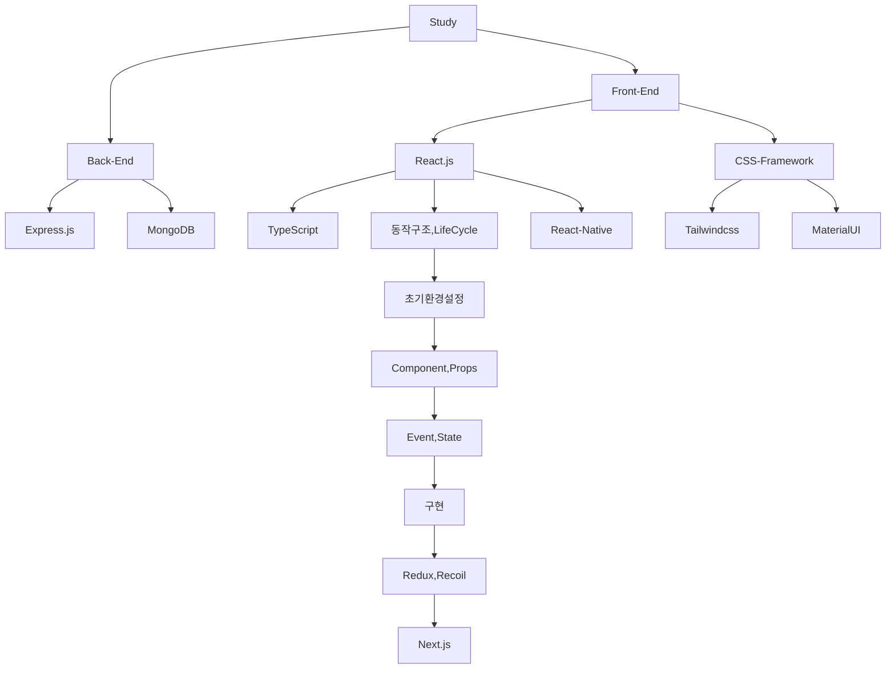

# When?
매주 화요일(또는 금요일) 오전 8:30

# How?
정해진 주제를 가지고 매주 발표자가 발표 자료를 준비하여 발표 및 지식 공유

# What?
- React.js
- Typescript
- Redux || Recoil
- Next.js
- CSS Framework
- Express.js
- MongoDB

```mermaid
flowchart TD
Study --> Front-End
Study ---> Back-End

Back-End --> Express.js
Back-End --> MongoDB

Front-End --> React.js
React.js --> TypeScript
React.js --> 동작구조,LifeCycle
동작구조,LifeCycle --> 초기환경설정
초기환경설정 --> Component,Props
Component,Props --> Event,State
Event,State --> 구현
구현 --> Redux,Recoil
Redux,Recoil --> Next.js

React.js --> React-Native

Front-End --> CSS-Framework
CSS-Framework --> Tailwindcss
CSS-Framework --> MaterialUI
```
