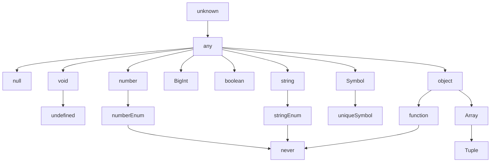

# TypeScript


## TypeScript = JavaScript + Type Check

- TypeScript는 **AltJS(Alternative JavaScript)** 중 하나입니다.
    - AltJS는 'JavaScript 파생 언어'로, TypeScript 말고도 CoffeScript, Dart 등이 있습니다.

- TypeScript는 **JavaScript(ES5)의 Superset(상위 확장)**이므로 기존의 JavaScript 문법을 그대로 사용할 수 있습니다.
    - 따라서 TypeScript 실행 환경에 JavaScript를 coding하면 정상적으로 동작합니다.
    - 하지만 JavaScript 실행 환경에 TypeScript를 coding하면 동작하지 않습니다.

- TypeScript는 '정적 Typing', ES6(ECMAScript 2015)의 'class'와 'module', ES7의 'Decorator' 등을 지원합니다.


### TypeScript의 Type 계층 구조




---


## TypeScript의 주요 특징 : 정적 Typing

- **TypeScript는 정적(Static) Typing을 지원**합니다.
    - 정적 type 언어는 변수를 선언할 때, 변수에 할당할 값의 type에 따라 **사전에 type을 명시적으로 선언(type declaration)**하고, **선언한 type에 맞는 값을 할당**합니다.
        - type이 결정된 후에는 type을 변경할 수 없습니다.
            - 잘못된 type의 값이 할당되거나 반환되면, compiler는 이를 감지해 오류를 발생시킵니다.
        - C-family(C, Java 등) 언어도 정적 typeing을 지원하는 언어입니다.

- **JavaScript는 동적(Dynamic) Typing만을 지원**합니다.
    - JavaScript는 동적 type(dynamic typed) 언어 혹은 느슨한 type(loosely typed) 언어이며, **type의 사전 선언 없이, 값이 할당되는 과정에서 동적으로 type을 추론(type inference)**합니다.
        - 동적 type 언어는 type 추론에 의해 **변수의 type이 결정된 후에도 같은 변수에 여러 type의 값을 교차하여 할당**할 수 있습니다.
    - 동적 typing은 사용하기 간편하지만, code를 예측하기 힘들어 예상치 못한 오류를 만들 가능성이 높습니다.


### 동적 Typing과 정적 Typing의 비교

#### 동적 Typing : JavaScript

```javascript
// JavaScript
function sum(a, b) {
    return a + b;
}

sum(1, 2);    // 3
sum('x', 'y');    // 'xy' (의도하지 않은 함수 사용 방법)
```

- 함수의 의도는 2개의 number type 인수를 전달받아 합계를 반환하는 것입니다.
    - 하지만 JavaScript code에는 어떤 type의 인수를 전달해야 하는지, 어떤 type의 반환 값을 return해야 하는지 명확히 기술되어 있지 않습니다.
- 함수의 인자로 string type을 넣어도 JavaScript 문법상 어떠한 문제도 없으므로, JavaScript Engine은 개발자가 의도하지 않은 동작을 그대로 실행합니다.
- 이러한 상황이 발생한 이유는 변수나 반환 값의 type을 사전에 지정하지 않는 JavaScript의 동적 typing에 의한 것입니다.

#### 정적 Typing : TypeScript

```typescript
// TypeScript
function sum(a: number, b: number): number {
    return a + b;
}

sum(1, 2);    // 3
sum('x', 'y');    // error TS2345: Argument of type '"x"' is not assignable to parameter of type 'number'.
```

- TypeScript는 정적 typing을 지원하므로, compile 단계에서 오류를 포착할 수 있습니다.
- 또한 명시적인 type 지정을 통해 type에 대한 의도를 명확하게 기술할 수 있고, code의 가독성, 예측성, 안정성을 향상시킬 수 있습니다.
    - 이는 대규모 project 개발에 크게 도움이 됩니다.


---


## TypeScript의 특징 : 객체 지향 Programming 지원

- interface, generic 등과 같은 객체 지향 programming(OOP, Object-Orientied Programming) 지원은 크고 복잡한 project의 code 기반을 쉽게 구성할 수 있도록 돕습니다.
- Java, C# 등의 class 기반 객체 지향 언어에 익숙한 개발자가 JavaScript Project를 수행하는 데 진입 장벽을 낮추는 효과도 있습니다.


---


## TypeScript의 특징 : 도구의 지원을 받을 수 있음

- TypeScript를 사용하면 IDE(통합 개발 환경)를 포함한 다양한 도구의 지원을 받을 수 있습니다.
- IDE에 type 정보를 제공함으로써, 높은 수준의 IntelliSense, Code Assist, Type Check, Refactoring 등을 지원받을 수 있습니다.
    - 동적 typing은 IDE가 변수나 매개 변수, 함수 반환 값의 type을 알 수 없어, 개발 편의 기능을 지원할 수 없게 합니다.
- 도구의 지원은 대규모 project를 위한 필수 요소이기도 합니다.


---


## Reference

- <https://poiemaweb.com/>
- <https://opentutorials.org/course/5080>


---
---
---
---
---
---
---
---
---
---


# TypeScript - Type Declaration (변수/함수의 Type 선언하기)


## Type Declaration

- **사전에 type을 선언(type declaration)**하여 변수나 함수의 type을 명시하는 작업은 code의 가독성, 예측성, 안정성을 향상시킵니다.
- type 선언은 강력한 type check를 가능하게 하여, '문법 오류'나 'type과 일치하지 않는 값의 할당' 등의 **기본적인 오류를 runtime 전에 검출**합니다.
    - **compile 시점에 type과 문법을 검사**합니다.
- VisualStudioCode와 같은 도구를 사용하면, code 작성 시점에 오류를 검출할 수 있어서 개발 효율이 대폭 향상됩니다.


---


## Type을 선언하는 방법


### 변수 Type 선언

- TypeScript는 변수명 뒤에 type을 명시하는 것으로 type을 선언할 수 있습니다.

```typescript
let foo: string = 'hello';
```

- 선언한 type에 맞지 않는 값을 할당하면 compile 시점에 오류가 발생합니다.

```typescript
let bar: number = true;    // error TS2322: Type 'true' is not assignable to type 'number'.
```


### 함수 Type 선언

- 함수의 매개 변수와 반환 값에 대한 type을 선언할 수 있습니다.
- 일반 변수와 마찬가지로 선언된 type에 일치하지 않는 값이 주어지면 오류가 발생합니다.

```typescript
// 함수 선언식
function multiply1(x: number, y: number): number {
    return x * y;
}

// 함수 표현식
const multiply2 = (x: number, y: number): number => x * y;

console.log(multiply1(10, 2));
console.log(multiply2(10, 3));

console.log(multiply1(true, 1));    // error TS2345: Argument of type 'true' is not assignable to parameter of type 'number'.
```


---


## 다양한 Type에 대한 선언 예시

```typescript
/* boolean */
let isDone: boolean = false;

/* null */
let n: null = null;

/* undefined */
let u: undefined = undefined;

/* number */
let decimal: number = 6;
let hex: number = 0xf00d;
let binary: number = 0b1010;
let octal: number = 0o744;

/* string */
let color: string = "blue";
color = 'red';
let myName: string = `Lee`;    // ES6 template 문자열
let greeting: string = `Hello, my name is ${ myName }.`;    // ES6 template 대입문

/* object */
const obj: object = {};

/* array */
let list1: any[] = [1, 'two', true];
let list2: number[] = [1, 2, 3];
let list3: Array<number> = [1, 2, 3];    // generic 배열 type

/* tuple */
let tuple: [string, number];
tuple = ['hello', 10];    // OK
tuple = [10, 'hello'];    // Error
tuple = ['hello', 10, 'world', 100];    // Error
tuple.push(true);    // Error

/* enum */
enum Color1 {Red, Green, Blue};
let c1: Color1 = Color1.Green;
console.log(c1);    // 1

enum Color2 {Red = 1, Green, Blue};
let c2: Color2 = Color2.Green;
console.log(c2);    // 2

enum Color3 {Red = 1, Green = 2, Blue = 4};
let c3: Color3 = Color3.Blue;
console.log(c3);    // 4

/* any */
let notSure: any = 4;
notSure = 'maybe a string instead';
notSure = false;    // okay, definitely a boolean

/* void */
function warnUser(): void {
    console.log("This is my warning message");
}

/* never */
function infiniteLoop(): never {
    while (true) {}
}

function error(message: string): never {
    throw new Error(message);
}
```

- **객체(`Object`)도 type으로 선언할 수 있으며**, 이 경우에 type은 대문자로 시작합니다.

```typescript
const today: Date = new Date();    // Date type

const elem: HTMLElement = document.getElementById('myId');    // HTMLElement type

class Person { }
const person: Person = new Person();    // Person type
```


---


## Reference

- <https://poiemaweb.com/typescript-typing>


---
---
---
---
---
---
---
---
---
---


# TypeScript - Type Inference (Type 추론)


## Type 추론 : Compiler의 Type 자동 결정 기능

- TypeScript의 type 추론(type inference)은 **code에서 type을 명시적으로 지정하지 않아도 TypeScript compiler가 자동으로 type 정보를 유추하는 기능**입니다.
    - **type 선언을 생략하면, 값이 할당되는 과정에서 동적으로 type이 결정**됩니다.
    - TypeScript와 달리, JavaScript는 동적 type 언어이기 때문에 모든 값에 기본적으로 type 추론이 적용됩니다.

- type 추론은 다양한 상황에서 작동하며, code의 명시성을 유지하면서도 type 선언의 번거로움을 줄여줍니다.
    - 그러나 type 추론의 한계점이 드러나는 특수한 상황에서는, type 선언을 명시적으로 하는 것이 좋습니다.


### 기본 Type 추론

- 변수나 상수에 초기 값을 할당할 때, TypeScript는 할당된 값의 type을 해당 변수나 상수의 type으로 추론합니다.

```typescript
let num = 5;    // num은 number type
const message = "Hello, TypeScript";    // message는 string type
```

```typescript
let foo = 123;    // foo는 number type
foo = 'hi';    // Error: Type '"hi"' is not assignable to type 'number'.
```

- 변수 foo에 type을 선언하지 않았으나, type 추론에 의해 변수의 type이 결정됩니다.
- 동적 type 언어는 type 추론에 의해 변수의 type이 결정된 후에도 같은 변수에 여러 type의 값을 교차하여 할당할 수 있습니다.
- 하지만 **정적 type 언어는 type이 결정된 후에는 type을 변경할 수 없습니다.**
- TypeScript는 정적 type 언어이므로, type 추론으로 type이 결정된 이후에 다른 type의 값을 할당하면 오류가 발생합니다.


### 함수 Type 추론

- 함수에서 반환 값에 대한 type을 명시하지 않으면 TypeScript는 반환되는 값들을 분석하여 반환 type을 추론합니다.

```typescript
function add(x: number, y: number) {
    return x + y;    // 반환 type은 number로 추론됨
}
```


### Best Common Type 추론

- 여러 type이 혼합된 배열을 생성할 때 TypeScript는 배열의 요소로 가능한 모든 type을 포함하는 "가장 근접한 공통 type(best common type)"을 추론합니다.

```typescript
let mixedArray = [1, "two", true];    // (number | string | boolean)[] type으로 추론됨
```


### Context Typing

- 변수나 함수에 사용된 context를 기반으로 type을 추론합니다.
    - e.g., event handler에서 event 객체의 type을 추론할 수 있습니다.

```typescript
window.onmousedown = function(mouseEvent) {
    console.log(mouseEvent.button);    // mouseEvent는 MouseEvent type으로 추론됨
};
```


### Generic Type 추론

- generic을 사용할 때 명시적으로 type 인수를 제공하지 않으면 TypeScript는 함수의 인수나 변수의 할당 값 등을 기반으로 해당 generic type을 추론합니다.

```typescript
function identity<T>(arg: T): T {
    return arg;
}

let output = identity("myString");    // output은 string type으로 추론됨
```


---


## Type 추론이 불가능한 경우 : `any` Type

- type 선언을 생략하고 값도 할당하지 않아서 type을 추론할 수 없으면, **자동으로 `any` type**이 됩니다.

```typescript
let foo;    // let foo: any

foo = 'Hello';
console.log(typeof foo);    // string

foo = true;
console.log(typeof foo);    // boolean
```

- `any` type의 변수는 JavaScript의 `var` keyword로 선언된 변수처럼, **어떤 type의 값도 재할당이 가능**합니다.
- 그러나 `any` type은 TypeScript를 사용하는 장점을 없애기 때문에, 사용하지 않는 편이 좋습니다.


---


## Reference

- <https://poiemaweb.com/typescript-typing>


---
---
---
---
---
---
---
---
---
---


# TypeScript - Type Casting (Type 변환하기)


## Type Casting : Type 변환하기

- type casting은 **변수의 type을 명시적으로 변환**하는 것입니다.
    - type casting은 type assertion(단언)과 비슷합니다.

- type casting을 사용하여 compiler에게 변수의 type을 알려줄 수 있습니다.
    - TypeScript는 정적 type을 가지고 있어 compile time에 type 검사를 수행하지만, 때로는 **개발자가 특정 변수의 type에 대해 더 잘 알고 있을 때**가 있습니다.

- type casting은 **type의 안전성을 개발자가 관리**할 수 있게 하지만, **남용은 code 안정성을 해칠 수 있으므로 신중하게 사용**해야 합니다.
    - type casting은 compile time에만 영향을 미치며, runtime에는 아무런 영향을 미치지 않습니다.
    - 따라서, 실제 runtime type이 casting한 type과 다를 경우 예상치 못한 오류가 발생할 수 있습니다.
    - type casting을 사용할 때는 주의해야 하며, type guard를 사용하여 runtime에 type을 확인하는 것이 좋습니다.


### Type Casting 방법 1 : `<>` Operator 사용

- `<>` 연산자는 JavaScript의 JSX와 함께 사용할 때 충돌을 일으킬 수 있으므로, JSX를 사용하는 환경에서는 권장되지 않습니다.

```typescript
let someValue: any = "this is a string";
let strLength: number = (<string>someValue).length;
```

- `<string>someValue`는 `someValue`를 `string` type으로 casting하고 있음을 나타냅니다.
- `string` type으로 type casting을 했기 때문에, `.length` property에 안전하게 접근할 수 있습니다.


### Type Casting 방법 2 : `as` Keyword 사용

- `as` keyword는 JSX와의 충돌 없이 사용할 수 있으므로, JSX를 사용하는 TypeScript 환경에서는 이 방법이 권장됩니다.

```typescript
let someValue: any = "this is a string";
let strLength: number = (someValue as string).length;
```

- `someValue as string`은 `someValue`를 `string` type으로 casting하고 있음을 나타냅니다.


---


## Type Casting 활용 예제 : `HTMLInputElement`

```typescript
const $input = document.querySelector('input["type="text"]');
const val = $input.value;    // TS2339: Property 'value' does not exist on type 'Element'.
```

- `document.querySelector` method는 `Element | null` type의 값을 반환합니다.
- `$input`은 `Element | null` type이며, `$input.value`를 실행하면 compile 오류가 발생합니다.
    - `Element` 또는 `null` type에는 `value`라는 property가 존재하지 않기 때문입니다.
- **`value` property는 `HTMLInputElement` type(`Element` type의 하위 type)에만 존재하므로, type casting이 필요합니다.**

```typescript
// 'as' keyword 사용
const $input = document.querySelector('input["type="text"]') as HTMLInputElement;
const val = $input.value;
```

```typescript
// '<>' 연산자 사용
const $input = <HTMLInputElement>document.querySelector('input["type="text"]');
const val = $input.value;
```


---


## Reference

- <https://poiemaweb.com/typescript-typing>


---
---
---
---
---
---
---
---
---
---


# TypeScript - Type Alias (Type 별칭)


## Type Alias : Type에 이름 붙이기

- type alias는 **기존에 존재하는 하나 이상의 type에 새로운 이름을 부여**하는, TypeScript의 강력한 type system을 활용한 기능 중 하나입니다.
    - 복잡한 type 구조를 간결하게 표현하고, code의 가독성을 높일 수 있습니다.

- type alias는 `type` keyword를 사용하여 정의합니다.

```typescript
type Person = {
    name: string,
    age?: number
}
```


### Type Alias의 특징

1. **재사용성** : type alias를 통해 정의한 type은 project 전반에 걸쳐 재사용할 수 있어, type 관리를 용이하게 합니다.

2. **가독성 향상** : 복잡한 type을 간결하고 의미 있는 이름으로 정의할 수 있어, code의 가독성이 향상됩니다.

3. **확장성 제한** : type alias는 확장이 불가능하며, 상속이나 interface처럼 기존 type을 확장하여 새로운 type을 만들 수 없습니다.
    - 대신, intersection type을 사용하여 type을 결합할 수는 있습니다.


---


## Type Alias 사용하기


### Primitive Type Alias

- 간단한 예로, 문자열이나 숫자 같은 기본 type에 더 구체적인 이름을 부여할 수 있습니다.

```typescript
type UserID = number;
type UserName = string;

type Str = 'Lee';    // string literal type

let id: UserID = 2;
let nm: UserName = 'simin';

id = '2';    // Error: Type 'string' is not assignable to type 'number'.
```


### Union Type Alias

- 두 개 이상의 type을 하나로 결합한 type을 정의할 때 사용합니다.
- union type을 통해 변수가 여러 type 중 하나를 가질 수 있음을 명시할 수 있습니다.

```typescript
type StringOrNumber = string | number;    // primitive union type
type Func = (() => string) | (() => void);    // function union type
type Shape = Square | Rectangle  Circle;    // interface union type

type Name = 'Lee' | 'Kim';    // string literal union type
type Num = 1 | 2 | 3 | 4 | 5;    // number literal union type
type Obj = {a: 1} | {b: 2};    // object literal union type
```


### Tuple Type Alias

- 고정된 길이의 배열 type을 정의할 때 사용하며, 각 요소의 type을 정확히 지정할 수 있습니다.

```typescript
type Point = [number, number];
```

```typescript
type Tuple = [string, boolean];

const tupleA: Tuple = ['', true];    // OK
const tupleB: Tuple = ['', ''];    // Error
```


### Object Type Alias

- 객체의 구조를 정의할 때 사용합니다.
- interface와 유사하지만, type alias를 사용하면 객체 type뿐만 아니라 다른 type들과의 조합도 가능합니다.

```typescript
type Point = {
    x: number;
    y: number;
};
```

```typescript
type UserID = number;
type UserName = string;

type User = {
    id: UserID;    // type alias를 type으로 지정
    name: UserName;    // type alias를 type으로 지정
    age: number;
};
```


### Intersection Type Alias

- 두 개 이상의 type을 모두 만족하는 새로운 type을 생성할 때 사용합니다.
- 이를 통해 여러 type의 특성을 합칠 수 있습니다.

```typescript
type Circle = {
    radius: number;
};

type Colorful = {
    color: string;
};

type ColorfulCircle = Circle & Colorful;
```


---


## 비슷하지만 다른 Type Alias와 Interface

- type alias와 interface 모두 custom type을 정의하고, 정의한 custom type을 type으로 사용할 수 있습니다.

```typescript
// 작성 : type alias
type Person = {
    name: string,
    age?: number
}

// 작성 : interface
interface Person {
    name: string,
    age?: number
}
```

```typescript
// 사용 : type alias, interface 공통
const person = {} as Person;    // 빈 객체를 'Person' type으로 지정
person.name = 'Lee';
person.age = 20;
person.address = 'Seoul';    // Error
```

- 작성과 사용 방법이 비슷하지만, 몇 가지 주요한 차이점이 있습니다.

| 기능 / 특징 | Type Alias | Interface |
| --- | --- | --- |
| **정의 방식** | **`type` keyword**를 사용하여 정의함. | **`interface` keyword**를 사용하여 정의함. |
| **확장 가능성** | **확장 불가능**. 새로운 type(intersection type)을 생성하여 확장해야 함. | **확장 가능**. `extends`를 사용하거나 같은 이름으로 추가 선언하여 확장할 수 있음. |
| **재정의 및 병합** | **재정의 불가능**. 동일 이름으로 여러 번 선언할 수 없음. | **자동 병합 지원**. 동일 이름의 interface를 여러 번 선언하면 자동으로 병합됨. |
| **Union/Intersection Type** | **지원**함. union type과 intersection type 사용 가능. | **직접적으로 지원하지 않음**. interface를 확장하여 유사한 기능 구현 가능. |
| **Type 결합** | **복잡한 type 결합에 유리**함. 다양한 type을 결합한 새로운 type 정의 가능. | 주로 **상속을 통한 확장에 유리**함. 단일 상속 구조를 따름. |

- 대부분의 경우, type alias와 interface는 개인적인 선호에 따라 선택하여 사용할 수 있습니다.
    - 많은 개발자들이 함수형 programming paradigm과 잘 맞기 때문에 type alias를 선호합니다.
        - type alias의 풍부한 type 표현을 사용하여, type-safe한 방식으로 함수형 programming 기능(함수형 구성, 불변성 등)을 쉽게 충족시킬 수 있습니다.

- interface와 type alias 둘 중 하나를 반드시 사용해야 하거나, 사용하는 편이 더 나은 경우도 있습니다.


### Interface를 사용해야 할 때 

- interface가 가지고 있는 대부분의 기능은 type alias로도 사용할 수 있지만, 예외적으로 **interface의 '선언 병합(declaration merging)'은 type alias에서 사용할 수 없습니다.**
- 따라서 기존의 library를 확장하거나 새로운 type의 spec을 작성할 때, **선언 병합이 필요다면 interface를 사용**해야 합니다.
    - interface의 선언 병합은 type alias에서 intersection type을 사용하여 비슷하게 구현할 수도 있습니다.

- 또한, program에 OOP의 **상속 개념을 적용하는 경우, interface의 `extends` keyword를 사용**하는 것이 type alias들을 intersection type으로 만들어 사용하는 것보다 더 낫습니다.


### Type Alias를 사용해야 할 때

1. 원시 type에 새로운 이름(별칭)을 생성할 때.
2. union type, tuple type, function type, 또는 더 복잡한 type을 정의할 때.
3. 함수를 overloading할 때.
4. mapped type, 조건부(conditional) type, type guard, 또는 기타 고급(advanced) type 기능을 사용할 때.

- interface로는 구현하기 어려운 **type alias만의 고급 기능**들이 있습니다.
    - e.g., 조건부(conditional) type, generic type, type guard, 고급(advanced) type 등.
    - type alias의 고급 기능을 사용하여, 강력한 type system을 갖춘 application을 만들 수 있습니다.

#### Type Alias 고급 기능 사용 예제 : 객체의 Getter Method 자동 생성하기

- type alias는 interface보다 표현력이 더 풍부합니다.
    - 수많은 고급 type 기능(advanced type feature)들을 interface는 지원하지 않으며, 이러한 고급 기능들은 TypeScript가 발전함에 따라 계속해서 추가되고 있습니다.

- 아래는 interface로 구현할 수 없는 고급 type 기능 구현 예제입니다.
    - 모든 object type 객체에 대해서, getter method를 자동으로 생성해주는 type alias입니다.
    - mapped type, template literal types, `keyof` 연산자(operator)를 사용합니다.

```typescript
type Client = {
    name: string;
    address: string;
}

type Getters<T> = {
    [K in keyof T as `get${Capitalize<string & K>}`]:  () => T[K];
};

type clientType = Getters<Client>;
// type clientType = {
//     getName: () => string;
//     getAddress: () => string;
// }
```


---


## Reference

- <https://poiemaweb.com/typescript-alias>
- <https://blog.logrocket.com/types-vs-interfaces-typescript/>


---
---
---
---
---
---
---
---
---
---


# TypeScript Primitive Type (원시 Type)


## Primitive Type : 원시 Type

- TypeScript의 원시(primitive) type은 JavaScript의 원시 type을 기반으로 합니다.
- 원시 type은 program의 기본 단위로 사용되며, **직접 변경할 수 없는 불변의 값**입니다.


### `number` Type

```typescript
let integer: number = 6;
let decimal: number = 6.5;
```

- **모든 종류의 숫자**를 나타내는 type으로 **정수와 실수를 포함**합니다.
- TypeScript는 JavaScript와 같이 별도의 정수형 타입을 제공하지 않으며, **모든 숫자는 부동 소수점 값으로 처리**됩니다.


### `string` Type

```typescript
let firstName: string = 'John';
let greeting: string = `Hello, ${firstName}`;
```

- **text data**를 나타내는 type으로, 문자 data를 작은따옴표(`' '`), 큰따옴표(`" "`), 또는 backtick(`` ` ` ``)으로 묶어서 표현합니다.
    - backtick을 사용하면 template literal을 통해 표현식을 문자열 안에 포함시킬 수 있고, 여러 line의 문자열도 한 묶음으로 지원할 수 있습니다.


### `boolean` Type

```typescript
let isDone: boolean = false;
```

- **논리적인 값인 `true`와 `false`**만을 가질 수 있는 type입니다.
- 조건문과 제어 흐름을 결정하는 데 주로 사용됩니다.


### `undefined` Type과 `null` Type

```typescript
let u: undefined = undefined;
let n: null = null;
```

- `undefined`는 **'정의되지 않은 값'**을, `null`은 **'없는 값'**을 나타냅니다.

- 기본 설정에서는 `undefined`와 `null`을 **다른 모든 type의 하위 type으로 취급**합니다.
    - e.g., `number`나 `string` type의 변수에 `null`이나 `undefined`를 할당할 수 있습니다.

- 만약 `--strictNullChecks` 옵션을 활성화하면, `null`과 `undefined`는 `any`와 각각의 type들에만 할당할 수 있게 됩니다.


### Symbol Type

```typescript
let sym1 = Symbol("key1");
let sym2 = Symbol("key2");
```

- ES2015(ES6)에서 도입된 Symbol type은 **고유하고 변경 불가능**한 type입니다.


### `bigint` Type

```typescript
let big: bigint = 100n;
```

- `bigint` type은 **큰 정수**를 나타내기 위해 ES2020에서 도입되었습니다.
    - `number` type으로 표현할 수 있는 범위를 넘어서는 큰 정수를 안전하게 처리할 수 있습니다.

- `bigint` literal은 **정수 뒤에 `n`을 붙여 표현**합니다.

- `bigint`와 `number` type 간에는 직접적인 연산이 불가능합니다.
    - `bigint`와 `number`가 내부적으로 다르게 처리되기 때문입니다.
    - e.g., `bigint`와 `number`를 더하려고 하면 compiler는 오류를 발생시킵니다.


---
---
---
---
---
---
---
---
---
---


# TypeScript Primitive Type - Number (숫자)


## Number(숫자) Type

- TypeScript에서 `number` type은 JavaScript의 **숫자**를 나타내는 type입니다.
    - `number` type은 JavaScript의 모든 숫자 값(정수, 실수, `NaN`, `Infinity`, `-Infinity` 등)를 포함합니다.


### 기본 사용법

```typescript
let integer: number = 6;
let float: number = 3.14;
let hex: number = 0xf00d;    // 16진수
let binary: number = 0b1010;    // 2진수
let octal: number = 0o744;    // 8진수
```

- `number` type 변수에는 모든 유형의 숫자를 할당할 수 있습니다.
    - 10진수뿐만 아니라, 16진수, 2진수, 8진수 literal도 지원합니다.
        - JavaScript의 `number` type이 'IEEE 754 표준'을 따르기 때문입니다.


### 숫자 연산

- `number` type 변수들은 수학적 연산(사칙연산)이 가능합니다.

```typescript
let sum: number = integer + float;    // 더하기
let difference: number = integer - float;    // 빼기
let product: number = integer * float;    // 곱하기
let quotient: number = integer / float;    // 나누기
let remainder: number = integer % float;    // 나머지
```


#### Example : 안전한 나누기 연산

- 무한대가 반환되지 않도록 값을 검사합니다.

```typescript
function safeDivide(a: number, b: number): number {
    if (b === 0) {
        throw new Error("Cannot divide by zero");
        // return 0;    // 또는 기본 값 반환
    }
    return a / b;
}
```


---


## 특별한 숫자 값 : `NaN`, `Infinity`, `-Infinity`

```typescript
let notANumber: number = NaN;
let positiveInfinity: number = Infinity;
let negativeInfinity: number = -Infinity;
```

- TypeScript의 **`number` type은 몇 가지 특별한 값(`NaN`, `Infinity`, `-Infinity`)을 포함**합니다.
    - 이 값들은 JavaScript에서의 동작을 그대로 따릅니다.

- **0으로 나누는 연산이 `Infinity`를 반환**하고, **`NaN`이 특별한 숫자 값으로 존재하는 것**은 TypeScript의 숫자 type을 다룰 때 이해해야 할 중요한 특징입니다.
    - 이 특성들이 유용하게 사용될 수도 있지만, 예상치 못한 결과를 초래할 수 있으므로 programming할 때 주의해야 합니다.
    - JavaScript와 TypeScript에서 모두 동일한 숫자 처리 방식을 사용하므로, 두 언어 모두 동일하게 적용됩니다.

- 이를 올바르게 처리하기 위해서는 특수 값들이 반환될 가능성이 있는 경우를 항상 염두에 두고, 적절한 검사 routine(`isNaN`, 무한대 검사 등)을 구현하는 것이 좋습니다.


### `Infinity`, `-Infinity` : 0으로 나누는 연산의 결과

- 일반적인 수학에서는 값을 0으로 나눌 수 없지만, programming 언어에서는 이를 어떻게 처리할지에 대한 정의가 필요합니다.
- JavaScript와 TypeScript에서는 0으로 나누는 연산을 수행할 경우, `Infinity` 또는 `-Infinity`를 반환합니다.
    - 'IEEE 754 부동소수점 수 표준'을 따릅니다.

```typescript
let positiveInfinity = 1 / 0;    // Infinity
let negativeInfinity = -1 / 0;    // -Infinity
```

- `Infinity` 또는 `-Infinity`를 사용하는 처리 방식은 runtime error를 방지하고, 연산의 결과를 계속해서 처리할 수 있게 합니다.
- 하지만 오류를 발생시키지 않고 계산을 계속 진행할 수 있게 하기 때문에, programming logic에서는 이런 결과 값이 예상치 못한 오류를 발생시킬 수 있습니다.


### `NaN` : 숫자가 아닌 값

- `NaN`은 'Not-a-Number'의 약자로, 숫자가 아닌 값을 나타내는 특별한 숫자 값입니다.
    - 숫자 연산의 결과가 유효한 숫자가 아닐 때 반환됩니다.

- 0으로 0을 나누거나, 숫자가 아닌 문자열을 숫자로 나누는 등의 연산에서 `NaN`이 반환됩니다.

```typescript
let notANumber1 = 0 / 0;    // NaN
let notANumber2 = "text" / 2;    // NaN
```

- `NaN`을 확인하기 위해서는 `isNaN()` 함수를 사용해야 합니다.
    - `NaN`은 그 자체로 고유하기 때문에, 다른 `NaN` 값과도 동등하지 않습니다.
    - `NaN === NaN`은 `false`를 반환합니다.

```typescript
console.log(NaN === NaN);    // false
console.log(isNaN(result));    // true
```

- `NaN`을 포함하는 모든 수학 연산의 결과는 `NaN`입니다.
    - `NaN`의 반환은 연산 중에 오류가 발생했다는 신호이며, 이후의 계산 결과에 영향을 미칠 수 있습니다.


---
---
---
---
---
---
---
---
---
---


# TypeScript Primitive Type - String (문자열)


## String(문자) Type

- TypeScript의 `string` type은 **text data를 다루기 위해 사용**됩니다.
    - `string` type은 Unicode 문자의 sequence를 나타내며, 이를 통해 text data를 표현, 저장, 조작할 수 있습니다.

- JavaScript와 마찬가지로, TypeScript에서 문자열은 **큰따옴표(`" "`), 작은따옴표(`' '`), 또는 backtick(`` ` ` ``)으로 묶어 표현**할 수 있습니다.
    - backtick을 사용하면 여러 line의 문자열을 한 묶음으로 표현할 수 있습니다.

- TypeScript에서는 **단일 문자(character)와 여러 문자를 포함하는 문자열(string) 사이에 구문적인 차이가 없습니다.**
    - JavaScript와 TypeScript에서 문자와 문자열 사이에는 기술적으로 명확한 구분이 없습니다.
        - 모든 text data가 문자열로 처리되며, 단일 문자도 길이가 1인 문자열로 취급합니다.
    - 다른 programming 언어(C, Java 등)에서는 문자(`char`)와 문자열(`String`)이 별도의 data type으로 구분되기도 합니다.


### 문자열 기본

- 문자열은 문자의 연속으로, JavaScript의 기본적인 문자열 조작 기능과 함께 사용할 수 있습니다.

```typescript
let firstName: string = "John";
let lastName: string = 'Doe';
let greeting: string = `Hello, ${firstName} ${lastName}!`;
console.log(greeting);    // "Hello, John Doe!"

let multiLine: string = `
first line.
second line.
third line.
`;
```


### 문자열 Template

- backtick(`` ` ``)을 사용한 문자열 literal에서는, 문자열 내에 변수나 표현식의 값을 직접 삽입할 수 있는 template literal 기능을 사용할 수 있습니다.
- template literal을 통해 문자열을 쉽게 구성하고, code의 가독성을 높일 수 있습니다.

```typescript
let price: number = 19.99;
let message: string = `The price is: $${price}`;
console.log(message);    // "The price is: $19.99"
```


### 문자열 Method

- TypeScript에서 문자열은 JavaScript의 `String` 객체와 동일한 method를 사용할 수 있습니다.
- 문자열 method를 사용하여 문자열 검색, 변환, 분할 등 다양한 조작을 수행할 수 있습니다.

```typescript
let myString: string = "Hello, TypeScript!";
console.log(myString.length);    // 17 (길이)
console.log(myString.toUpperCase());    // HELLO, TYPESCRIPT! (대문자 변환)
console.log(myString.substring(7));    // TypeScript! (자르기)
```


### 문자열과 Unicode

- TypeScript의 문자열은 Unicode text를 완벽하게 지원합니다.
- Unicode를 지원하기 때문에 다양한 언어와 특수 문자를 문자열 내에서 자유롭게 사용할 수 있습니다.

```typescript
let greetingInKorean: string = "안녕하세요!";
console.log(greetingInKorean);    // 안녕하세요!

let emojiString: string = "😀 😃 😄 😁";
console.log(emojiString);    // 😀 😃 😄 😁
```


---


## `string`과 `String`의 차이

- `string` type은 TypeScript가 기본으로 제공하는 원시 type인 문자열 type을 의미합니다.
- 하지만 대문자로 시작하는 `String` type은 `String` 생성자 함수로 생성된 `String` wrapper 객체 type을 의미합니다.
- 따라서 `string` type에 `String` type을 할당하면 오류가 발생합니다.
    - `String` type에는 `string` type을 할당할 수 있습니다.

```typescript
/* String : String 생성자 함수로 생성된 String wrapper 객체 type */
let objectStr: String;
objectStr = 'hello';    // OK
objectStr = new String('hello');    // OK

/* string : 원시 문자열 type */
let primitiveStr: string;
primitiveStr = 'hello';    // OK
primitiveStr = new String('hello');    // Error : 원시 type 문자열 type에 객체를 할당하면 오류 발생
// Type 'String' is not assignable to type 'string'.
// 'string' is a primitive, but 'String' is a wrapper object. Prefer using 'string' when possible.
```


---
---
---
---
---
---
---
---
---
---


# TypeScript Primitive Type - Boolean (참과 거짓)


## Boolean Type : True/False

- `boolean` type은 **참(`true`) 또는 거짓(`false`)의 논리적 값**으로 표현됩니다.
- TypeScript의 `boolean` type은 JavaScript의 `boolean` type과 동일하게 작동합니다.

- `boolean` type을 효과적으로 사용하면 program의 logic을 명확하게 표현하고 제어할 수 있습니다.
    - 조건문, 제어 흐름, 논리 연산 등 program의 흐름을 결정하는 데 주로 사용됩니다.

```typescript
let isCompleted: boolean = false;
let isVisible: boolean = true;
```


### 조건문에서의 Boolean 사용

- `boolean` type은 조건문에서 특히 유용합니다.
- program의 흐름을 제어하는 데 사용되는 조건문에서는 `boolean` type의 표현식이나 변수가 자주 사용됩니다.

```typescript
if (isCompleted) {
    console.log("Task is completed.");
} else {
    console.log("Task is not completed.");
}
```


### 논리 연산자와 함께 사용하기

- `boolean` type은 논리 연산자(`&&`, `||`, `!`)와 함께 사용될 때 더욱 강력해집니다.
- 이를 통해 복잡한 조건을 표현하고 program의 흐름을 더 세밀하게 제어할 수 있습니다.

```typescript
let isReady: boolean = true;
let isAllowed: boolean = false;

if (isReady && isAllowed) {
    console.log("You can proceed.");
} else {
    console.log("You cannot proceed.");
}

if (!isAllowed) {
    console.log("Access is denied.");
}
```


---


## Boolean을 사용한 복잡한 예제 : 사용자 검증

```typescript
interface User {
    age: number;
    hasPermission: boolean;
    isAccountActive: boolean;
}

function canUserPerformAction(user: User, actionRequiredAge: number, needsPermission: boolean): boolean {
    // 계정 활성 상태 확인
    if (!user.isAccountActive) {
        console.log("User's account is not active.");
        return false;
    }

    // 필요한 나이보다 사용자의 나이가 적은지 확인
    if (user.age < actionRequiredAge) {
        console.log(`User needs to be at least ${actionRequiredAge} years old.`);
        return false;
    }

    // 특정 작업을 수행하기 위해 특별한 권한이 필요한지 확인
    if (needsPermission && !user.hasPermission) {
        console.log("User does not have the required permission.");
        return false;
    }

    // 모든 조건을 통과했다면, 사용자는 작업을 수행할 수 있음
    return true;
}

const user: User = {
    age: 20,
    hasPermission: false,
    isAccountActive: true
};

const actionRequiredAge = 18;
const needsPermission = true;

// 사용자가 특정 작업을 수행할 수 있는지 여부를 결정함
const canPerform = canUserPerformAction(user, actionRequiredAge, needsPermission);

console.log(`Can user perform action? ${canPerform}`);
```


---
---
---
---
---
---
---
---
---
---


# TypeScript Primitive Type - Undefined and Null (정의되지 않았거나 없는 값)


## Undefined Type & Null Type

- `undefined`는 '값이 정의되지 않음'을, `null`은 '값이 없음'을 명시적으로 표현합니다.

| Undefined | Null |
| --- | --- |
| 초기화가 되지 않음 | 초기화가 된 후, 의도적으로 `null` 값을 할당함 |

- 변수에 `null` 또는 `undefined`를 할당할 수 있으며, 이는 해당 변수가 값이 없거나 정의되지 않았음을 의미합니다.

```typescript
let myVar: null = null;
let myUndefinedVar: undefined = undefined;
```

- TypeScript에는 JavaScript에는 없는 `undefined`와 `null` type에 대한 추가적인 기능들이 있으며, 이는 TypeScript가 제공하는 강력한 type system의 일부입니다.
    - e.g., `--strictNullChecks` option을 사용하여 type 안전성을 강화하고, optional chaining과 nullish coalescing를 활용하여 code의 안정성과 가독성을 높일 수 있습니다.


---


## 엄격한(Strict) Null Check : `--strictNullChecks` Compile Option

- TypeScript에서 `--strictNullChecks` option은 type 안전성을 강화하기 위한 중요한 compiler 설정 중 하나입니다.
    - TypeScript project 설정에서 활성화할 수 있습니다.

- `--strictNullChecks` option이 활성화되면, `null`과 `undefined`를 모든 type에서 기본적으로 허용하지 않게 되고, 오직 `any` type과 각각의 type(`null`, `undefined`)에만 할당할 수 있습니다.
    - 변수나 함수의 반환 값 등이 `null` 또는 `undefined`일 수 있다면, 이를 명시적으로 type에 추가해야 합니다.
    - 이런 엄격한 check는 code 내에서 잠재적인 null 참조 오류를 사전에 방지하고, 더 안전하고 예측 가능한 code를 작성할 수 있도록 도와줍니다.

```typescript
let myName: string = null;    // 오류: --strictNullChecks가 활성화되어 있을 때, 'null'을 'string'에 할당할 수 없습니다.
```


### `--strictNullChecks` 활성화의 이점

1. Type 안전성 향상 : 변수나 반환 값에 예상치 못한 `null` 또는 `undefined`가 할당되는 것을 방지하여, runtime 오류의 가능성을 줄일 수 있습니다.
2. 명시적 Type 선언 : 개발자는 `null`이나 `undefined`를 처리해야 하는 경우, 이를 명시적으로 type에 포함시켜 code의 의도를 더 명확하게 전달할 수 있습니다.
3. Bug 조기 발견 : compile 시점에 `null` 또는 `undefined`와 관련된 잠재적 오류를 포착하여, runtime에 발생할 수 있는 bug를 사전에 제거할 수 있습니다.


### `--strictNullChecks` 사용 방법

- `--strictNullChecks` option을 활성화하면, 모든 type은 기본적으로 `null`과 `undefined`를 포함하지 않습니다.
- 따라서, 변수가 `null` 또는 `undefined`를 받을 수 있게 하려면, union type을 사용하여 명시적으로 선언해야 합니다.

```typescript
let myName: string | null = null;    // 정상 작동
let myAge: number | undefined;    // 'undefined'를 명시적으로 포함
```


### `--strictNullChecks` 예제

- 함수의 매개 변수나 반환 type도 `--strictNullChecks` option의 영향을 받습니다.
- 함수가 `null`이나 `undefined`를 반환할 수 있다면, 이를 type에 포함시켜야 합니다.

```typescript
function getCustomer(id: number): Customer | null {
    // 고객 정보를 조회하고 결과에 따라 Customer 객체 또는 null 반환
    if (foundCustomer) {
        return foundCustomer;
    } else {
        return null;    // 명시적으로 null 반환을 허용했기 때문에 null 반환 가능
    }
}
```


---


## TypeScript 3.7 이상에서 지원하는 고급 기능 : Optional Chaining, Nullish Coalescing

- TypeScript 3.7에서는 'optional chaining(선택적 chaining)'과 'nullish coalescing(null 병합 연산자)'가 도입되었습니다.
- 이 기능들은 `null`과 `undefined`를 다루는 방식을 개선하여 code의 가독성을 높이고, error를 줄이는 데 기여합니다.


### Optional Chaining (`?.`) : 객체의 속성에 안전하게 접근하기

- optional chaining(`?.`)은 객체의 속성에 접근할 때, 그 객체 또는 속성이 `null` 또는 `undefined`일 경우 오류가 발생하는 것을 방지하는 안전한 방법을 제공합니다.
- 이는 객체의 속성을 참조할 때 중첩된 객체가 있고, 그 중 하나라도 `null` 또는 `undefined`일 가능성이 있을 때 매우 유용합니다.

```typescript
obj?.prop    // 객체의 속성 접근
obj?.[expr]    // 객체의 계산된 속성 접근
arr?.[index]    // 배열 index 접근
func?.(args)    // 함수 호출
```

#### Optional Chaining 예제

- `user.info?.email`은 `user.info`가 `null` 또는 `undefined`이면 평가를 중지하고 `undefined`를 반환합니다.
    - 그렇지 않으면 `email` 속성에 계속 접근합니다.

```typescript
type User = {
    info?: {
        email?: string;
    };
};

const user: User = {};

// optional chaining을 사용하지 않는 경우
const userEmail = user.info ? user.info.email : undefined;

// optional chaining을 사용하는 경우
const userEmailWithOptionalChaining = user.info?.email;
```


### Nullish Coalescing (`??`) : 

- `??` 연산자(nullish coalescing)는 왼쪽 피연산자가 `null` 또는 `undefined`일 경우에만 오른쪽 피연산자의 값을 반환합니다.
    - 이는 논리 OR 연산자(`||`)와 유사하지만, `||` 연산자는 `0`, `NaN`, 빈 문자열(`''`)을 포함한 모든 falsy 값들을 검사한다는 점이 다릅니다.
    - 'falsy 값'은 조건문이나 논리 연산에서 `false`로 평가되는 `false`, `0`, `-0`, `0n`, 빈 문자열(`""`, `''`, ` `` `), `null`, `undefined`, `NaN` 등의 값들을 의미합니다.

- 따라서 `??` 연산자(nullish coalescing)는 `null`이나 `undefined`인 경우만 검사하여 값을 정하고 싶을 때 사용합니다.

```typescript
let result = expr1 ?? expr2;
```

- `expr1`이 `null` 또는 `undefined`가 아니면 `expr1`의 결과가 반환되고, 그렇지 않으면 `expr2`의 결과가 반환됩니다.


#### Nullish Coalescing 예제

- `??` 연산자는 `input` 값이 빈 문자열인 경우에도 `input`의 값을 유지합니다.
    - `input`이 `null`이나 `undefined`가 아니기 때문입니다.
- 그러나 `||` 연산자는 `input`이 falsy한 값(`0`, `NaN`, `''` 등)일 경우, 오른쪽 피연산자(`'default'`)를 반환합니다.

```typescript
const input = '';    // 빈 문자열

// || 연산자를 사용할 경우, 빈 문자열은 falsy한 값으로 간주되어 기본 값("default")이 사용됩니다.
const output = input || 'default';    // 'default' 

// ?? 연산자를 사용할 경우, 오직 null 또는 undefined일 때만 기본 값("default")이 사용됩니다.
const outputWithNullish = input ?? 'default';    // ''
```


---
---
---
---
---
---
---
---
---
---


# TypeScript Primitive Type - Symbol (고유 값)


## Symbol Type

- JavaScript의 symbol type은 ES6(ES2015)에서 도입된, **변경 불가능한 원시(primitive) type**입니다.

- 각 symbol 값은 고유하며, 주로 객체 속성의 key로 사용됩니다.
    - symbol type을 사용하는 주된 목적은 이름 충돌의 위험 없이 객체에 유일한 속성들을 추가하는 것입니다.

- symbol을 사용하면 객체에 Metaprogramming 기능을 추가하여, JavaScript engine이 객체를 어떻게 처리해야 할지에 대한 사용자 정의 동작을 구현할 수 있습니다.

- TypeScript에서 symbol type은 `Symbol()`로 표현합니다.
    - symbol type의 동작 방식, 사용 방법은 정적 typing을 제외하고 JavaScript와 모두 동일합니다.


---


## 일반 Symbol : `Symbol()`

- `Symbol()` 함수를 호출하여 symbol을 생성할 수 있으며, 선택적으로 문자열을 description 인자로 전달할 수 있습니다.

```typescript
let symbol1: symbol = Symbol();
let symbol2: symbol = Symbol('description');
```

- 각 symbol은 고유합니다.
- 동일한 description을 가진 두 symbol을 생성해도, 두 symbol은 서로 다릅니다.

```typescript
let symbol1 = Symbol('description');
let symbol2 = Symbol('description');
console.log(symbol1 === symbol2);    // false
```


### 객체 속성 Key로 Symbol 사용하기

- symbol을 객체의 속성 key(object property key)로 사용할 때, 'computed property names 문법'을 사용하여 객체 literal 내에서 symbol을 속성 key로 사용할 수 있습니다.

```typescript
let mySymbol: symbol = Symbol('mySymbol');
let obj: { [key: symbol]: string } = {
    [mySymbol]: 'value'
};

console.log(obj[mySymbol]);    // value
```

- symbol을 객체의 속성 key로 사용하면, 해당 속성은 열거할 수 없으며, 기본적으로는 JSON 문자열로 변환될 때 포함되지 않습니다.
    - symbol로 선언된 속성은 `for...in` loop나 `Object.keys()` method로는 찾을 수 없습니다.
    - 이러한 특성 때문에 symbol을 사용하면, 객체 내부의 '숨겨진(private)' 속성을 만들 수 있습니다.


#### Example : Symbol을 사용한 숨겨진 속성(Private Property) 추가

- symbol을 사용하여 객체에 숨겨진 속성을 추가하고, 숨겨진 속성이 일반적인 방법으로 열거되지 않는 것을 확인하는 code입니다.
- `Object.getOwnPropertySymbols()` method를 사용하여, 객체에 추가된 숨겨진 symbol 속성 key를 조회할 수 있습니다.

```typescript
/* symbol을 생성합니다. */
let hiddenSymbol: symbol = Symbol('hiddenProperty');
let anotherSymbol: symbol = Symbol('anotherProperty');

/* symbol을 속성 key로 사용하여 객체를 생성합니다. */
let myObject: { [key: symbol]: any } = {
  [hiddenSymbol]: 'This is a hidden message',
  [anotherSymbol]: 'This is another hidden message',
  visibleProperty: 'This is a visible message'
};

/* symbol로 선언된 속성에 접근합니다. */
console.log(myObject[hiddenSymbol]);    // This is a hidden message
console.log(myObject[anotherSymbol]);    // This is another hidden message

/* 객체의 모든 속성을 열거합니다(for...in loop). */
for (let property in myObject) {
  console.log(`${property}: ${myObject[property]}`);
}
// 출력: visibleProperty: This is a visible message
// Note: symbol로 선언된 속성은 출력되지 않습니다.

/* Object.keys()를 사용하여 속성 key를 얻습니다. */
console.log(Object.keys(myObject));
// 출력: ["visibleProperty"]
// Note: symbol로 선언된 속성 key는 포함되지 않습니다.

/* Object.getOwnPropertySymbols()를 사용하여 symbol 속성 key를 얻습니다. */
console.log(Object.getOwnPropertySymbols(myObject));
// 출력: [Symbol(hiddenProperty), Symbol(anotherProperty)]
// Note: symbol 속성 key만 포함됩니다.

/* JSON.stringify()를 사용하여 객체를 문자열로 변환합니다. */
console.log(JSON.stringify(myObject));
// 출력: {"visibleProperty":"This is a visible message"}
// Note: symbol로 선언된 속성은 포함되지 않습니다.
```


---


## 전역 Symbol : `Symbol.for()`와 `Symbol.keyFor()`

- `Symbol.for()`와 `Symbol.keyFor()`는 전역 symbol registry(global symbol registry)를 사용하여 symbol을 생성하고 조회하는 기능을 제공합니다.
    - `Symbol`을 통한 Metaprogramming 기능 중에서도, 특히 전역적인 context에서 symbol을 공유하고 재사용할 필요가 있을 때 유용하게 사용됩니다.

- 전역 symbol registry는 전역적으로 공유되어야 하는 고유한 식별자를 생성하고자 할 때 사용합니다.
    - e.g., 여러 module이나 package에서 동일한 식별자를 참조해야 하는 경우, `Symbol.for()`를 사용하여 동일한 symbol을 안전하게 공유할 수 있습니다.
    - 이는 이름 충돌 없이 module 간의 상호 작용을 구현하는 데 도움이 됩니다.
    - application 전반에서 symbol 값의 일관성을 유지할 수 있으며, debugging이나 code의 이해를 돕는 데에도 유용하게 사용될 수 있습니다.


### `Symbol.for()` : 전역 Symbol 생성 및 사용

- `Symbol.for()` method는 symbol의 고유성이 유지되면서도, 명시적으로 이름을 지정하여 전역적으로 공유할 수 있는 방법을 제공합니다.
    - 전역 symbol registry를 사용하여 symbol을 생성하고 검색하는 mechanism을 제공합니다.
    - application의 어느 부분에서든지 동일한 문자열 인자로 `Symbol.for()`를 호출하면, 항상 동일한 symbol instance를 반환합니다.

```typescript
let globalSymbol1: symbol = Symbol.for('globalSymbol');
let globalSymbol2: symbol = Symbol.for('globalSymbol');

console.log(globalSymbol1 === globalSymbol2);    // true
```

- `globalSymbol1`과 `globalSymbol2`는 동일한 symbol을 참조합니다.
    - 두 변수가 'globalSymbol'이라는 동일한 key로 `Symbol.for()`를 호출했기 때문입니다.


### `Symbol.keyFor()` : 전역 Symbol의 Key 확인

- `Symbol.keyFor()` method는 주어진 symbol이 전역 symbol registry에 등록되어 있다면, 해당 symbol의 key를 문자열로 반환합니다.
    - `Symbol.for()`를 사용하여 생성한 symbol에만 적용될 수 있으며, 직접 `Symbol()` 생성자로 생성한 symbol에는 적용되지 않습니다.

```typescript
let globalSymbol: symbol = Symbol.for('globalSymbol');
let symbolKey: string | undefined = Symbol.keyFor(globalSymbol);

console.log(symbolKey);    // 'globalSymbol'
```

- `globalSymbol` symbol이 'globalSymbol'이라는 key로 전역 symbol registry에 등록되어 있기 때문에 `symbolKey`는 'globalSymbol'이라는 문자열을 반환합니다.


---


## Well-Known Symbol : 사전 정의된 Symbol

- well-known symbol은 ECMAScript 사양에 미리 정의되어 있는 '잘 알려진(well-known)' symbol을 의미합니다.

- well-known symbol은 객체의 표준 동작(내부적인 언어 동작)을 변경(사용자 정의)할 수 있게 하여, metaprogramming을 가능하게 합니다.
    - e.g., `Symbol.iterator`는 객체가 반복자 protocol을 구현하는 방법을 정의하는 데 사용됩니다.

- 다양한 Well-Known Symbol들이 있으며, 필요에 따라서 선택하여 사용합니다.

| Well-Known Symbol | 설명 |
| --- | --- |
| `Symbol.iterator` | 객체가 'iterable'이 되게 하여 `for...of` loop와 같은 구문에서 사용될 수 있도록 합니다.<br>`Symbol.iterator`는 객체에 method를 정의하며, 이 method는 반복자(iterator)를 반환해야 합니다.<br>이 반복자는 `next` method를 가지고 있으며, `next`는 반복될 각 값에 대한 `{value, done}` 객체를 반환해야 합니다. |
| `Symbol.asyncIterator` | 비동기 반복자를 정의하는 데 사용됩니다.<br>이를 통해 객체는 `for await...of` loop에 의해 비동기적으로 반복될 수 있습니다. |
| `Symbol.toStringTag` | 객체의 기본 `toString()` method 호출 결과에 사용되는 문자열을 정의합니다.<br>e.g., `Object.prototype.toString.call(new Array())`을 호출하면 `"[object Array]"`가 반환되는데, 이는 `Array` 객체의 `Symbol.toStringTag` 속성이 `"Array"`로 설정되어 있기 때문입니다. |
| `Symbol.species` | 생성자 함수에 의해 생성된 객체의 유형을 지정합니다.<br>이 symbol을 사용하여 내장 객체의 subclass에서 `map`, `filter` 같은 method를 호출할 때 반환되는 instance의 유형을 customizing할 수 있습니다. |
| `Symbol.hasInstance` | `instanceof` 연산자를 사용할 때 객체의 instance 여부를 결정하는 method를 정의합니다. |


### `Symbol.iterator`

- 어떤 객체가 `Symbol.iterator`를 property key로 사용한 method를 가지고 있으면, JavaScript engine은 이 객체가 iteration protocol을 따르는 것으로 간주하고 iterator로 동작하도록 합니다.

- `Symbol.iterator`를 property key로 사용하여 method를 구현하고 있는 여러 built-in 객체(built-in iterable)가 있습니다.
    - Built-in iterable은 iteration protocol을 준수하여 iterator를 반환하며, iterator를 반환한다는 뜻은 `for...of` loop로 요소를 순회할 수 있다는 것을 의미합니다.


| Object | Built-in Itertable |
| --- | --- |
| Array | `Array.prototype[Symbol.iterator]` |
| String | `String.prototype[Symbol.iterator]` |
| Map | `Map.prototype[Symbol.iterator]` |
| Set | `Set.prototype[Symbol.iterator]` |
| DOM data structures | `NodeList.prototype[Symbol.iterator] HTMLCollection.prototype[Symbol.iterator]` |
| arguments | `arguments[Symbol.iterator]` |
        
```js
// Symbol.iterator를 property key로 사용한 method를 구현해야 합니다.
// 배열에는 Array.prototype[Symbol.iterator] method가 구현되어 있습니다.
const iterable = ['a', 'b', 'c'];

// iterator : iterable의 Symbol.iterator를 property key로 사용한 method는 iterator를 반환합니다.
const iterator = iterable[Symbol.iterator]();

// iterator는 순회 가능한 자료 구조인 iterable의 요소를 탐색하기 위한 pointer로써,
// value, done property를 갖는 객체를 반환하는 next() 함수를 method로 갖는 객체입니다.
// iterator의 next() method를 통해 iterable 객체를 순회할 수 있습니다.
console.log(iterator.next());    // { value: 'a', done: false }
console.log(iterator.next());    // { value: 'b', done: false }
console.log(iterator.next());    // { value: 'c', done: false }
console.log(iterator.next());    // { value: undefined, done: true }
```


#### `Symbol.iterator` 예제

- `Symbol.iterator`를 사용하여 반복될 객체의 내부 동작을 사용자가 제어할 수 있으며, 다양한 유형의 data에 대해 반복 logic을 쉽게 구현할 수 있습니다.

```typescript
let iterableObj: {
    [Symbol.iterator]: () => {
        next: () => { value: string, done: boolean }
    }
} = {
    [Symbol.iterator]() {
        let step = 0;
        return {
            next() {
                step++;
                if (step === 1) return { value: 'Hello', done: false };
                else if (step === 2) return { value: 'World', done: false };
                return { value: '', done: true };
            }
        };
    }
};

for (let value of iterableObj) {
    console.log(value);    // 'Hello' 다음 'World' 출력
}
```

- `iterableObj` 객체는 `Symbol.iterator`를 사용하여 반복 가능한(iterable) protocol을 구현합니다.

- `iterableObj[Symbol.iterator]` method는 호출될 때마다 새로운 반복자(iterator) 객체를 반환합니다.
    - iterator 객체는 `next` method를 포함하고 있으며, `next`는 반복될 각 단계에서 `{value, done}` 객체를 반환합니다.
        - `value`는 현재 단계의 값이며, `done`은 반복이 끝났는지의 여부를 나타냅니다.

- 이 구조를 통해 `for...of` loop는 `iterableObj`를 반복할 때마다 `iterableObj`의 `Symbol.iterator` method로부터 반환된 반복자의 `next` method를 호출합니다.
- `next` method는 처음에는 "Hello"를, 두 번째에는 "World"를 반환하고, 그 다음에는 `done`을 `true`로 설정하여 반복이 종료되었음을 나타냅니다.


---


## Reference

- <https://inpa.tistory.com/entry/JS-%F0%9F%93%9A-%EC%9E%90%EB%A3%8C%ED%98%95-Symbol-%F0%9F%9A%A9-%EC%A0%95%EB%A6%AC>


---
---
---
---
---
---
---
---
---
---


# TypeScript Primitive Type - BigInt (매우 큰 정수)


## BigInt Type : 매우 큰 정수

- `bigint`는 JavaScript와 TypeScript에서 **매우 큰 정수**를 나타내기 위한 원시(primitive) type입니다.
    - ES2020에서 JavaScript에 도입되었으며, TypeScript에서도 사용할 수 있습니다.

- `bigint`는 매우 큰 숫자를 사용하거나 정밀한 숫자 계산이 필요한 경우에 유용하게 사용될 수 있습니다.
    - e.g., 큰 숫자를 암호화(cryptography), 고정밀 시간 측정기(high precision timer), 고유 식별자 생성(unique id generation) 생성, 금융 service 등.

- `bigint` 값을 생성하기 위해서는 숫자 literal 끝에 `n`을 붙이거나, `BigInt()` 함수를 호출합니다.

```typescript
// literal을 통한 bigint 생성
let bigIntegerLiteral: bigint = 1234567890123456789012345678901234567890n;

// 함수를 통한 bigint 생성
let bigIntegerFunction: bigint = BigInt("1234567890123456789012345678901234567890");
```


### JSON 직렬화 불가능

- `bigint` type은 JSON 표준에서 기본적으로 지원되지 않습니다.
- `bigint` 값을 JSON으로 직렬화(serialization)하려면 주의가 필요하며, 일반적으로는 값을 문자열로 변환하여 처리합니다.
    - `JSON.stringify()` 함수가 `bigint` 값을 직접 처리할 수 없기 때문입니다.

```typescript
let bigInt: bigint = 1234567890123456789012345678901234567890n;
const serializedBigInt = JSON.stringify(bigInt.toString());    // 문자열로 변환하여 JSON 직렬화
console.log(serializedBigInt);    // "1234567890123456789012345678901234567890"
```


### BigInt Type과 Number Type

- `bigint`와 `number`는 모두 TypeScript에서 수치 data를 다룰 때 선택할 수 있는 type입니다.

1. `bigint` type은 `number` type보다 다를 수 있는 숫자의 범위가 크고, 정밀한 계산이 가능합니다.
    - `number` type은 IEEE 754 표준에 따른 64 Bit 부동 소수점 숫자를 나타내며, 큰 정수값을 정확히 표현하는 데 한계가 있습니다.
    - `bigint` type은 이론상으로 제한 없이 큰 정수를 표현할 수 있어, `number` type의 한계를 넘어서는 큰 정수 연산에 적합합니다.

2. `bigint`와 `number` type 간에는 자동 변환이 이루어지지 않으며, 따라서 두 type 간의 직접적인 산술 연산 역시 불가능합니다.
    - e.g., `bigint` type의 값과 `number` type의 값을 더하려고 하면, TypeScript는 type 오류를 발생시킵니다.
    - 이러한 제약은 `bigint`와 `number`가 내부적으로 다르게 처리되기 때문이며, 명시적인 type 변환(type casting)을 통해 해결할 수 있지만, type의 안전성을 해칠 수 있으므로 권장되지 않습니다.
        - 가능한 한 같은 type 간의 연산을 유지하는 것이 좋습니다.

```typescript
let bigInt1: bigint = 100n;
let bigInt2: bigint = 200n;
let sumOfBigInts: bigint = bigInt1 + bigInt2;    // 300n

let normalNumber: number = 15;
let sumOfBigIntAndNumber = bigInt1 + normalNumber;    // Error : 'bigint'와 'number'를 더할 수 없음
```


---


## BigInt의 사용 예제 : Unique ID 생성

```typescript
function generateUniqueId(): bigint {
    let timestamp: bigint = BigInt(new Date().getTime());
    let random: bigint = BigInt(Math.floor(Math.random() * 10000));
    return timestamp * 10000n + random;
}

console.log(generateUniqueId());
```


---
---
---
---
---
---
---
---
---
---


# TypeScript Literal Type (특정한 값)


## Literal Type - 특정 값을 지정하기

- TypeScript의 literal type은 **특정 값만을 가질 수 있는 변수**를 선언할 때 사용합니다.
    - 이는 변수가 **정확히 그 값만을 가질 수 있음**을 의미합니다.

- literal type은 문자열, 숫자, boolean 값 등을 정확하게 지정할 수 있습니다.

- literal type을 사용하면 type의 정확성을 높일 수 있어, code의 안정성을 높이고 오류를 줄이는 데 도움이 됩니다.
    - code를 통해 변수나 속성이 가질 수 있는 값의 범위를 명확히 표현할 수 있습니다.
    - 예상치 못한 값의 할당을 compile time에 방지하여, runtime 오류의 가능성을 줄일 수 있습니다.
    - IDE에서 literal type을 사용하면, 가능한 값에 대한 자동 완성 기능을 지원받을 수 있어, 개발 효율성을 높일 수 있습니다.

- literal type은 **보통 union type과 결합하여 literl union type으로 만들어 사용하는 경우가 많습니다.**


### 문자열 Literal Type

- 문자열 literal type을 사용하면 변수가 특정 문자열 값만 가질 수 있습니다.

```typescript
let direction: "up" | "down" | "left" | "right";
direction = "up";
direction = "down";
direction = "forward";    // Error: Type '"forward"' is not assignable to type '"up" | "down" | "left" | "right"'.
```


### 숫자 Literal Type

- 숫자 literal type은 변수가 특정 숫자 값만을 가질 수 있게 합니다.

```typescript
let errorCode: 404 | 403 | 500;
errorCode = 404;
errorCode = 200;    // Error: Type '200' is not assignable to type '404 | 403 | 500'.
```


### Boolean Literal Type

- boolean literal type을 사용하여, 변수가 `true`나 `false` 중 하나의 값만 가질 수 있게 할 수 있습니다.
    - 하지만 `true`나 `false` 중 하나의 값만 가질 수 있다는 점은 기본 boolean type과 동일하기 때문에, boolean literal type은 특정 조건에서만 유용합니다.

```typescript
let isTrue: true;
isTrue = true;
isTrue = false;    // Error: Type 'false' is not assignable to type 'true'.
```


### 객체 literal type

- 객체의 속성에 literal type을 사용할 수도 있습니다.
    - 특정 속성이 정해진 몇 가지 값 중 하나만을 가질 수 있도록 제한할 수 있습니다.

```typescript
type Button = {
    color: "red" | "blue" | "green";
    disabled: boolean;
};

let submitButton: Button = {
    color: "red",
    disabled: false
};

submitButton.color = "yellow";    // Error: Type '"yellow"' is not assignable to type '"red" | "blue" | "green"'.
```


---


## Literal Union Type : Literal Type으로 만든 Union Type

- literal union type은 TypeScript의 강력한 type 정의 방식 중 하나로, **여러 literal type을 union(`|`) 연산자를 사용하여 결합**한 것입니다.
    - literal union type을 사용하면 이러한 literal type들을 하나의 type으로 결합하여, 변수가 **여러 개의 구체적인 값 중 하나를 가질 수 있도록** 할 수 있습니다.

- literal union type을 통해 변수나 속성이 가질 수 있는 값의 범위를 명시적으로 제한할 수 있습니다.
    - 변수가 특정 값들 중 하나만을 가질 수 있도록 제한할 때, 함수가 받을 수 있는 인자의 값을 제한하고자 할 때 literal union type을 사용합니다.
    - 또한 특정 값에 따라 다른 처리를 해야 하는 경우, type guard와 함께 사용하여 code의 안전성을 보장할 수 있습니다.


### Type Alias와 결합하기

- literal union type으로 객체의 속성을 제한합니다.

```typescript
type Status = "open" | "closed" | "pending";
type UserStatus = {
    name: string;
    status: Status;
};

let userStatus: UserStatus = {
    name: "Alice",
    status: "open"
};
```


### 함수의 인자와 결과 값을 제한하기

- union literal type을 사용하여, 함수가 특정한 문자열이나 숫자 값만을 인자로 받도록 제한할 수 있습니다.
    - 이는 API 호출 시 action type을 지정하거나, 설정 option 값을 제한하는 데 유용합니다.

```typescript
function configureSettings(setting: "light" | "dark" | "auto") {
    // 설정 적용 logic
}

configureSettings("light");
configureSettings("dark");
configureSettings("blue");    // Error: Argument of type '"blue"' is not assignable to parameter of type '"light" | "dark" | "auto"'.
```

```typescript
function getResponseStatus(status: "success" | "error"): 200 | 404 {
    if (status === "success") {
        return 200;
    } else {
        return 404;
    }
}
```


### 객체 속성의 값을 제한하기

- 객체의 속성 값으로 특정 literal 값만을 허용하도록 할 때, union literal type을 사용합니다.
    - 이는 객체가 특정 상태 중 하나만 가지도록 제한하는 데 활용될 수 있습니다.

```typescript
type User = {
    name: string;
    role: "admin" | "user" | "guest";
};

const newUser: User = {
    name: "Jane Doe",
    role: "admin",
};

const invalidUser: User = {
    name: "John Doe",
    role: "superuser",    // Error: Type '"superuser"' is not assignable to type '"admin" | "user" | "guest"'.
};
```


### Type Guard와 결합하기

- literal union type을 사용한 type guard를 통해, code block 내에서 변수의 type을 좁히는 것(type narrowing)이 가능해집니다.
    - 이는 함수 내에서 다양한 조건 처리를 할 때 TypeScript가 type을 정확하게 인식하도록 돕습니다.

```typescript
type Action = { type: "LOGIN" } | { type: "LOGOUT" } | { type: "REFRESH"; timeout: number };

function handleAction(action: Action) {
    if (action.type === "REFRESH") {
        // 'action'이 { type: "REFRESH"; timeout: number } type으로 추론됨
        console.log(`Refreshing with timeout: ${action.timeout}`);
    } else {
        // 'action'이 { type: "LOGIN" } | { type: "LOGOUT" } type으로 추론됨
        console.log(`Action type: ${action.type}`);
    }
}
```

```typescript
type Action = { type: "INCREMENT" } | { type: "DECREMENT"; amount: number };

function performAction(action: Action) {
    if (action.type === "INCREMENT") {
        // 'action'이 { type: "INCREMENT" } type으로 추론됨
    } else {
        // 'action'이 { type: "DECREMENT"; amount: number } type으로 추론됨
    }
}
```


---


## Generic Literal Union Type : 더 유연하게 값을 제한하기

- literal type과 generic을 결합하면 함수나 class가 처리할 수 있는 값의 범위를 좁히면서도 code의 재사용성을 높일 수 있습니다.

```typescript
function getProperty<T, K extends keyof T>(obj: T, key: K) {
    return obj[key];
}

const obj = { a: 1, b: 2, c: 3 };
const a = getProperty(obj, "a");
const d = getProperty(obj, "d");    // Error: Argument of type '"d"' is not assignable to parameter of type '"a" | "b" | "c"'.
```


### Generic 예시 : 상태 관리

- 상태 관리 함수를 구현할 때, literal type과 generic을 함께 사용하여 특정 상태 값들만을 처리하도록 제한할 수 있습니다.
    - 이는 상태 관리 logic에서 오류를 방지하는 데 도움이 됩니다.

```typescript
type State = {
    status: "loading" | "success" | "error";
};

function updateState<T extends State, K extends keyof State>(state: T, key: K, value: T[K]) {
    state[key] = value;
}

const myState: State = { status: "loading" };

updateState(myState, "status", "success");
updateState(myState, "status", "failed");    // Error: Argument of type '"failed"' is not assignable to parameter of type '"loading" | "success" | "error"'.
```


### Generic 예시 : 설정 객체 Update

- 설정 객체를 update하는 함수에서, 특정 field에 할당될 수 있는 값의 종류를 제한하고자 할 때 literal type과 generic을 사용할 수 있습니다.

```typescript
type Config = {
    theme: "light" | "dark";
    layout: "grid" | "list";
};

function setConfigOption<T extends Config, K extends keyof Config>(config: T, option: K, value: T[K]) {
    config[option] = value;
}

const myConfig: Config = { theme: "light", layout: "grid" };

setConfigOption(myConfig, "theme", "dark");
setConfigOption(myConfig, "theme", "blue");    // Error: Argument of type '"blue"' is not assignable to parameter of type '"light" | "dark"'.
```


### Generic 예시 : Event Handler

- event 유형과 해당 event에 대한 handler 함수를 mapping할 때, literal type과 generic을 사용하여 event 유형을 제한할 수 있습니다.
    - 이를 통해 특정 event 유형에 대해서만 handler 함수를 등록할 수 있게 합니다.

```typescript
type EventHandlers = {
    onClick: () => void;
    onMouseEnter: () => void;
};

function addEventHandler<T extends keyof EventHandlers>(eventType: T, handler: EventHandlers[T]) {
    // event handler 등록 logic
}

addEventHandler("onClick", () => console.log("Clicked"));
addEventHandler("onScroll", () => console.log("Scrolled"));    // Error: Argument of type '"onScroll"' is not assignable to parameter of type 'keyof EventHandlers'.
```


---
---
---
---
---
---
---
---
---
---


# TypeScript Enum Type (관련된 상수들의 집합)


## `enum` (Enumeration) Type : 열거형 Type

- TypeScript에서 `enum` type은 **명명된 숫자 상수의 집합**을 정의할 때 사용됩니다.
    - TypeScript의 `enum`은 JavaScript에는 존재하지 않는, TypeScript가 제공하는 특별한 기능 중 하나입니다.

- `enum`을 사용하면 **숫자나 문자열 값 집합에 더 의미 있는 이름을 부여**할 수 있습니다.
    - code에서 magic number 대신 의미 있는 명확한 이름을 사용하여 가독성을 높일 수 있습니다.
        - 'magic number'는 code 내에서 명확한 설명 없이 직접 사용된 hardcoding된 숫자 값으로, code의 가독성과 유지보수성을 저하시킬 수 있습니다.
    - `enum` 자체가 값의 범위를 문서화하는 역할을 하며, code의 의도를 더 명확하게 전달할 수 있습니다.
    - `enum`은 특정한 값들만을 가질 수 있게 함으로써, type 안전성을 높여줍니다.

- `enum`은 runtime에도 존재하는 실제 객체이며, 추가적인 JavaScript code를 생성합니다.
    - 이는 project의 크기나 성능에 악영향을 줄 수 있지만, 미미합니다.


### 숫자 열거형 (Numeric Enumeration)

- `enum`을 선언하면, **기본적으로 값은 0부터 시작하여 member마다 순차적으로 증가**합니다.
- 각 member에 특정 값을 할당하지 않으면, compiler가 자동으로 값을 할당합니다.

```typescript
enum Direction {
    Up,
    Down,
    Left,
    Right
}

console.log(Direction.Up);    // 0
console.log(Direction.Down);    // 1
```

- member에 **특정 숫자 값을 할당할 수도 있으며, 할당된 값부터 순차적으로 증가**합니다.

```typescript
enum Direction {
    Up = 1,
    Down,    // 2
    Left,    // 3
    Right    // 4
}
```


### 문자열 열거형 (String Enumeration)

- 각 member에 문자열 **string literal 값을 할당**하여 문자열 `enum`을 만들 수 있습니다.
- 문자열 `enum`은 값이 자동으로 증가하지 않으므로, **각 member에 값을 명시적으로 할당**해야 합니다.

```typescript
enum Direction {
    Up = "UP",
    Down = "DOWN",
    Left = "LEFT",
    Right = "RIGHT"
}
```


### `enum`과 비슷한 Literal Union Type

- `enum` type은 유용한 기능을 제공하지만, 모든 상황에서 최선의 선택은 아닐 수 있습니다.
- 특히, TypeScript 2.4 version 이상에서는 literal union type을 사용하여 `enum`과 유사한 기능을 구현할 수 있으며, 이 방법이 더 적합할 수 있습니다.

```typescript
/* literal union type의 사용 예시 */
type TextAlignment = "left" | "right" | "center";
type HttpStatusCode = 200 | 404 | 500;
type Toggle = true | false;    // 기본 boolean type을 사용하는 것과 동일함
```

| 특성 | `enum` Type | Literal Union Type |
| --- | --- | --- |
| 정의 방식 | `enum` Type 사용. 'enum' keyword. | type alias 사용. 'type' keyword. |
| Runtime에 code 추가 | runtime에 추가 code를 생성함(runtime 객체로 존재). runtime code가 있어 bundle 크기가 증가할 수 있음. | runtime에 추가 code를 생성하지 않음. compile time에만 존재하므로 bundle 크기에 영향 없음. |
| Type Checking | 자동 완성 기능 지원. type checking에 용이함. | 각 가능한 값을 수동으로 입력해야 함. 자동 완성 기능 사용 시 덜 편리함. |
| Iterable | 값이기 때문에 순회가 가능함. | type이기 때문에 순회가 불가능함. |
| JavaScript 호환성 | TypeScript code를 JavaScript로 compile할 때 그 구조를 유지함. JavaScript와 TypeScript를 혼합하여 사용하는 project에 적합함. | JavaScript로 compile 시 구조를 유지하지 않음. type 정보만 존재함. |
| 사용을 권장하는 경우 | `enum` 값을 반복하거나, `enum`의 값들을 runtime에 조작해야 하는 경우.<br>특정 범주에 속하는 명확한 option 집합을 표현해야 할 때.<br>TypeScript와 JavaScript 간의 호환성이 중요한 경우. | type이 간단하고, runtime에서의 사용이 필요하지 않을 때(더 가볍고 간결한 code를 유지할 수 있음).<br>최종 bundle 크기를 최소화하고자 할 때(web application의 loading 시간과 성능 최적화에 유리). |


---


## `enum` 사용 방법


### `enum` 항목을 반복하기

- `enum`을 반복하는 것은 JavaScript 객체를 반복하는 방법과 유사합니다.
- `enum`의 key와 값을 순회할 수 있으며, 이를 통해 동적인 `enum` 관련 code를 작성할 수 있습니다.

```typescript
enum Color {
    Red = "RED",
    Green = "GREEN",
    Blue = "BLUE"
}

for (let color in Color) {
    console.log(color);    // 'Red', 'Green', 'Blue'
}
```


### `switch` 문과 함께 사용하기

- `enum`을 `switch` 문과 함께 사용하는 것은 분기 처리를 위한 일반적인 pattern입니다.

- `enum`을 `switch`의 조합은 code의 가독성을 높이고, `enum` 값에 따라 다른 logic을 실행할 수 있게 해주어, 복잡한 조건 logic을 효과적으로 관리할 수 있습니다.
    - `enum`의 각 member를 `case`로 사용하여 `switch` 문 내에서 분기를 처리하는 방식은, 특정 상태나 option에 따라 다른 행동을 취해야 할 때 유용합니다.

- `switch` 문에서 `enum`을 사용했을 때의 여러가지 장점이 있습니다.
    1. 명확성 : `enum` member를 사용하면, magic number나 문자열 literal 대신 의미 있는 이름을 사용할 수 있어, code의 의도를 명확히 전달할 수 있습니다.
    2. type 안전성 : TypeScript compiler는 `enum`과 `switch` 문을 사용할 때, 모든 `enum` member가 처리되었는지 확인합니다.
        - `case`를 누락한 경우, compiler가 경고할 수 있으므로, error를 미연에 방지할 수 있습니다.
    3. 유지보수성 : `enum`을 사용하면, 관련 상수 값을 한 곳에서 관리할 수 있어, 나중에 값이 변경되거나 새로운 값이 추가될 때 유지 보수하기가 더 쉽습니다.

- `enum`을 정의하고, 해당 `enum`의 값에 따라 다른 작업을 수행하도록 `switch` 문을 사용하는 예제입니다.

```typescript
enum Color {
    Red,
    Green,
    Blue,
}

function getColorName(color: Color): string {
    switch (color) {
        case Color.Red:
            return 'Red Color Name';
        case Color.Green:
            return 'Green Color Name';
        case Color.Blue:
            return 'Blue Color Name';
        default:
            return 'Unknown Color Name';
    }
}

console.log(getColorName(Color.Red));    // "Red Color Name"
```

#### 완전성 검사 (Exhaustiveness Checking)

- `switch` 문에서 `enum`을 사용할 때는 모든 `enum` member가 처리되었는지 확인하는 것이 좋습니다.
- TypeScript에서는 `never` type을 사용하여, 처리되지 않은 `enum` member가 있을 경우 compile 타임에 error를 발생시키는 완전성 검사를 할 수 있습니다.

```typescript
function assertNever(x: never): never {
    throw new Error("Unexpected object: " + x);
}

function getColorName(color: Color): string {
    switch (color) {
        case Color.Red:
            return 'Red Color Name';
        case Color.Green:
            return 'Green Color Name';
        case Color.Blue:
            return 'Blue Color Name';
        default:
            return assertNever(color);    // 모든 경우를 처리했다면 이 line은 실행되지 않음
    }
}
```

- `assertNever` 함수는 `never` type의 인자를 받으며, 만약 `switch` 문에서 모든 `case`가 처리되지 않아 `default`로 넘어온 경우, 예상치 못한 상태임을 알리는 error를 발생시킵니다.


### `enum` 확장하기

- TypeScript에서 `enum`은 직접적으로 확장할 수 없습니다.
- 즉, 다른 `enum`에서 상속받거나 상속을 주는 것은 불가능합니다.
- 하지만 `enum` 값을 다른 `enum`에 복사하여 확장하는 것은 가능합니다.
- 이는 때때로 `enum`의 값을 다른 `enum`으로 "확장"하는 데 사용될 수 있습니다.

```typescript
enum FirstEnum {
    A = 1,
    B = 2
}

enum SecondEnum {
    C = 3,
    D = 4,
    // FirstEnum의 값 포함
    A = FirstEnum.A,
    B = FirstEnum.B
}
```


---


## `enum` Type의 고급 기능 활용

- `enum` type에는 추가적인 특성과 고급 사용 방법이 있습니다.


### Reverse Mapping

- reverse mapping 기능은 `enum`의 값으로부터 그에 해당하는 이름을 찾아낼 수 있게 해주는 기능입니다.

- TypeScript `enum` type의 reverse mapping 기능은 숫자 `enum`만을 지원합니다.
    - 문자열 `enum`은 reverse mapping이 지원되지 않습니다.
    - 숫자 `enum`의 경우, 값으로부터 이름을 얻는 것이 가능하지만, 문자열 `enum`에서는 그렇지 않습니다.

```typescript
enum Example {
    A
}

let exampleName = Example[Example.A];    // "A"
let exampleValue = Example["A"];    // 0
```

- reverse mapping 기능은 `enum`의 값과 이름 사이를 쉽게 전환할 수 있게 해주어, debugging과 logging 작업을 용이하게 합니다.


### `const enum`

- `const enum`은 `enum`을 선언할 때 앞에 `const`를 붙여 정의합니다.
- `const enum`은 `enum`의 값이 inline으로 치환되어, 최종 JavaScript 출력에서 `enum` 객체를 제거하여 bundle 크기를 줄일 수 있습니다.
    - 성능 최적화에 유용합니다.

```typescript
const enum Directions {
    Up,
    Down,
    Left,
    Right
}

let directions = [Directions.Up, Directions.Down, Directions.Left, Directions.Right];
```

- compile된 JavaScript에서는 `Directions`에 대한 참조가 해당 값으로 직접 치환됩니다.
- build 과정에서 참조 값만 남기기 때문에 tree-shaking이 된다는 장점이 있습니다.
    - tree-shaking이란 나무를 흔들면 죽은 나뭇잎이 떨어지는 것처럼 사용하지 않는 code를 삭제하는 방식입니다.
- 하지만 `enum`과 다르게 직접적인 값으로 치환되기 때문에, 전체 namespace에 접근하지 못하고 순회할 수도 없다는 단점이 있습니다.


### `enum`의 계산된 Member (Computed Member)

- `enum` 내의 항목(member)는 주로 '상수 member'와 '계산된 member' 두 가지 유형으로 나뉩니다.
    - 상수(constant) member은 compile time에 그 값이 확정되는 `enum` member입니다.
        - 상수 member의 값은 compile time에 결정되므로, compiler가 더 강력한 type check를 수행할 수 있고, 실행 결과를 쉽게 예측할 수 있습니다.
        - `enum` type에서 일반적으로 사용하는 member 유형입니다.

- 계산된(computed) member runtime에 평가되어야 하는 값을 가지는 `enum` member입니다.
    - runtime에 함수 호출 결과나 표현식 평가를 통해 동적으로 값을 할당받을 수 있습니다.
    - 상수 member와 달리 compile time이 아닌 runtime에 값이 결정됩니다.
        - 따라서 계산된 member의 값은 실행 전까지 실제 값을 알 수 없습니다.
    - compile time에 값을 알 수 없기 때문에 compiler의 최적화에 한계가 있습니다.

```typescript
enum RandomValues {
    A = Math.random(),    // runtime에 값 결정
    B = Math.random(),    // runtime에 값 결정
    C = A + B,    // runtime에 A와 B의 결과를 사용하여 계산
}
```

- 계산된 member는 runtime 의존성으로 인해 예측 가능성과 유지보수성이 감소할 수 있으므로, 사용 시 해당 `enum`의 목적과 program의 전체적인 구조를 고려하여 신중하게 결정해야 합니다.
    - 계산된 member는 program의 다른 부분과의 명확한 계약(contract)을 형성하는 `enum`의 본질과 대비될 수 있습니다.
        - `enum`의 본질에 가까운 것은 compile time에 값이 확정되는 상수 member이기 때문에, `enum` 사용 pattern에서 상수 member를 사용하는 것이 더 일반적입니다.
    - 하지만 계산된 member는 특정 상황에서 필요한 동적 값 할당을 가능하게 하여, 필요 시에 program에 유연성을 제공합니다.


### `enum`과 Bit Flag

- `enum`을 사용하여 'bit flag' 또는 'bit field'를 구현할 수 있습니다.
- bit 연산을 사용하여 여러 `enum` member를 조합하는 방식은, 설정 값이나 권한 관리와 같이 여러 option을 조합해야 하는 경우 유용합니다.

```typescript
enum Permissions {
    Read = 1 << 0,    // 1
    Write = 1 << 1,    // 2
    Execute = 1 << 2,    // 4
}

// 여러 권한 조합
const myPermissions = Permissions.Read | Permissions.Write;

// 특정 권한 검사
const canExecute = (myPermissions & Permissions.Execute) === Permissions.Execute;
console.log(canExecute);    // false
```


### `enum`과 `namespace`의 결합

- `enum`은 `namespace`와 결합하여 사용될 수 있습니다.
- 이를 통해 `enum`에 method를 추가하거나, `enum` 내부에 추가적인 정보를 저장할 수 있습니다.

```typescript
enum Animal {
    Dog = "DOG",
    Cat = "CAT"
}

namespace Animal {
    export function info(animal: Animal) {
        switch (animal) {
            case Animal.Dog:
                return "Dogs are domesticated mammals.";
            case Animal.Cat:
                return "Cats are domesticated mammals.";
        }
    }
}

console.log(Animal.info(Animal.Dog));    // "Dogs are domesticated mammals."
```


---
---
---
---
---
---
---
---
---
---


# TypeScript Special Type (특수 Type)


## 특수 Type : 독특한 역할을 수행하는 Type

- TypeScript의 특수 type은 **type system에서 독특한 역할을 수행**하는 type들을 말합니다.
    - 특수 type은 type system에서 각각의 고유하고 특별한 역할을 맡고 있으며, code의 의도를 명확하게 표현하고, type 안전성을 향상시키는 데 도움이 됩니다.

- 특수 type에는 `any`, `void`, `unknown`, `never` type이 있습니다.


### `any` Type

- `any` type은 TypeScript의 **type check를 회피할 수 있는 우회로(탈출구)**를 제공합니다.
- **어떤 type의 값이든 할당할 수 있으며**, compiler는 `any` type에 대한 type check를 수행하지 않습니다.

```typescript
let notSure: any = 4;
notSure = "maybe a string instead";
notSure = false;    // okay, definitely a boolean
```

- `any` type을 사용하면 type 안전성이 저하될 수 있으므로, 가능한 한 사용을 피하는 것이 좋습니다.


### `void` Type

- `void` type은 함수가 값을 반환하지 않을 때 사용됩니다.
- 주로 함수의 반환 type으로 사용됩니다.
- `undefined` 또는 `null`만 할당할 수 있습니다.
    - 이는 TypeScript 설정에 따라 다를 수 있습니다.

```typescript
function warnUser(): void {
    console.log("This is my warning message");
}
```

- `warnUser` 함수는 아무것도 반환하지 않으므로, 반환 type으로 `void`를 사용합니다.


### `unknown` Type

- `unknown` type은 **`any` type의 type-safe한 대안**이 됩니다.
- `any` type과 마찬가지로 어떤 type의 값이든 할당할 수 있지만, **해당 값에 대해 연산을 수행하기 전에 type을 좁혀야**(type을 확인하거나 단언해야) 합니다.

```typescript
let notSure: unknown = 4;
notSure = "maybe a string instead";

if (typeof notSure === "string") {
    console.log(notSure.toUpperCase());    // OK
}
```

- `unknown` type 변수는 type guard를 사용하여 안전하게 접근합니다.


### `never` Type

- `never` type은 **절대 발생할 수 없는 type**을 나타냅니다.
- 주로 도달할 수 없는 code 영역을 나타내거나, 항상 예외를 발생시키는 함수의 반환 type으로 사용됩니다.

```typescript
function error(message: string): never {
    throw new Error(message);
}

function fail() {
    return error("Something failed");
}
```

- `error` 함수는 반환되지 않으므로 `never` type을 반환 type으로 사용합니다.


---
---
---
---
---
---
---
---
---
---


# TypeScript Special Type - Any (Type Check 우회하기)


## `any` Type : TypeScript의 Type Check 기능 우회하기

- TypeScript에서 `any` type은 **가장 유연한 type**으로, **어떤 종류의 값도 할당할 수 있습니다.**
    - 문자열, 숫자, 배열, 객체 등 어떤 type이든 `any` type 변수에 할당 가능합니다.

- `any` type을 사용하면, 해당 변수에 대한 **compile time type check를 compiler가 수행하지 않습니다.**
    - TypeScript의 type 검사 기능을 일시적으로 끌 수 있습니다.
    - 이는 동적 type 언어의 특징을 유지하면서 TypeScript를 사용하고자 할 때 유용합니다.
        - e.g., JavaScript와의 호환성을 유지하면서 점진적으로 TypeScript를 도입하거나, type 정보가 없는 library를 사용할 때.

- 그러나 `any` type은 TypeScript의 **핵심 가치인 type 안정성을 손상**시킬 수 있기 때문에, 가능한 **사용을 최소화**하는 것이 좋습니다.
    - `any` type은 TypeScript의 type system을 우회하기 때문에, code 내에서 type 관련 오류가 발생할 가능성을 증가시킵니다.
    - code의 type 안정성과 유지보수성을 유지하기 위해서는 `any` type 대신 더 구체적이고 명확한 type(`unknown`, generic, union type 등)을 사용하는 것이 바람직합니다.
        - 특히 type 안정성이 중요한 project에서는 `any` type의 사용을 피하는 것이 좋습니다.


```typescript
let notSure: any = 4;
notSure = "maybe a string instead";
notSure = false;    // okay, definitely a boolean

let looselyTyped: any = {};
let d = looselyTyped.a.b.c.d;    // any type을 사용하면, 모든 하위 속성도 자동으로 any type이 됨
```


---


## `any` Type 사용 최소화 전략

- `any` type은 TypeScript의 type check를 우회할 수 있는 유연한 도구이지만, type 안정성을 저해할 수 있으므로 신중하게 사용해야 합니다.
- TypeScript의 다양한 type system 기능을 활용하여 `any` 사용을 최소화하고, project의 type 안정성과 가독성을 향상시키는 것이 좋습니다.
- `any` type을 사용하고 있다면 점진적으로 구체적인 type으로 변경해 나가야 합니다.


### `any` Type 대신 고려할 수 있는 Type들

#### `unknown` Type

- `unknown` type은 `any`와 비슷하게 모든 종류의 값을 할당할 수 있지만, `unknown` type에 할당된 변수는 사용하기 전에 해당 변수의 type을 확인해야 합니다.
    - `unknown` type 변수 사용 전 type을 확인하는 과정은, type 안정성을 높이는 데 도움이 됩니다.

```typescript
let value: unknown;
value = "Hello";    // OK
value = 123;    // OK

if (typeof value === "string") {
    console.log(value.toUpperCase());    // type check 후 사용
}
```

#### Generic Type

- 함수나 class 등에서 입력 type을 미리 정의하지 않고, 사용 시점에 type을 결정할 수 있습니다.
- generic을 사용하면 유연함을 유지하면서도 type 안정성을 향상시킬 수 있습니다.

```typescript
function identity<T>(arg: T): T {
    return arg;
}

let output = identity("myString");    // output은 string type
```

#### Union Type

- 두 개 이상의 type 중 하나일 수 있는 변수의 type을 지정할 때 사용합니다.
- union type은 `any` type보다 type을 더 명확하게 제한할 수 있습니다.

```typescript
let myVar: number | string;
myVar = "Hello";    // OK
myVar = 123;    // OK
```


### `any` Type 사용을 막는 Compiler Option : `noImplicitAny`

- `noImplicitAny` option은 TypeScript의 type checker가 변수, 매개 변수, 반환 값 등의 type을 자동으로 `any`로 추론하지 못하게 막습니다.
    - 개발자가 명시적으로 type을 선언하지 않았을 때, compiler가 오류를 발생시킵니다.

- `noImplicitAny` option을 통해 `any` type의 사용을 줄이고, TypeScript의 type 추론(type inferenece) 기능에 의존하지 않는 명확한 type 선언을 장려할 수 있습니다.

```json
{
    "compilerOptions": {
        "noImplicitAny": true
    }
}
```

- `tsconfig.json` file에서 `noImplicitAny` option을 `true`로 설정하여 활성화할 수 있습니다.


---
---
---
---
---
---
---
---
---
---


# TypeScript Special Type - Void (함수가 값을 반환하지 않을 때)


## `void` Type : 함수가 명시적으로 값을 반환하지 않을 때

- `void` type은 함수가 명시적으로 값을 반환하지 않을 때 사용하는 type입니다.
    - 함수가 실행된 후에 **어떠한 값도 반환하지 않음을 명시적으로 표시**하는 방법입니다.
    - 이는 함수의 목적이 반환 값이 아닌 어떤 동작을 수행하는 것임을 나타냅니다.

- 함수 type signature의 `void` 반환 type을 보고 함수의 목적을 더 쉽게 이해할 수 있으며, 실수로 반환 값을 기대하는 code를 작성하는 것을 방지할 수 있습니다.
    - `void` type은 **함수의 의도(동작을 수행하되, 호출자에게 값을 반환하지 않을 것임)를 명확히 표현**합니다.


### 기본적인 `void` 사용

- 함수가 값을 반환하지 않고 종료될 때, 반환 type으로 `void`를 지정합니다.
    - 이는 함수가 단순히 작업을 수행하고 명시적인 반환 값 없이 종료됨을 나타냅니다.
- 가장 흔한 `void` 사용 사례입니다.

- 이런 함수는 작업을 실행하긴 하지만, 호출자에게 반환 값을 돌려주지 않습니다.
    - 주로 logging, message 출력, event triggering 등의 부수 효과(side effects)를 위해 수행합니다.

```typescript
function printMessage(message: string): void {
    console.log(message);
}
```

```typescript
function greet(name: string): void {
    console.log(`Hello, ${name}!`);
}
```

```typescript
const logError = (error: Error): void => {
    console.error(error.message);
};
```


### `void` Callback 함수를 매개 변수로 사용하는 경우

- 함수가 callback 함수를 매개 변수로 받을 때, 해당 callback의 반환 type으로 `void`를 사용할 수 있습니다.
- 이는 callback이 어떤 작업을 수행하기는 하지만, 그 결과를 호출자에게 반환하지 않고, 단지 동작을 수행하기만 한다는 것을 명시합니다.

```typescript
function processUserInput(callback: (input: string) => void) {
    const input = "Some input";
    callback(input);
}
```

- 이 함수는 사용자 입력을 처리하고, callback 함수에 그 입력을 전달합니다.
- callback 함수는 입력을 사용해 작업을 수행하지만, 값은 반환하지 않습니다.


### Interface나 Type Alias에서의 `void` 사용

- `void` type은 interface나 type alias 내의 함수 signature에서도 사용될 수 있습니다.

```typescript
interface ILogger {
    log: (message: string) => void;
    error: (error: Error) => void;
}

type Callback = (success: boolean) => void;
```

- `ILogger` interface는 log와 error를 출력하는 두 method를 정의하며, 모두 반환 값 없이 동작합니다.
- `Callback` type은 `boolean` 매개 변수를 받고, 반환 값 없이 동작하는 함수의 type을 나타냅니다.


### Promise와 `void` type

- `Promise<void>`는 비동기 작업이 성공적으로 완료되었지만, 특정 값을 반환하지 않음을 나타낼 때 유용합니다.
    - e.g., database에 data를 저장하는 비동기 함수는 작업이 완료된 후 반환 값 없이 성공적으로 완료되었다는 사실만 알립니다.

```typescript
async function saveToDatabase(data: any): Promise<void> {
    // database에 data를 저장하는 logic
}
```


---


## `void`와 `undefined`, `null`의 관계

- `void` type은 다른 type과는 달리, 변수에 할당할 수 있는 값이 매우 제한적입니다.
- TypeScript에서 `void` type의 변수에 할당할 수 있는 유일한 값은 `undefined`와 `null`입니다.
    - `null`은 `strictNullChecks` option이 비활성화된 경우에만 할당할 수 있습니다.
- 하지만, 일반적으로 `void` type을 변수에 사용하는 것보다는 함수의 반환 type으로 사용하는 경우가 훨씬 더 많습니다.

```typescript
function logMessage(message: string): void {
    console.log(message);
}

let unusable: void = undefined;
```

- `void`를 반환 type으로 사용하는 함수가 `undefined`를 명시적으로 반환하는 것도 일반적이지 않습니다.
- `void` type을 가진 함수에서 `return`문을 사용할 수는 있지만, 어떤 값도 반환하지 않아야 합니다.

```typescript
function doNothing(): void {
    return;    // OK
    return undefined;    // OK, but not recommended
    return null;    // Error if strictNullChecks is enabled
}
```


### `void`와 `undefined`

- `void` type 함수는 기술적으로 `undefined`를 반환할 수 있습니다.
    - TypeScript에서 함수가 반환 값을 명시하지 않으면 자동으로 `undefined`를 반환합니다.

- 그러나 `void`를 반환 type으로 명시한 함수에서 `return undefined;`를 사용하는 것은 권장되지 않습니다.
    - `undefined` 값을 반환하는 것은 `void`의 의도와 상충될 수 있으며, 함수의 반환 값에 대한 의도를 혼란스럽게 만들 수 있습니다.

- `void` 함수에서는 가능한 `return;`만 사용하거나, `return`문을 전혀 사용하지 않는 것이 좋습니다.


### `void`와 `null`

- `void` type은 `undefined`와 `null`을 엄격하게 구분합니다.
    - 두 type에 대한 `void`의 동작이 다릅니다.

- `strictNullChecks` option이 활성화된 TypeScript 환경에서는 `void` type 함수에서 `null`을 반환하려고 시도하면 type error가 발생합니다.
    - 반대로 `strictNullChecks` option이 비활성화된 경우에는 `null` 반환이 가능합니다.

- `strictNullChecks`가 활성화되면, `null`은 `void` type에 할당할 수 없으며, 이는 type 안전성을 강화하는 데 도움을 줍니다.


---
---
---
---
---
---
---
---
---
---


# TypeScript Special Type - Unknown (Type 안전성이 있는 Any Type)


## `unknown` Type : Type-safe하게 모든 Type의 값 할당하기

- `unknown` type은 TypeScript 3.0 version에서 도입되었습니다.
- `any` type과 유사하게, `unknown` type의 변수에는 **어떤 종류의 값도 할당할 수 있습니다.**

- 그러나 `unknown`은 **`any`보다 type 안전성 측면에서 더 엄격**합니다.
    - `unknown` type의 주된 목적은 개발자가 type을 좀 더 명확하게 확인하거나 좁혀나가도록 강제하는 것입니다.

- `unknown` type은 **`any` type의 안전한 대안**으로, TypeScript에서 type 안전성을 높이고자 할 때 유용하게 사용됩니다.
    - `unknown` type의 변수는 사용하기 전에 type 검사 등의 과정을 통해 해당 변수의 type을 좁혀야(type narrowing) 합니다.
        - 이는 type check 없이 사용할 수 있는 `any` type과 대조적입니다.

- `unknown` type의 변수를 사용하기 위해서는 해당 변수가 특정 type인지 확인하는 type guard가 필요합니다.
    - `unknown` type을 사용할 때는 해당 값의 실제 type을 확인하지 않고 직접적으로 사용하려는 시도를 피해야 합니다.

```typescript
let value: unknown;

value = "hello";    // 문자열 할당
value = 123;    // 숫자 할당
value = [];    // 배열 할당

if (typeof value === "string") {    // type guard
    console.log(value.toUpperCase());
} else if (typeof value === "number") {    // type guard
    console.log(value.toFixed(2));
}
```

- `unknown` type은 **type 정보 없이 data를 처리해야 하는 경우** 유용하게 사용됩니다.
    - e.g., **외부 API로부터 받은 data의 type이 미리 정의되지 않은 경우**, `unknown` type을 사용하여 초기 변수를 선언할 수 있습니다.
        - 이후, type guard를 통해 data의 type을 좁혀나갑니다.
    - e.g., library 개발 시 **type 정보 없이 data를 처리해야 하는 경우**, library 사용자가 type을 명확하게 지정하도록 강제하기 위해 `unknown` type을 사용할 수 있습니다.


### `unknown`과 `any`의 차이점

- `unknown`과 `any` type 모두 유연성을 제공하지만, **`unknown`은 type 안전성을 보장**하는 데 더 유리하며, **`any`는 편의성을 제공하지만 type 안전성 측면에서는 단점**이 있습니다.
    - `any` type을 사용할 때는 type 검사를 수동으로 수행할 수 있지만, TypeScript compiler가 type 오류를 자동으로 감지하거나 알려주지 않습니다.
    - `unknown` type을 사용하면 compiler가 type을 확인하거나 확정하지 않고는 사용할 수 없게 함으로써, 더 안전한 code를 작성하도록 강제합니다.
        - `unknown` type을 사용하면 type 안전성을 유지하면서도 동적 type data를 다룰 수 있으며, code의 다른 부분에서 예기치 않은 type 오류가 발생하는 것을 방지할 수 있습니다.

#### `any` Type

- `any` type은 TypeScript의 type check system을 완전히 무시할 수 있게 해줍니다.
    - `any` type의 변수는 어떤 종류의 값이든 할당할 수 있으며, 할당된 값에 대해 어떠한 type의 연산이나 method 호출도 수행할 수 있습니다.
- `any` type을 사용하면 type 안전성이 손상될 수 있으며, 이는 runtime error로 이어질 수 있습니다.
- `any`를 사용하면 TypeScript compiler가 type check를 수행하지 않으므로, 개발자가 직접 type 검사를 수행해야 합니다.

#### `unknown` Type

- `unknown` type은 어떤 값이든 할당할 수 있지만, `unknown` type의 변수를 사용하기 전에 해당 변수의 type을 검사하거나 확정(assert)해야 합니다.
    - 개발자가 변수의 실제 type을 확인하거나 변환하지 않고는 해당 변수에 대해 아무런 연산도 수행할 수 없게 함으로써, 잠재적인 runtime error를 줄일 수 있습니다.
- `unknown` type은 type을 사전에 알 수 없는 경우나 외부 data source로부터 data를 받아올 때 유용하게 사용될 수 있으며, 이후에 적절한 type 검사를 통해 안전하게 사용할 수 있습니다.


---


## 다양한 `unknown` Type 사용 방법


### `unknown`과 Union Type

- `unknown` type과 union type을 함께 사용하면, 여러 다른 type 중 하나가 될 수 있는 값을 안전하게 처리할 수 있는 유연성을 제공합니다.
    - union type이란 변수가 여러 type 중 하나를 가질 수 있음을 나타내는 방법입니다.
        - e.g., `string | number` union type은 해당 변수가 문자열 또는 숫자 type의 값을 가질 수 있음을 의미합니다.

- `unknown` type을 union type과 함께 사용할 때, `unknown` type의 변수에 대해 진행할 수 있는 연산은 해당 union type의 모든 member에 공통적으로 적용될 수 있는 연산에만 제한됩니다.
    - 특정 type에만 적용 가능한 연산을 수행하기 전에, 해당 변수의 type을 좁혀주는 type guard를 사용하여 변수의 실제 type을 확인해야 합니다.

```typescript
function processValue(value: unknown) {
    if (typeof value === 'string') {
        // 이 block 내에서, value는 string type으로 처리됨
        console.log(value.toUpperCase());    // 문자열 method를 안전하게 호출
    } else if (typeof value === 'number') {
        // 이 block 내에서, value는 number type으로 처리됨
        console.log(value.toFixed(2));    // 숫자 method를 안전하게 호출
    } else {
        console.log('Other type');    // value가 string 또는 number type이 아닌 경우
    }
}
```

- `processValue` 함수는 `unknown` type의 `value` 매개 변수를 받습니다.
- 함수 내에서 `typeof` 연산자를 사용하여 `value`의 type을 check하는 type guard를 적용합니다.
- 이를 통해 `value`가 문자열인지, 숫자인지를 안전하게 확인한 후, 해당 type에 특화된 method(`toUpperCase` 또는 `toFixed`)를 호출합니다.
    - 만약 `value`가 문자열이나 숫자가 아니라면, "Other type"이 출력됩니다.


### `unknown`과 Type 단언

- `unknown` type의 값을 다룰 때, 해당 값의 구체적인 type에 대해 개발자가 확신할 수 있는 경우가 있습니다.
- 이런 경우, type 단언(type assertion)을 사용하여 `unknown` type을 더 구체적인 type으로 변환할 수 있습니다.
- 하지만, type 단언은 주의해서 사용해야 하며, 가능한 type guard를 사용하는 것이 더 안전한 방법입니다.

```typescript
let value: unknown = "Hello, TypeScript";

// type 단언을 사용하여 unknown을 string type으로 변환
let someString: string = value as string;

console.log(someString.toUpperCase());    // "HELLO, TYPESCRIPT"
```


### `unknown`과 Generic 기본 Type

- generic 함수나 generic type을 정의할 때, `unknown`을 기본 type으로 사용하면 함수나 type의 사용성을 높이면서도 type 안전성을 유지할 수 있습니다.
- 이 방법은 함수나 type이 다양한 type의 값을 처리할 수 있도록 하면서도, 호출하는 측에서 명시적인 type 정보를 제공하도록 강제합니다.

```typescript
function processValue<T = unknown>(value: T) {
    // value에 대한 처리 logic
}

processValue(42);    // T는 number
processValue("Hello");    // T는 string
```


---
---
---
---
---
---
---
---
---
---


# TypeScript Special Type - Never (절대 발생할 수 없는 값)


## `never` Type

- TypeScript의 `never` type은 함수나 method가 정상적으로 종료되지 않을 때 사용되는 type입니다.
    - **함수가 값을 반환하지 않거나, 항상 예외를 던지거나, 혹은 무한 loop에 빠지는 경우**에 해당합니다.
    - `never` type은 변수에 할당 가능한 어떤 값도 존재하지 않는, **절대 발생할 수 없는 값의 type**을 의미합니다.

- `never` type은 **어떠한 값도 가질 수 없습니다.**
    - 함수가 정상적으로 종료되지 않거나 도달할 수 없는 code 영역을 나타낼 때 사용됩니다.

- `never` type은 **모든 type의 하위 type**입니다.
    - 어떤 type도 `never` type의 하위 type이 될 수 없습니다.
    - 이 특징은 `never` type이 union type에서 자동으로 제거되는 성질을 가지게 합니다.

- `never` type을 **type guard의 종점**으로 사용하면, code의 특정 부분이 절대 실행되지 않음을 type system에 알릴 수 있습니다.
    - 이는 exhaustive check(완전 검사)에 유용하게 사용됩니다.

- `never` type의 사용은 code의 논리적 흐름을 분석하는 데 도움을 주며, type 안전성을 강화하고 compiler 최적화에 도움이 됩니다.
    1. **type 안전성 향상** : `never` type을 사용함으로써, code의 특정 부분이 실행될 수 없음을 명확히 하여 type 안전성을 향상시킬 수 있습니다.
    2. **code의 의도 명확화** : 함수가 예외만을 발생시키거나 무한 loop에 빠지는 등, 특정 동작만을 수행함을 명확히 표현할 수 있습니다.
    3. **compiler 최적화** : `never` type을 통해 compiler는 code의 도달할 수 없는 영역을 더 쉽게 식별하고, 최적화할 수 있습니다.


---


## `never` Type의 주요 사용 사례


### 절대 반환되지 않는 함수

- 함수가 무한 loop에 빠지거나, 항상 예외를 발생시키는 경우 해당 함수의 반환 type으로 `never`를 사용할 수 있습니다.

```typescript
function throwError(errorMsg: string): never {
    throw new Error(errorMsg);
}

function infiniteLoop(): never {
    while (true) {}
}
```


### 완전 검사 (Exhaustive Check)

- `never` type을 사용하여 특정 조건에서 code가 도달할 수 없음을 명시적으로 표현할 수 있습니다.
    - type guard에서 type 좁히기(narrowing)를 적용해, **모든 가능한 case를 처리했는지 확인**합니다.
    - 모든 case를 처리한 후 남는 code 영역에 도달했다면(논리적 오류), `never` type을 통해 오류 상황을 감지할 수 있습니다.

- `switch` 문의 `default` 영역에서 `never` type을 사용하여, 모든 가능한 case를 처리했음을 compiler에게 보장할 수 있습니다.

```typescript
type Shape = Circle | Square;

function getArea(shape: Shape): number {
    switch (shape.kind) {
        case "circle":
            return Math.PI * shape.radius ** 2;
        case "square":
            return shape.sideLength * shape.sideLength;
        default:
            // 여기에 도달했다면, 모든 가능한 case를 처리했음을 의미함
            // 이 경우, shape는 never type이 됨
            const exhaustiveCheck: never = shape;
            return exhaustiveCheck;    // 이 code는 실행되지 않음 (compiler error)
    }
}
```

```typescript
type Action = { type: 'INCREMENT' } | { type: 'DECREMENT' } | { type: 'RESET' };

function performAction(action: Action) {
    switch (action.type) {
        case 'INCREMENT':
            console.log('Incrementing');
            break;
        case 'DECREMENT':
            console.log('Decrementing');
            break;
        case 'RESET':
            console.log('Resetting');
            break;
        default:
            const exhaustiveCheck: never = action;
            break;
    }
}

performAction({ type: 'INCREMENT' });
performAction({ type: 'DECREMENT' });
performAction({ type: 'RESET' });
```

- `default` case에 도달하는 것은 `Action` type에 정의되지 않은 새로운 행동 type이 추가되었고, 해당 case를 처리하지 않았음을 의미합니다.
- `default` case에서 `action` 변수의 type을 `never`로 명시함으로써, 모든 가능한 행동 type을 처리했다는 것을 compile time에 보장합니다.
- 만약 새로운 행동 type이 `Action` union type에 추가되면, `exhaustiveCheck`에 할당하는 과정에서 compile 오류가 발생하여, 개발자가 이를 인지하고 적절한 처리 logic을 추가할 수 있도록 돕습니다.


---
---
---
---
---
---
---
---
---
---


# TypeScript Object Type (객체 Type)


## Object Type : 객체 Type

- TypeScript의 객체 type을 활용하여, type system 안에서 **복잡한 data 구조를 설계**할 수 있습니다.

- TypeScript(및 JavaScript)에서 `Object`와 `object` type은 다른 의미를 가지고 구분되어 사용됩니다.

| `Object` type (대문자 'O') | `object` type (소문자 'o') |
| --- | --- |
| JavaScript의 **모든 객체가 기본적으로 상속받는 최상위 class**입니다.<br>JavaScript에서 생성할 수 있는 **모든 값(원시 값과 객체)을 포함**합니다. | **원시 type을 제외한 모든 객체** type입니다.<br>**`null`을 제외한 모든 객체**, 즉 배열, 함수, class instance 등 JavaScript에서 생성할 수 있는 거의 모든 구조체를 포함합니다. |

- 여기서 말하는 모든 '객체(object)'는 소문자 'o'로 시작하는 `object`를 의미합니다.


### 객체 Type

- 객체 type(소문자로 시작하는 `object`)은 **원시 type을 제외한 모든 객체 type**을 나타내며, **`null`을 제외한 모든 객체를 포함**합니다.
    - 객체, 배열, 함수, class instance 등 JavaScript에서 생성할 수 있는 거의 모든 구조를 포함할 수 있습니다.

- 객체 type을 사용하면 가장 일반적인 형태의 객체를 다룰 수 있지만, 구체적인 구조를 명시하지 않기 때문에 더 세밀한 type checking을 위해서는 다른 구체적인 객체 type을 사용하는 것이 좋습니다.
    - 객체 type을 사용하는 것보다 더 구체적인 객체 type(`Array<T>`, `function`, `class`, `interface` 등)을 사용하여 type의 세부 사항을 명시하는 것이 type 안정성을 향상시키는 데에 도움이 됩니다.
    - e.g., 배열을 다룰 때 `Array<number>` 또는 `number[]`와 같이 명시적으로 type을 선언함으로써 배열 내부의 모든 요소가 숫자 type임을 보장할 수 있습니다.


### 배열 Type

- 배열은 **동일한 type의 값들을 순서대로 저장하는 collection**입니다.
- TypeScript에서 배열 type은 `type[]` 또는 `Array<type>`의 형태로 표현됩니다.
    - 배열 내부의 모든 요소가 동일한 type을 가진다는 것을 명시할 수 있으며, type 안정성을 보장할 수 있습니다.


### 함수 Type

- 함수 type은 **함수의 signature를 정의**하는 데에 사용됩니다.
    - 함수의 매개 변수 type, 반환 type을 포함하여 함수의 전체적인 구조를 명확하게 설명할 수 있습니다.

- 함수 type을 정의함으로써, 함수가 호출될 때의 type 안정성을 보장받을 수 있습니다.


### Class Type

- class는 실제 구현을 포함하며 **instance를 생성할 수 있는 template**(class instance spec)을 제공합니다.
    - class type을 사용하여 instance가 가질 수 있는 property(속성)과 method, 그리고 그 type들을 명시합니다.

- class는 상속(inheritance), 캡슐화(encapsulation), 다형성(polymorphism)과 같은 객체 지향 programming의 중요한 개념을 TypeScript에서 효과적으로 사용할 수 있게 합니다.


### Interface Type

- interface는 **객체의 구조를 정의**하는 데 사용됩니다.
    - interface를 통해 객체가 가져야 할 property(속성)과 method, 그리고 그 type들을 명시합니다.

- interface는 class와 함께 사용하여 특정 구조를 갖춘 객체를 생성할 수 있도록 강제할 수 있습니다.
    - interface는 type checking을 위한 구조적 계약을 정의하며, 실제 구현은 포함하지 않습니다.
    - 객체가 "interface를 구현하겠다"는 것은 "특정 구조를 따르도록 강제하는 계약을 따르겠다"는 말과 같습니다.

- interface는 확장 가능하며, code의 재사용성과 유지보수성을 향상시키는 데 유용하게 사용됩니다.


### Tuple Type

- tuple은 **고정된 길이의 배열 type으로, 배열 내 각 요소의 type이 정해져 있습니다.**
    - tuple은 다양한 type의 요소를 포함할 수 있으며, 각 요소의 정확한 type을 사전에 알 수 있어야 할 때 유용합니다.

- e.g., 두 개의 요소를 갖는 tuple `let x: [string, number] = ['hello', 10];`은 첫 번째 요소가 문자열이고 두 번째 요소가 숫자인 배열을 나타냅니다.


---
---
---
---
---
---
---
---
---
---


# TypeScript Object Type - Object (객체)


## Object Type : All Non-Primitive Type

- TypeScript에서 `object` type은 **원시 type을 제외한 값**(배열, 함수, 객체 등)을 포함합니다.
    - 원시 type에는 `number`, `string`, `boolean`, `bigint`, `symbol`, `null`, `undefined`가 있으며, 이 type들을 제외한 모든 type이 `object` type에 속합니다.

- `object` type을 사용하여 변수를 선언할 수 있으며, 이는 해당 변수가 원시 type이 아닌 값을 가질 수 있음을 의미합니다.

```typescript
/* 객체 literal (이름과 값을 가진 속성의 집합) */
let user: object = { name: "John", age: 30 };

/* 배열 (순서가 있는 값의 집합) */
let numbers: object = [1, 2, 3, 4, 5];

/* 함수 (실행 가능한 code block) */
let greet: object = function() { console.log("Hello World!"); };
greet({ name: "Alice", age: 30 });    // 정상 작동
greet({ name: "Bob" });    // Error: Property 'age' is missing in type '{ name: string; }'

/* class instances (특정 class의 생성자를 통해 생성된 객체) */
class Car {
    constructor(public make: string, public model: string) {}
}
let myCar: object = new Car("Toyota", "Corolla");

/* built-in 객체 (JavaScript에 내장된 객체) */
let today: object = new Date();
let pattern: object = /d+/g;
let map: object = new Map();
let set: object = new Set();

/* promise (비동기 작업 완료 결과 값) */
let promise: object = new Promise((resolve, reject) => {
 resolve("Success");
});

/* tuple (각 요소의 type을 지정할 수 있는 고정된 길이의 배열) */
let tuple: object = ["hello", 100];

/* 복잡한 중첩 객체 (내부에 다른 객체, 배열, 함수 등이 중첩된 구조를 가진 객체) */
let complex: object = {
    data: [1, 2, 3],
    func: function() { console.log("Complex"); },
    object: { key: "value" }
};
```

- `object` type에 원시 type의 값을 할당받으려고 하면 TypeScript compiler가 오류를 발생시킵니다.

```typescript
let obj: object;

obj = 42;    // Error: Type 'number' is not assignable to type 'object'.
obj = "hello";    // Error: Type 'string' is not assignable to type 'object'.
obj = true;    // Error: Type 'boolean' is not assignable to type 'object'.
```


---


## 지나치게 유연한 `object` Type

- TypeScript에서 `object` type은 원시 type을 제외한 모든 비원시(non-primitive) type의 객체를 포함할 수 있는 유연한 type입니다.
- `object` type의 유연성은 다양한 객체를 하나의 type으로 처리할 수 있게 해주지만, 과도한 유연성은 code 품질에 부정적인 영향을 줄 수 있습니다.
    1. **type 안정성 감소** : `object` type은 구체적인 구조를 정의하지 않기 때문에, 객체가 예측 가능한 속성을 가지고 있는지, 또는 올바른 type의 값을 가지고 있는지 compile time에 확인할 수 없습니다.
    2. **가독성 저하** : `object` type을 사용하면 해당 변수가 어떤 구조를 가지고 있는지 code만으로는 명확하게 알 수 없습니다.
    3. **유지보수성 저하** : `object` type의 변수를 수정하거나 확장해야 할 경우, 해당 변수가 어떤 속성이나 method를 지원하는지 알기 어렵습니다.

- 따라서, code의 명확성과 안정성을 보장하기 위해 가능한 한 **`object` type 대신 더 구체적인 type을 선언하여 사용하는 것을 권장**합니다.
    - 구체적인 type을 사용함으로써, type 안정성을 높이고, code의 가독성 및 유지보수성을 향상시킬 수 있습니다.


### 구체적인 Type 사용하기

- `object` type의 지나친 유연성 때문에 발생하는 문제를 해결하기 위해, 가능한 한 `object` type 대신 구체적인 type을 사용해야 합니다.

#### Interface와 Type Alias

- 구체적인 객체 구조를 정의하는 가장 일반적인 방법은 interface와 type alias을 사용하는 것입니다.
- 이 방법을 통해 객체가 가질 수 있는 속성과 그 type을 명시적으로 선언할 수 있습니다.

```typescript
interface User {
    id: number;
    name: string;
    email?: string;    // optional property
}

type Product = {
    id: number;
    name: string;
    price: number;
};
```

#### Class

- class를 사용하면 type과 함께 객체의 구조와 행위를 정의할 수 있습니다.
- class는 type checking과 함께 instance 생성 logic을 포함할 수 있으므로, 객체 지향 programming paradigm을 따르는 application에 적합합니다.

```typescript
class Car {
    constructor(public make: string, public model: string, public year: number) {}
}

let myCar: Car = new Car("Toyota", "Corolla", 2020);
```

#### 배열과 Tuple

- 배열과 tuple에 대해서도, 가능한 한 구체적인 type을 사용해야 합니다.
- 이는 배열 내의 요소 type을 명확히 함으로써 type 안정성을 향상시킵니다.

```typescript
let numbers: number[] = [1, 2, 3, 4, 5];
type StringNumberPair = [string, number];
et pair: StringNumberPair = ["one", 1];
```


---
---
---
---
---
---
---
---
---
---


# TypeScript Object Type - Array (배열)


## 배열 Type : Type이 같은 값들의 집합

- TypeScript의 배열 type은 강력한 type checking 기능을 제공하여, **배열 내의 모든 요소가 동일한 type**을 갖도록 합니다.

- 배열 type의 정의는 `type[]`과 `Array<type>` 두 가지 방식 중 상황에 맞는 방식을 선택하여 사용할 수 있습니다.


### `type[]`을 사용한 배열 type 정의

- 가장 간단하고 일반적인 방법으로, 배열이 담을 요소의 type 뒤에 대괄호(`[]`)를 붙여 배열 type을 정의합니다.

```typescript
let numbers: number[] = [1, 2, 3, 4, 5];
let names: string[] = ["Alice", "Bob", "Charlie"];
```

- `numbers` 배열은 `number` type의 요소만을 포함할 수 있으며, `names` 배열은 `string` type의 요소만을 포함할 수 있습니다.


### `Array<type>`을 사용한 배열 type 정의

- generic 배열 type `Array<type>`을 사용하여 배열 type을 정의할 수도 있습니다.
- generic 방식은 특히 type이 복잡하거나 다중 type을 다룰 때 유용할 수 있습니다.

```typescript
let scores: Array<number> = [85, 92, 88, 76];
let fruits: Array<string> = ["Apple", "Orange", "Banana"];
```


---


## 다양한 형태의 배열


### 다차원 배열

- 다차원 배열은 배열의 배열을 의미합니다.

```typescript
let matrix: number[][] = [
    [1, 2, 3],
    [4, 5, 6],
    [7, 8, 9]
];
```


### 읽기 전용 배열

- 읽기 전용 배열은 배열이 생성된 후에 수정할 수 없습니다.
- `readonly` keyword를 사용하여 읽기 전용 배열을 정의할 수 있습니다.

```typescript
let readonlyNumbers: readonly number[] = [1, 2, 3];
readonlyNumbers.push(4);    // Compile Error: readonly 배열에는 push 메서드를 사용할 수 없습니다.
```


### 객체 배열

- 배열 내의 객체에 대한 type도 정의할 수 있습니다.
- 이는 복잡한 data 구조를 안전하게 다루는 데 유용합니다.

```typescript
interface User {
    id: number;
    name: string;
}

let users: User[] = [
    { id: 1, name: "Alice" },
    { id: 2, name: "Bob" }
];
```


### Union Type을 사용한 배열

- 배열이 여러 type의 요소를 포함할 수 있도록 union type을 사용하여 배열 type을 정의할 수도 있습니다.

```typescript
let mixed: (number | string)[] = [1, "two", 3, "four"];
```


---


## 배열 활용하기

- TypeScript과 배열의 특성을 활용한 기능들을 사용하여, 더 편리하게 개발할 수 있습니다.


### 일관된 Type의 요소

- 배열 type을 활용하면 compiler가 배열의 요소에 대한 type을 check하여, type이 일치하지 않는 요소가 배열에 추가되는 것을 방지할 수 있습니다.

```typescript
let numbers: number[] = [1, 2, 3];
numbers.push(4);
// numbers.push("five");    // Compile Error: 'string' type은 'number' type 배열에 할당할 수 없습니다.
```


### 배열 Method와 Type 추론

- TypeScript는 표준 배열 method를 사용할 때도 'type 추론'을 제공합니다.
    - type 추론(type inference)은 TypeScript가 code에서 변수나 함수의 type을 자동으로 결정하는 과정입니다.

- e.g., `map`, `filter`, `reduce` 같은 method에 대한 callback 함수의 매개 변수 type도 자동으로 추론됩니다.

```typescript
let numbers: number[] = [1, 2, 3, 4, 5];
let doubled = numbers.map((number) => number * 2);
// doubled는 number[] type으로 추론됩니다.
```


### 배열과 비구조화 할당

- 배열의 비구조화 할당에 대한 type 정의 방법은 code를 더욱 간결하고 읽기 쉽게 만들어 줍니다.

```typescript
let [first, second]: [number, number] = [1, 2];
```


---
---
---
---
---
---
---
---
---
---


# TypeScript Object Type - Function (함수 Signature)


## 함수 Type : 함수의 Signature 정의하기

- 함수 type은 **함수의 매개 변수와 반환 값의 type을 정의**하는 데 사용합니다.
    - 함수의 매개 변수와 반환 type을 정의한 것을 **'함수의 signature'**라 부릅니다.
    - 함수 type을 통해 명시적으로 선언된 signature를 갖는 함수는 compile 시점에 TypeScript에 의해 검사됩니다.
    - 함수가 올바르게 사용되고 있는지 확인함으로써, code의 안정성과 가독성을 향상시킬 수 있습니다.

- 함수 type은 매개 변수의 type과 반환 type을 명시하여 정의합니다.

```typescript
let myFunction: (param1: type1, param2: type2) => returnType;
```


---


## 함수 Type의 다양한 사용 예시

- TypeScript는 다양한 형태의 함수를 지원하므로, 함수 type 역시 다양한 상황에서 유연하게 활용할 수 있습니다.


### 1. 단순 함수 Type 선언

- 수학 연산을 수행하는 함수 type을 선언합니다.
- "함수 type을 먼저 선언하고 함수를 나중에 할당"해도 되고, "함수 type을 inline으로 정의(화살표 함수 사용)하고 함수를 바로 할당"해도 됩니다.

```typescript
let add: (x: number, y: number) => number;

add = function(x: number, y: number): number {
    return x + y;
};

console.log(add(10, 20));    // 30
```

```typescript
const multiply: (x: number, y: number) => number = (x, y) => {
    return x * y;
};

console.log(multiply(5, 3));    // 15
```


### 2. 선택적 매개 변수와 기본 매개 변수

- 선택적 매개 변수를 함수 type을 정의할 때 사용할 수 있습니다.
    - 선택적 매개 변수(optional parameter)는 함수 호출 시 반드시 제공하지 않아도 되는 매개 변수를 의미합니다.

```typescript
let greet: (name: string, greeting?: string) => string;

greet = function(name: string, greeting: string = "Hello"): string {
    return `${greeting}, ${name}!`;
};

console.log(greet("Alice"));    // Hello, Alice!
console.log(greet("Bob", "Hi"));    // Hi, Bob!
```


### 3. Callback 함수 Type

- 함수 type은 콜백(callback) 함수의 type을 정의하는 데에도 사용될 수 있습니다.

```typescript
let processString: (input: string, callback: (result: string) => void) => void;

processString = function(input: string, callback: (result: string) => void): void {
    callback(input.toUpperCase());
};

processString("hello", result => console.log(result));    // HELLO
```


### 4. 함수 Type과 Interface

- 인터페이스에 함수 type을 사용하여, 복잡한 객체의 구조를 명확하게 정의할 수 있습니다.
    - 함수 type을 interface 내에서 정의함으로써, 함수가 받아야 할 매개 변수의 type과 반환해야 할 값의 type을 지정합니다.


```typescript
interface StringProcessor {
    (input: string): string;
}

let stringReverser: StringProcessor = function(input: string): string {
    return input.split("").reverse().join("");
};

console.log(stringReverser("TypeScript"));    // tpircSepyT
```


---
---
---
---
---
---
---
---
---
---


# TypeScript Object Type - Class (객체 설계도)


## Class

- TypeScript가 지원하는 class는 **JavaScript ES6의 class와 유사**하지만, 몇 가지 **TypeScript만의 고유한 확장 기능**이 있습니다.
    - TypeScript의 class는 정적 typing과 몇 가지 추가 기능을 제공하여 class를 더욱 강력하고 안전하게 만듭니다.


---


## Class Definition

- JavaScript와 TypeScript의 class 정의 방식은 정적 typing 말고도, **class property(member 변수) 선언 여부**에서도 차이가 있습니다.


### TypeScript에서 Class 정의하기

- JavaScript ES6의 class는 class body에 method만을 포함할 수 있습니다.
- class body에 class property를 선언할 수 없고, 반드시 생성자 내부에서 class property를 선언하고 초기화합니다.

```javascript
// person.js
class Person {
    constructor(name) {
        this.name = name;    // class property의 선언과 초기화
    }

    walk() {
        console.log(`${this.name} is walking.`);
    }
}
```

- JavaScript ES6에서는 문제없이 실행되는 code이지만, file의 확장자를 `ts`로 바꾸어 TypeScript file로 변경한 후 compile하면 compile error가 발생합니다.

```log
person.ts(4,10): error TS2339: Property 'name' does not exist on type 'Person'.
person.ts(8,25): error TS2339: Property 'name' does not exist on type 'Person'.
```


### TypeScript에서 Class 정의하기

- TypeScript class는 class body에 **class property를 사전에 선언**해야 합니다.

```typescript
// person.ts
class Person {
    name: string;    // class property 사전 선언

    constructor(name: string) {
        this.name = name;    // class property에 값 할당
    }

    walk() {
        console.log(`${this.name} is walking.`);
    }
}

const person = new Person('Lee');
person.walk();    // Lee is walking
```


---


## 접근 제한자 (Access Modifier)

- TypeScript class는 class 기반 객체 지향 언어가 지원하는 접근 제한자 `public`, `private`, `protected`를 지원하며, 의미 또한 기본적으로 동일합니다.
    - 접근 제한자는 class 내부의 property과 method의 접근성을 제어하는 keyword입니다.
    - 접근 제한자는 class를 사용하는 외부 code에서 class 내부의 특정 member에 접근할 수 있는지 여부를 결정합니다.

| 접근 가능성 | public | protected | private |
| --- | --- | --- | --- |
| Class 내부 | O | O | O |
| 자식 Class 내부| O | O | x |
| Class Instance | O | x | x |

- `public`으로 지정하고자 하는 member 변수와 method는 접근 제한자를 생략하면 됩니다.
    - TypeScript의 경우, 접근 제한자를 생략한 class property와 method는 암묵적으로 `public`이 선언됩니다.
    - 다른 class 기반 언어의 경우, 접근 제한자를 명시하지 않으면 암묵적으로 `protected`로 지정되어 package level로 공개됩니다.

```typescript
class Foo {
    public x: string;
    protected y: string;
    private z: string;

    constructor(x: string, y: string, z: string) {
        // public, protected, private 접근 제한자 모두 class 내부에서 참조 가능함
        this.x = x;
        this.y = y;
        this.z = z;
    }
}

const foo = new Foo('x', 'y', 'z');

// public 접근 제한자는 class instance를 통해 class 외부에서 참조 가능함
console.log(foo.x);

// protected 접근 제한자는 class instance를 통해 class 외부에서 참조할 수 없음
console.log(foo.y);    // error TS2445: Property 'y' is protected and only accessible within class 'Foo' and its subclasses.

// private 접근 제한자는 class instance를 통해 class 외부에서 참조할 수 없음
console.log(foo.z);    // error TS2341: Property 'z' is private and only accessible within class 'Foo'.

class Bar extends Foo {
    constructor(x: string, y: string, z: string) {
        super(x, y, z);

        // public 접근 제한자는 자식 class 내부에서 참조 가능함
        console.log(this.x);

        // protected 접근 제한자는 자식 class 내부에서 참조 가능함
        console.log(this.y);

        // private 접근 제한자는 자식 class 내부에서 참조할 수 없음
        console.log(this.z);    // error TS2341: Property 'z' is private and only accessible within class 'Foo'.
    }
}
```


### 생성자 Parameter에 접근 제한자 선언

- 생성자(constructor) parameter에도 접근 제한자를 선언할 수 있습니다.
- **접근 제한자가 사용된 생성자 parameter**는 **암묵적으로 class property로 선언**되고, 생성자 내부에서 별도의 초기화가 없어도 **암묵적으로 초기화가 수행**됩니다.


#### 생성자 Parameter에 `private`, `public` 접근 제한자 선언

- `private` 접근 제한자가 사용되면, class 내부에서만 참조 가능하고, `public` 접근 제한자가 사용되면 class 외부에서도 참조가 가능합니다.

```typescript
class Foo {
    // 접근 제한자가 선언된 생성자 parameter 'x'는 class property로 선언되고 지동으로 초기화됨
    constructor(public x: string) { }
}

const foo = new Foo('Hello');
console.log(foo);    // Foo { x: 'Hello' }

// public이 선언된 'foo.x'는 class 외부에서도 참조가 가능함
console.log(foo.x);    // Hello
```

```typescript
class Bar {
    // 접근 제한자가 선언된 생성자 parameter 'x'는 class property로 선언되고 지동으로 초기화됨
    constructor(private x: string) { }
}

const bar = new Bar('Hello');
console.log(bar);    // Bar { x: 'Hello' }

// private이 선언된 'bar.x'는 class 내부에서만 참조 가능함
console.log(bar.x);    // Property 'x' is private and only accessible within class 'Bar'.
```

#### 생성자 Parameter에 접근 제한자를 선언하지 않은 경우

- 생성자 parameter에 접근 제한자를 선언하지 않으면, 생성자 parameter는 생성자 내부에서만 유효한 지역 변수가 되어, 생성자 외부에서 참조가 불가능합니다.

```typescript
class Foo {
    // 'x'는 생성자 내부에서만 유효한 지역 변수임 (접근 제한자가 선언되지 않아 class property 선언과 초기화가 되지 않음)
    constructor(x: string) {
        console.log(x);
    }
}

const foo = new Foo('Hello');
console.log(foo);    // Foo {}
```


---


## 읽기 전용 속성 (Readonly Property)

- TypeScript class의 `readonly` keyword는 변수 할당 시의 `const` keyword와 유사합니다.
- `readonly`가 선언된 class property는 선언 시 또는 생성자 내부에서만 값을 할당할 수 있습니다.
    - 이 외의 경우에는 값을 할당할 수 없고, 오직 읽기만 가능한 상태가 됩니다.
- 일반적으로 상수를 선언할 때 사용합니다.

```typescript
class Foo {
    private readonly MAX_LEN: number = 5;
    private readonly MSG: string;

    constructor() {
        this.MSG = 'hello';
    }

    log() {
        // readonly가 선언된 property는 재할당이 금지됨
        this.MAX_LEN = 10;    // Cannot assign to 'MAX_LEN' because it is a constant or a read-only property.
        this.MSG = 'Hi';    // Cannot assign to 'MSG' because it is a constant or a read-only property.

        console.log(`MAX_LEN : ${this.MAX_LEN}`);    // MAX_LEN : 5
        console.log(`MSG : ${this.MSG}`);    // MSG : hello
    }
}

new Foo().log();
```


---


## Static Member

- TypeScript에서 **`static` keyword를 사용하여 class member를 정적으로 선언**할 수 있습니다.
    - class member에는 method(함수)와 property(속성)가 있으며, 따라서 **static member도 static method와 static property로 나뉩니다.**


### Static Method

- JavaScript ES6의 class에서 `static` keyword는 class의 정적(static) method를 정의합니다.
    - TypeScript에서도 JavaScript ES6와 동일한 방식으로 사용할 수 있습니다.

- 정적 method는 class의 instance가 아닌 **class 이름으로 호출**하기 때문에, class의 instance를 생성하지 않아도 호출할 수 있습니다.
    - 정적 method는 `this`를 사용할 수 없으며, 정적 method 내부의 `this`는 class의 instance가 아닌 class 자신을 가리킵니다.

```javascript
class Foo {
    constructor(prop) {
        this.prop = prop;
    }

    static staticMethod() {
        return 'staticMethod';
    }

    prototypeMethod() {
        return this.prop;
    }
}

// 정적 method는 class 이름으로 호출함
console.log(Foo.staticMethod());    // staticMethod

// 정적 method는 instance로 호출할 수 없음
const foo = new Foo(123);
console.log(foo.staticMethod());    // Uncaught TypeError: foo.staticMethod is not a function.
```


### Static Property

- **TypeScript에서는 static keyword를 class property에도 사용**할 수 있습니다.
- 정적 method와 마찬가지로, 정적 class property는 instance가 아닌 class 이름으로 호출하며, class의 instance를 생성하지 않아도 호출할 수 있습니다.

```typescript
class Foo {
    // 생성된 instance의 갯수
    static instanceCounter = 0;
    constructor() {
        // 생성자가 호출될 때마다 counter를 1씩 증가시킴
        Foo.instanceCounter++;
    }
}

var foo1 = new Foo();
var foo2 = new Foo();

// 정적 class property는 class 이름으로 호출함
console.log(Foo.instanceCounter);    // 2

// 정적 class property는 instance로 호출할 수 없음
console.log(foo2.instanceCounter);    // error TS2339: Property 'instanceCounter' does not exist on type 'Foo'.
```


---


## 추상 Class (Abstract Class)

- 추상 class는 **하나 이상의 추상 method를 포함**하며, 일반 method도 포함할 수 있습니다.
    - 추상 method는 내용이 없이 method 이름과 type만이 선언된 method입니다.

- 추상 class와 추상 method를 선언할 때는 `abstract` keyword를 사용합니다.

- 추상 class는 직접 instance를 생성할 수 없고 상속만을 위해 사용됩니다.
    - 추상 class를 상속한 class는 추상 class의 추상 method를 반드시 구현해야 합니다.

- `interface` type은 추상 class와 비슷하지만, 일반 method를 선언할 수 없다는 점에서 추상 class와 다릅니다.
    - `interface` type은 모든 method가 추상 method입니다.
    - 추상 class는 하나 이상의 추상 method와 일반 method를 포함할 수 있습니다.

```typescript
abstract class Animal {
    // 추상 method
    abstract makeSound(): void;
    // 일반 method
    move(): void {
        console.log('roaming the earth...');
    }
}

// 직접 instance를 생성할 수 없음
new Animal();    // error TS2511: Cannot create an instance of the abstract class 'Animal'.

class Dog extends Animal {
    // 추상 class를 상속한 class는 추상 class의 추상 method를 반드시 구현해야 함
    makeSound() {
        console.log('bowwow~~');
    }
}

const myDog = new Dog();
myDog.makeSound();
myDog.move();
```


---


## Interface 구현 (`implements`)

- class는 `implements` keyword를 사용하여 특정 interface를 구현하겠다고 선언할 수 있습니다.
    - class가 interface의 계약을 준수하도록 강제합니다.

- class가 interface를 구현하는 경우, class는 interface에 정의된 모든 property와 method를 구현해야 합니다.

```typescript
interface Vehicle {
    model: string;
    year: number;
    displayDetails(): void;
}

class Car implements Vehicle {
    model: string;
    year: number;

    constructor(model: string, year: number) {
        this.model = model;
        this.year = year;
    }

    displayDetails() {
        console.log(`Model: ${this.model}, Year: ${this.year}`);
    }
}

const myCar = new Car("Hyundai Sonata", 2020);
myCar.displayDetails();
```

- 하나 이상의 interface를 구현할 수도 있습니다.

```typescript
interface Chargeable {
    batteryLevel: number;
    charge(): void;
}

interface Connectable {
    isConnected: boolean;
    connect(): void;
    disconnect(): void;
}

class Smartphone implements Chargeable, Connectable {
    batteryLevel: number;
    isConnected: boolean;

    constructor(batteryLevel: number) {
        this.batteryLevel = batteryLevel;
        this.isConnected = false;
    }

    charge() {
        this.batteryLevel = 100;
        console.log("Smartphone 충전 완료");
    }

    connect() {
        this.isConnected = true;
        console.log("Smartphone 연결");
    }

    disconnect() {
        this.isConnected = false;
        console.log("Smartphone 연결 해제");
    }
}

const myPhone = new Smartphone(50);
myPhone.charge();
myPhone.connect();
myPhone.disconnect();
```


---


## Reference

- <https://poiemaweb.com/typescript-class>


---
---
---
---
---
---
---
---
---
---


# TypeScript Object Type - Interface (객체 계약서)


## Interface : 객체 계약서

- TypeScript의 interface는 **변수, 함수, class가 특정 구조와 type을 갖추도록 명시**하는 데 사용됩니다.
    - 여러 type의 property로 이루어진 새로운 type을 정의하는 것과 같습니다.
        - interface에 선언된 property 또는 method의 구현을 강제하여 일관성을 유지할 수 있도록 합니다.
    - interface는 **객체가 구현해야 할 구체적인 사항을 지정하고, 지키도록 강제**합니다.

- interface는 compile time에 구조와 type을 검사하기 위해 사용되며, runtime에는 제거됩니다.
    - TypeScript file이 compile된 JavaScript file에는 interface에 대한 code가 없습니다.

- JavaScript ES6는 interface를 지원하지 않지만, TypeScript는 interface를 지원합니다.
    - TypeScript는 interface를 통해 개발자가 더 명확하고 유지보수가 용이한 code를 작성할 수 있도록 합니다.


---


## 변수와 Interface

- interface는 변수의 type으로 사용할 수 있습니다.
- interface를 type으로 선언한 변수는 해당 interface를 준수하여야 합니다.
- interface를 정의하는 것은 새로운 type을 정의하는 것과 유사합니다.

```typescript
interface Todo {
    id: number;
    content: string;
    completed: boolean;
}

// 변수 'todo'의 type으로 'Todo' interface를 선언함
let todo: Todo;

// 변수 todo는 Todo interface를 준수해야 함
todo = { id: 1, content: 'typescript', completed: false };
```

- interface를 사용하여 함수 parameter의 type을 선언할 수 있습니다.
    - 해당 함수에는 함수 parameter의 type으로 지정한 interface를 준수하는 인수를 전달해야 합니다.
    - 함수에 객체를 전달할 때 복잡한 매개 변수 검사 과정이 필요 없어서 매우 유용합니다.

```typescript
interface Todo {
    id: number;
    content: string;
    completed: boolean;
}

let todos: Todo[] = [];

// parameter 'todo'의 type으로 'Todo' interface를 선언함
function addTodo(todo: Todo) {
    todos = [...todos, todo];
}

// parameter 'todo'는 'Todo' interface를 준수해야 함
const newTodo: Todo = { id: 1, content: 'typescript', completed: false };
addTodo(newTodo);
console.log(todos);    // [ { id: 1, content: 'typescript', completed: false } ]
```


---


## 함수와 Interface

- interface는 함수의 type으로 사용할 수 있습니다.
- 함수의 interface에는 type이 선언된 parameter list와 return type을 정의합니다.
- 함수 interface를 구현하는 함수는 interface를 준수하여야 한다.

```typescript
interface SquareFunc {
    (num: number): number;
}

// 함수 interface를 구현하는 함수는 interface를 준수해야 함
const squareFunc: SquareFunc = function (num: number) {
    return num * num;
}

console.log(squareFunc(10));    // 100
```


---


## Class와 Interface

- class 선언문의 `implements` 뒤에 interface를 선언하면, 해당 class는 지정된 interface를 반드시 구현해야 합니다.
    - 이로써 interface를 구현하는 class들은 일관성을 유지할 수 있게 됩니다.

- interface는 property와 method를 가질 수 있다는 점에서 class와 유사하나, 직접 instance를 생성할 수는 없습니다.

```typescript
interface ITodo {
    id: number;
    content: string;
    completed: boolean;
}

// 'Todo' class는 'ITodo' interface를 구현해야 함
class Todo implements ITodo {
    constructor (
        public id: number,
        public content: string,
        public completed: boolean
    ) { }
}

const todo = new Todo(1, 'Typescript', false);
console.log(todo);
```

- interface는 property뿐만 아니라 method도 포함할 수 있으며, 추상 class와 달리 모든 method는 추상 method이어야 한다.
    - 추상 class는 추상 method와 일반 method 모두 가질 수 있습니다.

- interface를 구현하는 class는 interface에서 정의한 property와 추상 methdo를 반드시 구현해야 합니다.

```typescript
interface IPerson {
    name: string;
    sayHello(): void;
}

// 'Person' class는 'IPerson' interface에서 정의한 property와 추상 method를 반드시 구현해야 함
class Person implements IPerson {
    // interface에서 정의한 property 구현
    constructor(public name: string) { }

    // interface에서 정의한 추상 method 구현
    sayHello() {
        console.log(`Hello ${this.name}`);
    }
}

function greeter(person: IPerson): void {
    person.sayHello();
}

const me = new Person('Lee');
greeter(me);    // Hello Lee
```


### 비슷하지만 다른 Interface와 추상 Class

- interface와 추상 class(abstract class)는 method, property의 구조와 type을 강제하고, 추상 method(구현 없이 선언만 한 method)를 가진다는 점에서 비슷하지만, 몇 가지 다른 점이 있습니다.

| Interface | Abstract Class |
| --- | --- |
| 주로 **type check를 위해 사용**됩니다.<br>객체의 구조를 정의하며, 이 구조에 따라 객체가 형성되어야 함을 명시합니다. | **구현과 상속을 위해 사용**됩니다.<br>일부 기능을 구현하고, 나머지 기능은 상속받는 class에서 구현하도록 강제할 수 있습니다. |
| property과 method의 signature(추상 method 등)만을 정의할 수 있으며, **구현을 포함할 수 없습니다.** | 추상 method뿐만 아니라 **구현(일반 method 등)도 포함할 수 있습니다.** |
| class는 **여러 interface를 구현(implement)**할 수 있습니다.<br>이를 통해 **다중 상속**과 유사한 효과를 낼 수 있습니다. | class는 **하나의 추상 class만 상속(extend)**할 수 있습니다.<br>이는 JavaScript와 TypeScript에서 다중 상속을 지원하지 않기 때문입니다. |
| **runtime에는 존재하지 않습니다.**<br>TypeScript를 JavaScript로 compile할 때 interface는 제거됩니다. | **runtime에도 존재합니다.**<br>compile 후에도 JavaScript code에 추상 class는 남습니다. |
| 특별한 keyword 없이 추상 method를 정의합니다. | `abstract` keyword를 사용하여 추상 method를 정의합니다. |

- **다중 상속이 필요하거나 type check만이 목적이라면 interface**를, **구현을 공유하고 싶다면 추상 class**를 사용하는 것이 좋습니다.


---


## 선택적 속성 (Optional Property)

- 선택적 속성(optional property)을 선언하여 **interface의 property를 선택적으로 구현**할 수 있습니다.
    - interface의 일반적인 property는 반드시 구현해야 합니다.

- 선택적 속성은 property 이름 뒤에 물음표(`?`)를 붙이며, 구현을 생략해도 오류가 발생하지 않습니다.

```typescript
interface UserInfo {
    username: string;
    password: string;
    age?: number;
    address?: string;
}

const userInfo: UserInfo = {
    username: 'simin@gmail.com',
    password: '123456'
}

console.log(userInfo);
```


---


## Interface 상속 (Interface 확장)

- interface는 `extends` keyword를 사용하여 interface 또는 class를 상속받을 수 있습니다.

```typescript
interface Person {
    name: string;
    age?: number;
}

interface Student extends Person {
    grade: number;
}

const student: Student = {
    name: 'Lee',
    age: 20,
    grade: 3
}
```

- 복수의 interface를 상속받을 수도 있습니다.

```typescript
interface Person {
    name: string;
    age?: number;
}

interface Developer {
    skills: string[];
}

interface WebDeveloper extends Person, Developer {}

const webDeveloper: WebDeveloper = {
    name: 'Lee',
    age: 20,
    skills: ['HTML', 'CSS', 'JavaScript']
}
```

- interface는 interface뿐만 아니라 class도 상속받을 수 있습니다.
- 이때 class의 모든 member(`public`, `protected`, `private`)가 상속되지만, 구현까지 상속하지는 않습니다.

```typescript
class Person {
    constructor(public name: string, public age: number) {}
}

interface Developer extends Person {
    skills: string[];
}

const developer: Developer = {
    name: 'Lee',
    age: 20,
    skills: ['HTML', 'CSS', 'JavaScript']
}
```


---


## Reference

- <https://poiemaweb.com/typescript-interface>


---
---
---
---
---
---
---
---
---
---


# TypeScript Object Type - Tuple (고정 배열)


## Tuple Type : 갯수와 Type이 정해진 배열 Type

- TypeScript에서 tuple은 고정된 개수의 요소와 각 요소의 type이 정해진 배열 type입니다.
- tuple을 사용하면 서로 다른 type의 data를 grouping하여 관리할 수 있으며, 각 요소의 정확한 type을 알 수 있어 type 안정성을 보장합니다.
- tuple은 배열과 유사하게 작동하지만, 배열 내의 각 위치에 특정 type을 지정할 수 있다는 점에서 차이가 있습니다.

```typescript
let tuple: [string, number, boolean] = ["", 0, false];
```

- tuple을 정의할 때는 각 요소의 type을 괄호 안에 comma(`,`)로 구분하여 나열합니다.


### 비슷하지만 다른 배열과 Tuple

- 배열(array)과 tuple은 TypeScript에서 data를 순서대로 저장하는 데 사용되는 구조이지만, 각각의 특성과 사용 목적이 다릅니다.
    - 배열은 동일한 type의 data를 다룰 때 사용합니다.
    - tuple은 고정된 수의 서로 다른 type의 data를 다룰 때 사용합니다.

```typescript
/* Array */
let array: number[] = [1, 2, 3, 4, 5];
let genericArray: Array<string> = ["Apple", "Banana", "Cherry"];

/* Tuple */
let tuple1: [string, number] = ["Alice", 30];
let tuple2: [number, string, boolean] = [1, "Steve", true];
```

| 배열 | Tuple |
| --- | --- |
| 동일한 type의 요소만 포함할 수 있음. | 각 요소가 서로 다른 type을 가질 수 있음. |
| 길이가 가변적임. 갯수 제한이 없음. | 길이가 고정적임. 정의된 요소의 개수만큼의 data가 저장됨. |
| type이 동일한 많은 양의 data를 처리할 때 사용. | 여러 type의 data를 한 번에 관리할 필요가 있을 때 사용. |
| 동일한 type의 data 집합을 나타내는 데 사용 | 각 요소의 type을 명시적으로 정의하여 data 구조의 의도를 명확하게 전달하기 위해 사용. |


### Tuple 요소에 접근하기

- tuple 내의 각 요소에 접근하는 것은 배열과 유사하게, index를 통해 이루어집니다.
- 다만, tuple에서는 각 요소가 특정 type으로 지정되어 있기 때문에, 해당 index에 접근하면 TypeScript는 자동으로 올바른 type을 추론합니다.

```typescript
let person: [string, number] = ["Alice", 30];

let personName: string = person[0];    // Alice (string type으로 자동 추론됨)
let personAge: number = person[1];    // 30 (number type으로 자동 추론됨)
```

- `person` tuple은 첫 번째 요소로 문자열(`string`)을, 두 번째 요소로 숫자(`number`)를 가집니다.
- 각 요소에 접근할 때 TypeScript는 해당 index의 type을 알고 있으므로, type 안전성이 보장됩니다.


### Tuple 요소 변경하기

- tuple의 값은 각 요소의 index를 통해 직접 접근하여 변경할 수 있습니다.
- 이때, 변경하려는 요소의 type은 tuple에서 정의된 해당 요소의 type과 일치해야만 합니다.
- 또한 tuple은 고정된 길이를 가지므로, 새로운 요소를 추가하여 tuple의 길이를 변경하는 것은 type 정의에 위배됩니다.

```typescript
let person: [string, number] = ["Alice", 30];

person[0] = "Bob";    // 첫 번째 요소(이름) 변경
person[1] = 32;    // 두 번째 요소(나이) 변경

console.log(person);    // ["Bob", 32]
```

- 각 요소를 변경할 때는 tuple에서 해당 위치에 정의된 type에 맞는 값을 할당해야 합니다.
    - e.g., 숫자 type이 요구되는 위치에 문자열을 할당하려고 하면 TypeScript compiler는 type 오류를 발생시킵니다.

#### Tuple의 요소를 변경할 수 없는 경우

- 읽기 전용 tuple은 변경할 수 없습니다.
- `readonly`로 선언된 tuple은 그 요소를 변경할 수 없으며, 시도하면 compile time에 오류가 발생합니다.

```typescript
let readonlyPerson: readonly [string, number] = ["Alice", 30];

readonlyPerson[0] = "Bob";    // Error: Index signature in type 'readonly [string, number]' only permits reading.
```

- `readonly` tuple은 data의 불변성을 유지해야 할 때 유용하며, 이러한 tuple의 요소는 생성 시에만 할당할 수 있고, 이후에는 변경할 수 없습니다.


---


## Tuple 고급 기능


### 선택적 Tuple 요소

- TypeScript 3.0 이상에서는 tuple 내 요소를 선택적(optional)으로 만들 수 있습니다.
- 선택적 요소는 type 뒤에 물음표 기호(`?`)를 붙여 표시하며, 해당 위치에 값이 있거나 없을 수 있음을 의미합니다.

```typescript
let optionalTuple: [string, number, boolean?] = ["Bob", 25];
```

- `optionalTuple`은 세 번째 요소로 `boolean` type을 가질 수도 있고, 아예 없을 수도 있습니다.


### 나머지 요소와 Tuple

- tuple에서 나머지 요소(rest element)를 사용하여, 특정 위치 이후의 모든 요소에 대해 같은 type을 지정할 수 있습니다.

```typescript
let restTuple: [string, ...number[]] = ["hello", 1, 2, 3];
```

- `restTuple`은 첫 번째 요소로 `string`을, 그리고 나머지 요소로 `number` 배열을 가지는 tuple입니다.


### Tuple과 구조 분해 할당

- tuple은 구조 분해 할당(destructuring assignment)과 함께 사용 가능합니다.
    - 구조 분해를 사용하면 tuple의 각 요소를 개별 변수에 쉽게 할당할 수 있습니다.

```typescript
let employee: [number, string, string] = [1, "Steve", "Developer"];

// 구조 분해 할당을 사용하여 tuple 요소를 변수에 할당
let [id, name, position] = employee;
console.log(id);    // 1
console.log(name);    // Steve
console.log(position);    // Developer
```


### Tuple Type에서의 Spread 연산자

- spread 연산자(`...`)는 tuple type에서도 사용할 수 있습니다.
- spread 연산자로 tuple의 요소를 다른 tuple이나 배열에 쉽게 결합할 수 있습니다.

```typescript
let part1: [number, string] = [1, "Steve"];
let part2: [string, number] = ["Developer", 50000];

let employee: [number, string, string, number] = [...part1, ...part2];
```


### 읽기 전용 Tuple

- TypeScript는 읽기 전용 배열(`ReadonlyArray<T>`)과 유사하게, 읽기 전용 tuple(`readonly [T, U, ...]`)을 지원합니다.
- 읽기 전용 tuple을 사용하면 tuple의 요소를 변경할 수 없게 만들 수 있어, 불변성을 보장할 수 있습니다.

```typescript
let readOnlyTuple: readonly [number, string] = [1, "Steve"];
readOnlyTuple[0] = 2;    // 에러: 읽기 전용 속성이므로 '0'에 할당할 수 없습니다.
```


### Label이 있는 Tuple 요소

- TypeScript 4.0부터는 tuple 요소에 label을 지정할 수 있게 되었습니다.
    - label을 지정하여 코드의 가독성을 높이고, tuple의 구조를 더 명확하게 표현할 수 있습니다.

```typescript
let person: [id: number, name: string] = [1, "Steve"];
```


---
---
---
---
---
---
---
---
---
---


# TypeScript Combined Type (여러 Type이 조합된 Type)


## Combined Type : 두 개 이상의 Type들이 조합된 Type

- TypeScript는 **다양한 type들을 조합**해 복잡한 type checking을 가능하게 하는 고급 type 기능을 제공합니다.
- 이 중 intersection type과 union type은 type의 조합을 표현하는 데 사용되는 두 가지 주요한 방법입니다.
    - 두 조합된 type은 서로 다른 방식으로 type을 조합합니다.


### Intersection Type

- intersection type은 **여러 type을 결합해 모든 type의 특성을 포함하는 새로운 type을 생성**합니다.
- 이는 `&` 연산자를 사용하여 표현되며, 다양한 interface 또는 type을 하나로 합쳐 새로운 type을 정의할 때 유용합니다.

```typescript
interface Employee {
    employeeId: number;
    age: number;
}

interface Manager {
    stockPlan: boolean;
}

type EmployeeManager = Employee & Manager;

const john: EmployeeManager = {
    employeeId: 123,
    age: 30,
    stockPlan: true,
};
```

- `EmployeeManager` type은 `Employee`와 `Manager` interface의 모든 속성을 결합한 intersection type입니다.
- `john` 객체는 이 intersection type에 따라 `Employee`와 `Manager`의 모든 특성을 갖추어야 합니다.


### Union Type

- union type은 **변수가 여러 type 중 하나를 가질 수 있음**을 나타내며, `|` 연산자를 사용하여 type을 정의합니다.
- 이는 함수가 다양한 type의 인자를 받거나, 다양한 type의 값을 반환할 때 유용하게 사용됩니다.

```typescript
type StringOrNumber = string | number;

function logMessage(message: StringOrNumber) {
    if (typeof message === 'string') {
        console.log('String message:', message);
    } else {
        console.log('Number message:', message);
    }
}

logMessage("Hello, TypeScript!");    // String message: Hello, TypeScript!
logMessage(101);    // Number message: 101
```

- `StringOrNumber` union type은 `string` 또는 `number` type의 값을 가질 수 있습니다.
- `logMessage` 함수는 이 union type을 매개 변수로 받아, type에 따라 다른 작업을 수행합니다.


---


## Intersection Type과 Union Type의 차이점

- intersection type은 복잡한 type을 정확하게 표현할 수 있게 하는 반면, union type은 함수나 변수가 더 다양한 type을 유연하게 처리할 수 있도록 합니다.

| Intersection Type | Union Type |
| --- | --- |
| 서로 다른 type들을 결합하여 모든 type의 특성을 포함하는 새로운 type을 정의함 | 여러 type 중 하나의 type을 가질 수 있는 type을 정의함 |
| **'그리고(And)'의 개념**으로, 여러 type의 특성을 **모두 만족**해야 함 | **'또는(Or)'의 개념**으로, 정의된 type 중 **하나만 만족**하면 됨 |


---
---
---
---
---
---
---
---
---
---


# TypeScript Combined Type - Intersection (객체 속성 합치기)


## Intersection Type - 객체 합치기

- TypeScript의 intersection type은 **여러 type들을 결합해, 모든 type의 속성(property)을 포함하는 복합 type을 생성**합니다.
    - 다양한 interface나 type들의 특성을 통합하여, **필요한 모든 속성을 가진 새로운 type을 정의**할 때 사용됩니다.

- intersection type은 복잡한 data 구조의 표현, 다양한 source의 data 통합, 여러 interface의 구현 등 다양한 상황에 활용될 수 있습니다.
    - 특히 여러 type의 속성을 동시에 만족해야 하는 객체를 다룰 때 유용합니다.

- 여러 type들을 `&` 연산자로 결합하여 intersection type을 만듭니다.

```typescript
type Type1 = {
    a: number;
    b: string;
}

type Type2 = {
    c: boolean;
}

type IntersectionType = Type1 & Type2;

const intersectionType: IntersectionType = {
    a: 1,
    b: "String",
    c: false
};
```


### Intersection Type 사용 주의사항 : Type 충돌

- intersection type을 사용할 때는 주의가 필요합니다.
- **결합되는 type들 사이에 중복되는 속성이 없도록 해야** 하며, 만약 **중복된 속성이 있을 경우 해당 속성은 모든 결합된 type에서 공통으로 만족하는 type이 되어야** 합니다.
    - 서로 다른 type으로 정의된 동일한 이름의 속성을 가진 type들을 결합하려 하면, type 충돌이 발생합니다.

```typescript
interface Product {
    id: number;
    name: string;
}

interface Order {
    id: string;    // Product interface와 동일한 속성명이지만, type이 다름
    quantity: number;
}

type ProductOrder = Product & Order;    // Error : type 충돌
```

- `id` 속성은 `Product` interface에서는 `number` type이고, `Order` interface에서는 `string` type으로 정의되어 있어 type 충돌이 발생합니다.
- 따라서, `ProductOrder` type을 사용하여 객체를 생성하려고 할 때, 오류가 발생합니다.


---


## Intersection Type 활용하기

- type alias 외에도 함수 매개 변수, interface 확장, generic과 같은 여러 방식으로 적용할 수 있어, 상황에 따라 type의 유연성과 재사용성을 높일 수 있습니다.


### Type Alias 합치기

- 두 개의 기본적인 type alias을 정의하고, 이를 합쳐서 intersection type을 만듭니다.

```typescript
// 첫 번째 type 별칭 정의
type Color = {
  color: string;
};

// 두 번째 type 별칭 정의
type Dimension = {
  width: number;
  height: number;
};

// Color와 Dimension type을 결합하여 ColoredRectangle intersection type 생성
type ColoredRectangle = Color & Dimension;

// ColoredRectangle type의 객체 생성 예시
const myRectangle: ColoredRectangle = {
  color: "blue",
  width: 20,
  height: 10
};

console.log(myRectangle);
```

- `ColoredRectangle` intersection type은 `Color` type의 `color` 속성과 `Dimension` type의 `width` 및 `height` 속성을 모두 포함합니다.


### Interface 확장하기

- 서로 다른 interface를 결합하여, 각 interface의 모든 속성을 포함하는 새로운 type을 만듭니다.

```typescript
interface User {
    id: number;
    name: string;
}

interface Permissions {
    permissions: string[];
}

// User와 Permissions의 특성을 모두 갖는 AdminUser type
type AdminUser = User & Permissions;

const admin: AdminUser = {
    id: 1,
    name: "Admin",
    permissions: ["create", "read", "update", "delete"]
};
```

- `User`와 `Permissions` interface를 결합하여 `AdminUser` type을 생성합니다.

#### Interface 확장하기 : 상속 Version

- interface의 상속(`extends`) 기능을 사용하면, intersection type(`&`)을 사용하는 것과 같은 결과를 얻을 수 있습니다.
    - `extends` keyword를 사용하여, 한 interface가 다른 하나 또는 여러 interface의 속성을 상속받도록 할 수 있습니다.

- 여러 interface를 확장하여 새 interface를 만들면, 확장된 interface는 모든 부모 interface의 속성을 포함하게 됩니다.

```typescript
interface User {
    id: number;
    name: string;
}

interface Permissions {
    permissions: string[];
}

// User와 Permissions interface를 상속받아 AdminUser interface 정의
interface AdminUser extends User, Permissions {
}

const admin: AdminUser = {
    id: 1,
    name: "Admin",
    permissions: ["create", "read", "update", "delete"]
};
```

- interface 상속을 사용하여 `User`와 `Permissions` interface의 특성을 모두 갖는 `AdminUser` interface를 정의합니다.
    - `AdminUser` interface는 `User`와 `Permissions` interface의 모든 속성을 상속받습니다.
    - 따라서 `AdminUser` type의 객체를 생성할 때, `User`와 `Permissions` interface에서 정의된 모든 field를 포함해야 합니다.


### 함수 매개 변수의 Type 확장하기

- 함수가 받는 매개 변수의 type을 더 상세하게 지정하고자 할 때, intersection type을 활용할 수 있습니다.

```typescript
interface User {
    id: number;
    name: string;
}

function createUserSession(user: User & { sessionId: string }) {
    console.log(`User ${user.name} has session ID: ${user.sessionId}`);
}

createUserSession({ id: 2, name: "Jane Doe", sessionId: "abc123" });
```


### Generic과 함께 사용하기

- intersection type을 통해 generic을 사용한 기능을 확장하거나 결합할 수 있습니다.

```typescript
function mergeObjects<T, U>(obj1: T, obj2: U): T & U {
    return { ...obj1, ...obj2 };
}

const merged = mergeObjects({ name: "John" }, { age: 30 });
console.log(merged);    // { name: "John", age: 30 }
```


---


## 원시 Type의 Intersection : 가능하지만 쓸모없음

- intersection type을 사용한 원시 type(primitive type)의 결합은 기술적으로 가능하긴 하지만, 유용하지 않습니다.
    - intersection type은 주로 여러 객체 type을 결합하여 새로운 type을 생성하는 데 사용됩니다.
        - 객체 type이 다양한 속성과 method를 갖고 있기 때문에, 여러 type의 속성과 method를 결합하여 더 복합적인 객체 type을 만들 수 있기 때문입니다.

- 원시 type의 intersection을 생성하면, 그 결과는 결합된 모든 type의 특성을 만족하는 type이어야 합니다.
- 서로 다른 원시 type 간에는 공통된 특성이 없기 때문에, 원시 type 간의 결합은 실질적으로 의미가 없습니다.

```typescript
type ImpossibleType = string & number;
```

- `ImpossibleType`은 `string` type과 `number` type의 공통된 특성을 갖는 type이어야 합니다.
- 실제로 `string`과 `number`는 서로 호환되지 않는 type이므로, 이러한 type의 intersection은 어떠한 값도 만족시킬 수 없는 type이 됩니다.


---
---
---
---
---
---
---
---
---
---


# TypeScript Combined Type - Union (여러 Type 허용하기)


## Union Type - 여러 Type 중 하나 선택하기

- union type은 **서로 다른 여러 type 중 하나가 될 수 있는 값을 정의**할 때 사용하는 고급 type입니다. 
    - `|` 연산자를 사용하여 정의되며, 이는 변수나 매개 변수가 지정된 type 중 하나의 type을 가질 수 있음을 의미합니다.

- union type을 사용하면, 변수나 함수 매개 변수가 여러 다른 type 중 하나를 가질 수 있습니다.
    - e.g., `string | number` union type은 해당 변수나 매개 변수가 문자열 또는 숫자일 수 있음을 의미합니다.

- union type은 program이 **다양한 type의 값들을 유연하게 처리할 수 있게** 하며, 다양한 상황에서 유용하게 사용됩니다.
    - e.g., 함수가 여러 type의 인자를 받아들일 수 있도록 하거나, 함수가 여러 type 중 하나의 type을 반환할 수 있도록 할 때 union type을 사용할 수 있습니다.

- **`|` 연산자**로 여러 type들을 연결하여 union type을 정의합니다.

```typescript
function logMessage(message: string | number) {
    console.log(message);
}

logMessage("Hello, TypeScript!");    // 문자열을 인자로 전달
logMessage(100);    // 숫자를 인자로 전달
```


### Union Type과 Type Guard

- union type을 사용하면 변수가 여러 type 중 하나의 type을 가질 수 있음을 의미합니다.
- 이렇게 여러 type 중 하나를 가질 수 있는 변수에 대해서는, 해당 변수가 실제로 어떤 type을 가지는지를 정확히 알아내고, 그에 맞는 method나 속성에 접근하기 위해 type guard가 필요합니다.
- **union type과 type guard를 함께 사용**하면 다양한 type을 가진 변수들을 더 안전하게 처리할 수 있습니다.

#### Union Type과 `typeof` Type Guard

- `typeof` 연산자는 변수의 type을 검사하는 데 사용됩니다.
- `typeof` type guard는 주로 기본 type(`string`, `number`, `boolean`, `undefined`, `object`, `function`)을 검사하는 데 사용됩니다.

```typescript
function combine(input1: string | number, input2: string | number) {
    if (typeof input1 === "string" || typeof input2 === "string") {
        // input1과 input2는 문자열로 취급됨
        return input1.toString() + input2.toString();    // 문자열 결합
    }
    // input1과 input2는 숫자로 취급됨
    return input1 + input2;    // 숫자 합산
}
```

```typescript
const data = { key: 'value' };

if (typeof data === "object" && data !== null) {
    console.log('data는 객체입니다.');
}
```

```typescript
type Combined = object | function;

function doSomething(value: Combined) {
    if (typeof value === "object" && value !== null) {
        // 객체 관련 처리
    } else if (typeof value === "function") {
        // 함수 관련 처리
    }
}
```

#### Union Type과 `instanceof` Type Guard

- `instanceof` 연산자는 객체의 type을 검사(class의 instance인지 여부를 판단)하는 데 사용됩니다.
- `instanceof` type guard는 union type이 class instance를 포함할 때 사용됩니다.

```typescript
class Bird {
    fly() {
        console.log("bird flies");
    }
}

class Fish {
    swim() {
        console.log("fish swims");
    }
}

function move(pet: Bird | Fish) {
    if (pet instanceof Bird) {
        pet.fly();
    } else {
        pet.swim();
    }
}
```

#### Union Type과 사용자 정의 Type Guard

- 사용자 정의 type guard는 더 복잡한 type 검사 logic을 구현할 때 사용됩니다.
    - 사용자 정의 type guard는 `parameter is Type` 형태의 type 예측을 반환하는 함수입니다.

- 사용자 정의 type guard 함수를 통해 특정 type이 확실한 경우에만 해당 type의 속성이나 method에 접근할 수 있도록 합니다.

```typescript
// Fish와 Bird interface 정의
interface Fish {
    swim: () => void;
}
interface Bird {
    fly: () => void;
}

function isFish(pet: Fish | Bird): pet is Fish {
    // Fish type의 객체인지 여부를 판단하는 logic
    return (pet as Fish).swim !== undefined;
}

const pet: Fish | Bird = /* Fish 또는 Bird type의 객체 */;

// 사용자 정의 type guard를 사용하여 type을 좁힘
if (isFish(pet)) {
    pet.swim();    // pet이 Fish로 취급됨
} else {
    pet.fly();    // pet이 Bird로 취급됨
}
```


---


## 다양한 조합의 Union Type

- union type 자체는 특정 "종류"가 있는 것이 아니라, 필요에 따라 어떤 type들을 조합해 사용할 수 있는지에 대한 개념입니다.
    - 즉, union type의 "종류"는 개발자가 정의하는 type들의 조합에 의해 결정됩니다.
- union type을 사용하면 다양한 type의 조합을 생성할 수 있습니다.


### 기본 Type 조합

- 기본적인 type(`string`, `number`, `boolean` 등)을 조합하여 사용할 수 있습니다.

```typescript
let value: string | number;
value = "Hello";
value = 42;    // 유효
```


### Literal Type 조합

- literal type(특정 문자열, 숫자 등의 literal)을 union으로 조합하여, 제한된 값을 갖는 type을 정의할 수 있습니다.

```typescript
type Status = "success" | "failure" | "pending";
```

- literal type을 조합한 union type을 'literal union type'이라고 부릅니다.

#### Literal Union Type

- literal union type은 여러 literal type(주로 문자열 또는 숫자)을 `|` 연산자를 사용해 결합한 것입니다.
- 이를 통해 변수나 parameter가 특정 값들 중 하나를 가져야 함을 명시적으로 선언할 수 있습니다.
    - e.g., 함수가 받을 수 있는 특정 문자열이나 숫자의 집합을 제한하고 싶을 때 유용합니다.

```typescript
type Direction = "up" | "down" | "left" | "right";

function move(direction: Direction) {
    // ...
}

move("up");
move("forward");    // Error: Argument of type '"forward"' is not assignable to parameter of type 'Direction'.
```

- `Direction` type은 `"up"`, `"down"`, `"left"`, `"right"` 중 하나의 값을 가질 수 있습니다.
    - 함수 인자 등에 사용하여, type system을 통해 잘못된 값이 할당되는 것을 compile 시점에 방지할 수 있습니다.


### 객체 Type 조합

- union type은 객체 type에도 적용될 수 있으며, 이를 통해 함수나 component가 다양한 형태의 객체를 처리할 수 있도록 할 수 있습니다.

```typescript
interface Bird {
  fly(): void;
}

interface Fish {
  swim(): void;
}

let pet: Bird | Fish;
```

```typescript
interface Bird {
    type: "bird";
    flyingSpeed: number;
}

interface Horse {
    type: "horse";
    runningSpeed: number;
}

type Animal = Bird | Horse;

function moveAnimal(animal: Animal) {
    let speed;
    switch (animal.type) {
        case "bird":
            speed = animal.flyingSpeed;
            break;
        case "horse":
            speed = animal.runningSpeed;
            break;
    }
    console.log("Moving at speed:", speed);
}

moveAnimal({ type: "bird", flyingSpeed: 10 });    // "Moving at speed: 10"
```

#### 객체 Type 조합 주의사항

- 객체를 union type을 통해서 사용할 때, union type에 속한 모든 type에 공통으로 존재하는 속성에만 접근할 수 있습니다.
- 만약 공통 속성이 없다면, type guard를 사용하여 각 type에 맞는 처리를 해야 합니다.

```typescript
interface Bird {
    fly(): void;
    layEggs(): void;
}

interface Fish {
    swim(): void;
    layEggs(): void;
}

type Pet = Fish | Bird;

function getPet(): Pet {
    // ...
}

let pet = getPet();
pet.layEggs();    // OK: 모든 Pet은 layEggs method를 가지고 있음
pet.swim();    // Error: union type에서는 공통된 속성만 바로 접근할 수 있음
```


### 배열과 Tuple의 조합

- 배열(array)이나 tuple type을 union으로 조합할 수 있습니다.

```typescript
let arr: number[] | string[];
arr = [1, 2, 3];
arr = ["one", "two", "three"];
```


### 함수 Type 조합

- 함수 signature(함수의 매개 변수와 반환 type을 정의한 것)를 union으로 조합할 수 있습니다.

```typescript
let myFunction: ((a: number) => number) | ((b: string) => string);
```


### 고급 Type 조합

- generic type, 조건부(conditional) type 등과 같은 고급(advanced) type과 함께 union type을 사용할 수 있습니다.

```typescript
type Container<T> = T | T[];
```


---


## Union Type 활용하기


### Mapped Type에서의 Union Type

- mapped type을 사용하여 union type을 기반으로 새로운 type을 동적으로 생성할 수 있습니다.
- 이 방법은 union type의 각 member를 변환하거나 수정하여 새로운 type을 생성할 때 유용합니다.

```typescript
type Keys = "firstName" | "lastName";
type PersonRecord = Record<Keys, string>;
// PersonRecord type은 { firstName: string, lastName: string } type과 동일함
```


### 오류 처리에서의 Union Type

- 함수가 여러 type의 error를 반환할 수 있을 때, union type은 각기 다른 error type들을 하나의 type으로 표현하는 데 사용될 수 있습니다.
- 이를 통해 오류 처리 logic을 보다 명확하게 구성할 수 있습니다.

```typescript
type NetworkError = { type: "network"; status: number; message: string };
type TimeoutError = { type: "timeout"; timeout: number; message: string };

// network 요청을 simulation하는 함수
function fetchWithTimeout(url: string): NetworkError | TimeoutError {
    // 예제를 단순화하기 위해, 무작위로 error type을 선택
    if (Math.random() > 0.5) {
        // network error simulation
        return {
            type: "network",
            status: 404,
            message: "Not Found"
        };
    } else {
        // timeout error simulation
        return {
            type: "timeout",
            timeout: 5000,
            message: "Request timed out"
        };
    }
}

// fetchWithTimeout 함수 사용
const result = fetchWithTimeout("https://example.com");

// error type에 따라 다른 처리를 수행
if (result.type === "network") {
    console.log(`Network Error: status code ${result.status}, Message: ${result.message}`);
} else {
    console.log(`TimeOut Error: timeout ${result.timeout}ms, Message: ${result.message}`);
}
```


### 함수 Overloading에서의 Union Type

- 함수 overloading은 함수가 다양한 type의 인자를 받아, 각 type에 따라 다른 동작을 할 수 있도록 하는 기능입니다.
- union type은 함수 overloading을 구현할 때, 인자나 반환 type의 다양성을 제공하는 데 유용합니다.

```typescript
function padLeft(value: string, padding: string | number): string {
    if (typeof padding === "number") {
        return Array(padding + 1).join(" ") + value;
    }
    return padding + value;
}
```


### 조건부 Type에서의 Union Type

- 조건부 type(conditional type)은 입력된 type에 따라 다른 type을 반환할 수 있도록 하는 TypeScript 고급 기능입니다.
- union type과 결합하면, 더 동적이고 유연한 type 변환을 정의할 수 있습니다.

```typescript
type Wrapped<T> = T extends infer U[] ? U : T;
type Unwrapped = Wrapped<string[] | number>;    // string | number
```


### React Component와 Props에서의 union type

- React에서 union type은 다양한 종류의 props를 받을 수 있는 component를 정의할 때 유용합니다.
- 이를 통해 단일 component가 다양한 형태의 data를 처리할 수 있도록 할 수 있습니다.

```typescript
interface ImageProps {
    type: "image";
    src: string;
    alt: string;
}

interface TextProps {
    type: "text";
    text: string;
}

type Props = ImageProps | TextProps;

function Content(props: Props) {
    if (props.type === "image") {
        return ;
    } else {
        return <p>{props.text}</p>;
    }
}
```


---


## Discriminated Union Pattern

- discriminated union(또는 tagged union) pattern은 TypeScript에서 union type을 사용하여 type 안전성을 높이는 design pattern입니다.
    - discriminated union pattern을 사용하면 compile 시점에 각 type을 정확히 구분할 수 있어, type 관련 오류를 방지할 수 있습니다.
    - discriminator(type 구분 값)를 통해 각 type의 목적과 사용 방법이 명확해져, code 가독성이 좋아집니다.
    - 다양한 type을 안전하게 처리하면서도, 각 type에 대한 구체적인 구현을 유연하게 관리할 수 있습니다.

- 이 pattern은 union type 내의 각 type이 공통된 property(discriminator)를 가지고 있으며, 이 discriminator를 사용하여 compile time에 type을 구분할 수 있게 합니다.
    - 서로 다른 여러 type을 하나의 union type으로 결합할 때, 각 type을 구분할 수 있는 공통 속성(discriminator)을 포함시킵니다.
    - 'discriminator'는 각각의 type을 명확하게 식별할 수 있게 하는 literal type의 property이며, 'tag'라고도 불립니다.


```typescript
interface Circle {
    kind: "circle";
    radius: number;
}

interface Square {
    kind: "square";
    sideLength: number;
}

type Shape = Circle | Square;

function getArea(shape: Shape): number {
    switch (shape.kind) {
        case "circle":
            return Math.PI * shape.radius ** 2;
        case "square":
            return shape.sideLength ** 2;
    }
}
```

- discriminated union pattern을 적용하기 위해 3가지 단계가 필요합니다.

1. discriminator(tag) 정의 : union에 속한 각 type을 구별할 수 있는 literal type의 고유한 속성(discriminator)을 정의합니다.
    - `Circle`과 `Square` 두 type은 `kind`라는 discriminator를 포함하고 있으며, 각각 `"circle"`과 `"square"`라는 고유한 값을 가집니다.

2. union type 정의 : discriminator를 포함한 type들을 union으로 결합합니다.
    - `Circle`과 `Square` 두 type을 결합하여 `Shape` union type을 정의합니다.

3. type guard를 이용한 type 구분 : 함수 내에서 type의 discriminator를 검사하여, 각 type에 맞는 적절한 처리를 수행합니다.
    - `getArea` 함수는 `Shape` type의 객체를 인자로 받고, 인자의 `kind` 속성을 검사하여 적절한 type의 면적 계산식을 적용합니다.


---
---
---
---
---
---
---
---
---
---


# TypeScript Advanced Type (고급 Type)


## 고급 Type : TypeScript의 고급 Type System

- TypeScript의 고급 type system은 code의 재사용성, 유지보수성, 그리고 type 안전성을 향상시키는 다양한 기능을 제공합니다.
- 고급 type에는 generic type, utility type, conditional type, mapped type이 포함됩니다.
- 각각의 type은 TypeScript에서 보다 복잡한 type 관계를 표현하고 다루기 위한 강력한 도구를 제공합니다.


### Generic Type

- generic type은 **type을 parameter처럼 사용**하여, 다양한 type에 대해 작동할 수 있는 component(함수, class, interface 등)를 생성할 수 있게 해줍니다.
- 이를 통해 code의 재사용성을 높이며, type 안전성을 유지할 수 있습니다.

```typescript
function identity<T>(arg: T): T {
    return arg;
}
```

- `identity` 함수는 어떤 type의 값이든 받아 동일한 type의 값을 반환합니다.
- generic을 사용함으로써, 이 함수는 다양한 type에 대해 유연하게 사용될 수 있습니다.


### Utility Type

- TypeScript는 **기존 type을 변환하여 새로운 type을 생성**하는 데 도움을 주는 **여러 내장(built-in) utility type**을 제공합니다.
- 이는 code의 중복을 줄이고, type 변환의 편의성을 향상시킵니다.

```typescript
type PartialPoint = Partial<{ x: number; y: number }>;
```

- `Partial` utility type은 모든 property를 선택적으로 만듭니다.
- `PartialPoint` type은 `x`와 `y` property가 모두 선택적인 새로운 type입니다.


### Conditional Type

- conditional(조건부) type은 **type의 조건부 logic을 표현**할 수 있게 해주며, **입력된 type에 따라 다른 type을 반환**할 수 있습니다.

```typescript
type IsNumber<T> = T extends number ? "yes" : "no";
```

- `IsNumber` type은 `T`가 `number` type에 할당 가능한 경우 "yes" type을, 그렇지 않은 경우 "no" type을 반환합니다.


### Mapped Type

- mapped type은 **기존 type의 property를 반복하여 새로운 type을 생성하거나 변형**할 수 있게 해줍니다.

```typescript
type ReadonlyPoint = Readonly<{ x: number; y: number }>;
```

- `Readonly` mapped type은 모든 property를 읽기 전용(readonly)으로 만듭니다.
- `ReadonlyPoint` type은 `x`와 `y`가 읽기 전용인 새로운 type입니다.


---
---
---
---
---
---
---
---
---
---


# TypeScript Advanced Type - Generic Type (Type을 Parameter처럼 사용하기)


## Generic Type : Type을 Parameter처럼 사용하기

- generic type은 **type을 parameter처럼 사용**하여, 다양한 type에 대해 작동할 수 있는 함수, class, interface 등을 생성할 수 있게 해주는 기능입니다.
    - generic을 사용함으로써 type 안전성을 유지하면서, code를 재사용 가능하고 유연하게 만들 수 있스빈다.

- **generic을 사용하면, 하나의 함수나 class가 여러 type에 대해 작동할 수 있게 됩니다.**
    - code를 작성할 때 구체적인 type을 명시하는 대신, **type 변수(T)를 사용하여 함수나 class를 정의**합니다.
    - type 변수는 함수나 class가 호출되거나 instance를 생성할 때 구체적인 type으로 대체됩니다.


### 함수의 Generic

```typescript
function identity<T>(arg: T): T {
    return arg;
}

let output1 = identity<string>("myString");    // output1의 type은 'string'
let output2 = identity<number>(100);    // output2의 type은 'number'
```

- `identity` 함수는 어떤 type의 인자도 받을 수 있고, 받은 인자와 동일한 type으로 값을 반환합니다.
    - `T`는 type 변수로, 함수가 호출될 때 결정됩니다.

- `identity` 함수 호출 시, `<string>`, `<number>`와 같이 type 인자를 제공하여 `T`의 구체적인 type을 지정합니다.
    - 이를 통해 compiler는 반환 값의 type을 정확히 알 수 있습니다.


### Interface의 Generic

- generic은 interface에도 사용될 수 있으며, 이를 통해 다양한 type을 가질 수 있는 객체를 정의할 수 있습니다.

```typescript
interface GenericIdentityFn<T> {
    (arg: T): T;
}

function identity<T>(arg: T): T {
    return arg;
}

let myIdentity: GenericIdentityFn<number> = identity;
```

- `GenericIdentityFn` interface는 generic을 사용하여 정의되었습니다.
- `myIdentity` 함수는 이 interface의 구현체로, `number` type의 인자를 받고 `number` type을 반환하는 함수로 지정됩니다.


### Class의 Generic

- generic은 class 정의에도 사용될 수 있으며, 이를 통해 다양한 type을 가질 수 있는 class instance를 생성할 수 있습니다.

```typescript
class GenericNumber<T> {
    zeroValue: T;
    add: (x: T, y: T) => T;
}

let myGenericNumber = new GenericNumber<number>();
myGenericNumber.zeroValue = 0;
myGenericNumber.add = function(x, y) { return x + y; };
```

- `GenericNumber` class는 type `T`에 대해 generic입니다.
- `myGenericNumber` instance는 `number` type을 사용하여 생성되며, 이로 인해 해당 instance의 `zeroValue` property와 `add` method는 모두 `number` type을 사용하게 됩니다.


---


## Generic Constraint : 제약 조건 (`extends`)

- generic type을 사용할 때, 특정 property나 method에 접근하고 싶을 수 있습니다.
- 이럴 때 generic type에 제약 조건(constraint)을 사용하여, **특정 type이 가져야 할 구조를 명시**할 수 있습니다.
- generic type에 제약 조건을 추가하면, **generic type이 특정 속성이나 method를 가지고 있음을 강제**할 수 있습니다.

- 제약 조건을 통해, 함수나 class 내부에서 generic type에 대해 보다 안전하게 연산을 수행할 수 있습니다.
    - e.g., generic type이 특정 interface를 구현하도록 강제할 수 있습니다.

```typescript
<T extends Type>
```

- 제약 조건은 `extends` keyword를 사용하여 정의합니다.

```typescript
interface Lengthwise {
    length: number;
}

function loggingIdentity<T extends Lengthwise>(arg: T): T {
    console.log(arg.length);    // `.length` property를 안전하게 사용할 수 있음
    return arg;
}
```


### Intersection Type으로 제약 조건 추가하기

- intersection type(`&`)과 함께 generic을 사용하여, 여러 type의 특성을 모두 가진 새로운 type을 생성할 수 있습니다.
- 이 방식은 generic type이 여러 interface를 구현하거나, 여러 type의 특성을 조합해야 할 때 유용합니다.

```typescript
interface Identifiable {
    id: number;
}

interface Nameable {
    name: string;
}

function createItem<T extends Identifiable & Nameable>(item: T): T {
    console.log(`Item ${item.name} has ID: ${item.id}`);
    return item;
}
```


---


## Generic Default Type Parameter : 기본 값

- **generic type 기본 값(generic default type parameter)**은 TypeScript에서 **generic을 사용할 때 제공되지 않은 type 인자에 대해, 기본 type을 설정할 수 있게 해주는 기능**입니다.
    - generic type 기본 값을 통해 개발자는 generic 함수나 class를 더 유연하게 사용할 수 있으며, **type 인자를 생략했을 때의 동작을 명시적으로 정의**할 수 있습니다.

- generic type 기본 값을 사용하면 TypeScript의 type 추론(type inference) 기능이 동작합니다.
    - type 인자를 명시적으로 제공하지 않아도, TypeScript compiler는 제공된 값의 type을 기반으로 적절한 type을 추론하거나, 기본 값을 사용하여 type을 결정합니다.

- generic type 기본 값은 code를 더욱 간결하고 유연하게 만듭니다.
    - type 인자가 생략됐을 때 사용될 type을 명시적으로 지정함으로써, code의 가독성과 이해도를 높일 수 있습니다.
    - 함수나 class를 호출할 때마다 다른 type을 지정할 수 있는 option을 제공하면서도, 특정 상황에서는 기본 type을 자동으로 사용하게 함으로써 code의 유연성을 향상시킵니다.
    - 기본 값을 통해 안전하게 type을 지정함으로써, 잘못된 type 사용으로 인한 오류를 줄일 수 있습니다.

- generic type 기본 값은 `T = DefaultType` 형식을 사용하여 정의됩니다.
    - `T`는 generic type 매개 변수이며, `DefaultType`은 해당 매개 변수가 생략됐을 때 사용될 기본 type입니다.

```typescript
function createContainer<T = string>(value: T): {value: T} {
    return {value};
}

let container = createContainer('Hello');
```

- `createContainer` 함수는 generic type 매개 변수 `T`에 대한 기본 값으로 `string`을 사용합니다.
- 이는 함수를 호출할 때 type 인자를 명시하지 않아도, 자동으로 `T`가 `string`으로 설정됨을 의미합니다.
- 따라서, `container` 변수는 `{value: string}` type의 객체를 가지게 됩니다.


### 기본 값이 있는 Generic 함수

- 배열을 받아 그 배열의 첫 번째 요소를 반환하는, generic type 기본 값을 사용한 함수입니다.
- type 인자가 제공되지 않은 경우, 기본적으로 `number[]` type의 배열을 처리하도록 합니다.

```typescript
function getFirstElement<T = number>(arr: T[]): T | undefined {
    return arr[0];
}

const firstNumber = getFirstElement([10, 20, 30]);    // type 인자를 생략 (기본 값 number 사용)
const firstString = getFirstElement<string>(['apple', 'banana', 'cherry']);    // type 인자로 string 명시

console.log(firstNumber);    // 출력: 10
console.log(firstString);    // 출력: apple
```

- `getFirstElement` 함수는 generic type `T`에 대한 기본 값으로 `number`를 가집니다.
- 따라서 type 인자를 생략하고 숫자 배열을 인자로 전달하면, 함수는 숫자를 반환합니다.
- 반면, type 인자로 `string`을 명시하면, 문자열 배열을 처리합니다.


### 기본 값이 있는 Generic class

- generic type 기본 값을 사용하는, data wrapper class입니다.
    - data wrapper class는 data를 저장하고, 저장된 data를 반환하는 기능을 가집니다.

- type 인자가 제공되지 않은 경우, 기본적으로 `string` type을 다룹니다.

```typescript
class DataWrapper<T = string> {
    private data: T;

    constructor(data: T) {
        this.data = data;
    }

    getData(): T {
        return this.data;
    }
}

const stringWrapper = new DataWrapper('Hello, World!');    // type 인자를 생략 (기본 값 string 사용)
const numberWrapper = new DataWrapper<number>(12345);    // type 인자로 number 명시

console.log(stringWrapper.getData());    // 출력: Hello, World!
console.log(numberWrapper.getData());    // 출력: 12345
```

- `DataWrapper` class는 generic type `T`에 대한 기본 값으로 `string`을 가집니다.
- 생성자를 통해 data를 instance에 저장하고, `getData` method를 사용하여 저장된 data를 반환합니다.
- type 인자를 생략하면 문자열을 다루는 것으로 간주되며, 명시적으로 다른 type을 지정하면 해당 type의 data를 다룹니다.


---
---
---
---
---
---
---
---
---
---


# TypeScript Advanced Type - Utility Type (Type을 조작하기 위한 내장 Type)


## Utility Type

- TypeScript의 utility type은 type system 내에서 **type을 효과적으로 재사용하고 조작하기 위해 설계된 built-in(내장) type 집합**입니다.
    - 개발자가 보다 선언적이고 간결한 방식으로 type을 정의하고, type 조작을 통해 새로운 type을 생성할 수 있게 해줍니다.

- utility type은 일반적인 type 변환을 쉽게 수행할 수 있도록, TypeScript에서 기본으로 제공하는 미리 정의된 type 집합을 제공합니다.
    - utility type들을 사용하면, 기존 type을 변형하여 새로운 type을 생성하는 등의 작업을 간편하게 할 수 있습니다.
        - TypeScript type system의 강력한 type 변환 기능을 활용하여, 복잡한 type 조작을 보다 간편하고 안전하게 수행할 수 있습니다.

- utility type에는 `Partial`, `Readonly`, `Record`, `Pick`, `Omit` 등, 특정한 type 변환 작업을 위해 설계된 다양한 type이 있습니다.

| Utility Type | 설명 |
| --- | --- |
| `Partial<T>` | type `T`의 모든 속성을 선택적으로 만듦. |
| `Readonly<T>` | type `T`의 모든 속성을 읽기 전용으로 만듦. |
| `Record<K,T>` | key의 type이 `K`이고 값의 type이 `T`인 객체 type을 생성함. |
| `Pick<T,K>` | type `T`에서 속성 `K`만을 선택하여 구성된 type을 생성함. |
| `Omit<T,K>` | type `T`에서 속성 `K`를 제외한 type을 생성함. |
| `Exclude<T,U>` | type `T`에서 `U`에 할당할 수 있는 모든 속성을 제외함. |
| `Extract<T,U>` | type `T`에서 `U`에 할당할 수 있는 모든 속성만을 추출함. |
| `NonNullable<T>` | type `T`에서 `null`과 `undefined`를 제외한 type을 생성함. |
| `Parameters<T>` | 함수 type `T`의 매개 변수 type들을 tuple type으로 생성함. |
| `ConstructorParameters<T>` | class 생성자 type `T`의 매개 변수 type들을 tuple type으로 생성함. |
| `ReturnType<T>` | 함수 type `T`의 반환 type을 생성함. |
| `InstanceType<T>` | 생성자 함수 type `T`의 instance type을 생성함. |
| `Required<T>` | type `T`의 모든 속성을 필수로 만듦. |
| `ThisParameterType` | 함수 type의 `this` 매개 변수의 type을 추출함. TypeScript 3.2에서 추가됨. |
| `OmitThisParameter` | 함수 type에서 `this` 매개 변수 type을 제거함. TypeScript 3.0에서 추가됨. |
| `ThisType<T>` | 객체 literal이나 interface에서 `this`의 type을 지정함. TypeScript 2.0에서 추가됨. `--noImplicitThis` flag 필요. |


### Utility Type을 사용하는 이유

1. **type 안전성 향상** : utility type을 사용함으로써 개발자는 기존 type의 구조를 유지하면서, 특정 속성을 수정하거나 추가하는 등의 type 조작을 안전하게 수행할 수 있습니다.
    - code 전반에 걸쳐 일관된 type 안전성을 보장합니다.

2. **code 재사용성 증대** : utility type을 활용하면, 기존 type을 기반으로 새로운 type을 쉽게 생성하고 조작할 수 있습니다.
    - 비슷한 type pattern이 반복될 때 code 중복을 줄이고, 재사용성을 높이는 데 도움이 됩니다.

3. **개발 생산성 향상** : utility type을 사용하면 복잡한 type 조작을 간단한 선언으로 해결할 수 있어, 개발 과정이 간소화됩니다.
    - 개발자가 보다 신속하게 type-safe한 code를 작성할 수 있게 해주며, 결과적으로 생산성을 증대시킵니다.

4. **유연성과 확장성 제공** : utility type들은 다양한 type 조작을 위한 기능을 제공하여, 변경에 유연하게 대처할 수 있게 합니다.
    - project의 요구 사항이 변경되어 type을 수정하거나 확장해야 할 때 유연하게 대응할 수 있도록 해줍니다.


---


## Utility Type의 종류


### `Partial<T>`

- type `T`의 모든 속성을 선택적으로 만듭니다.

```typescript
interface Todo {
    title: string;
    description: string;
}

const updateTodo: Partial<Todo> = { title: "new title" };
```


### `Readonly<T>`

- type `T`의 모든 속성을 읽기 전용(readonly)으로 만듭니다.

```typescript
interface Todo {
    title: string;
}

const myTodo: Readonly<Todo> = { title: "Readonly title" };
myTodo.title = "new title";        // 오류: 'title'은 읽기 전용 속성이므로 할당할 수 없습니다.
```


### `Record<K, T>`

- key의 type이 `K`이고 값의 type이 `T`인 객체 type을 생성합니다.

```typescript
type Page = "home" | "about" | "contact";
const pageinfo: Record<Page, string> = {
    home: "Welcome",
    about: "About us",
    contact: "Contact us",
};
```


### `Pick<T, K>`

- type `T`에서 속성 `K`만을 선택하여 구성된 type을 생성합니다.

```typescript
interface Todo {
    title: string;
    description: string;
    completed: boolean;
}

type TodoPreview = Pick<Todo, "title" | "completed">;
```


### `Omit<T, K>`

- type `T`에서 속성 `K`를 제외한 type을 생성합니다.

```typescript
interface Todo {
    title: string;
    description: string;
    completed: boolean;
}

type TodoPreview = Omit<Todo, "description">;
```


### `Exclude<T, U>`

- type `T`에서 `U`에 할당할 수 있는 모든 속성을 제외합니다.

```typescript
type T = string | number | boolean;
type TWithoutBoolean = Exclude<T, boolean>;
```


### `Extract<T, U>`

- type `T`에서 `U`에 할당할 수 있는 모든 속성만을 추출합니다.

```typescript
type T = string | number | boolean;
type TOnlyNumber = Extract<T, number>;
```


### `NonNullable<T>`

- type `T`에서 `null`과 `undefined`를 제외한 type을 생성합니다.

```typescript
type T = string | number | null | undefined;
type NonNullableT = NonNullable<T>;
```


### `Parameters<T>`

- 함수 type `T`의 매개 변수 type들을 tuple type으로 생성합니다.

```typescript
function doSomething(name: string, age: number): void {}

type Params = Parameters<typeof doSomething>;
```


### `ConstructorParameters<T>`

- class 생성자 type `T`의 매개 변수 type들을 tuple type으로 생성합니다.

```typescript
class Todo {
    constructor(public title: string, public description: string) {}
}

type CtorParams = ConstructorParameters<typeof Todo>;
```


### `ReturnType<T>`

- 함수 type `T`의 반환 type을 생성합니다.

```typescript
function getAge(): number {
    return 30;
}

type Age = ReturnType<typeof getAge>;
```


### `InstanceType<T>`

- 생성자 함수 type `T`의 instance type을 생성합니다.

```typescript
class Todo {
    title: string;
    constructor(title: string) { this.title = title; }
}

type TodoInstance = InstanceType<typeof Todo>;
```


### `Required<T>`

- type `T`의 모든 속성을 필수로 만듭니다.

```typescript
interface Props {
    a?: number;
    b?: string;
}

const props: Required<Props> = { a: 5, b: "Required" };
```


### `ThisParameterType`

- 함수 type의 `this` 매개 변수의 type을 추출합니다.

```typescript
function toHex(this: Number) {
    return this.toString

(16);
}

type HexThis = ThisParameterType<typeof toHex>;
```


### `OmitThisParameter`

- 함수 type에서 `this` 매개 변수 type을 제거합니다.

```typescript
function toHex(this: Number) {
    return this.toString(16);
}

const fiveToHex: OmitThisParameter<typeof toHex> = toHex.bind(5);
```


### `ThisType<T>`

- `ThisType<T>` type은 객체 literal이나 interface에서 `this`의 type을 지정합니다.
- 주로 객체 literal의 메소드에서 `this`의 type을 명시적으로 선언할 때 사용됩니다.
- `ThisType<T>`는 TypeScript의 `--noImplicitThis` flag가 활성화된 경우에 유용합니다.

```typescript
type ObjectWithThis = { hello: string } & ThisType<{ world: string }>;

const obj: ObjectWithThis = {
    hello: "Hello",
    getWorld() {
        return this.world;    // `this`의 type이 { world: string }으로 명시적으로 지정됨
    }
};
```

- `ThisType<T>`는 직접적인 예제로 설명하기 어렵습니다.
- `ThisType<T>` type은 주로 mixin이나 고급 객체 구성 pattern에서 사용됩니다.


---
---
---
---
---
---
---
---
---
---


# TypeScript Advanced Type - Conditional Type (조건에 따라 Type 결정하기)


## Conditional Type : 특정 조건에 따라 Type 결정하기

- 조건부(conditional) type은 TypeScript에서 **특정 조건에 따라 type을 결정**할 수 있게 해주는 고급 type system의 기능입니다.
    - type의 형태를 동적으로 조작할 수 있어, 복잡한 type 관계를 표현할 때 유용합니다.
        - type을 programming 언어의 `if` 문처럼 다룰 수 있게 해주어, type의 선택적 사용을 가능하게 합니다.
    - 조건부 type은 TypeScript의 code를 유연하고 재사용 가능하게 만들어줍니다.

- 조건부 type은 일반적으로 generic type과 함께 사용되며, TypeScript 2.8 version에서 도입되었습니다.

```typescript
T extends U ? X : Y;
```

- `T extends U ? X : Y`는 "type `T`가 `U`에 할당 가능한 경우 type `X`를, 그렇지 않은 경우 type `Y`를 사용하라"는 의미입니다.
    - `T`와 `U`는 type입니다.
    - `T`가 `U`에 할당 가능한 경우의 결과 type은 `X`가 되고, 그렇지 않은 경우는 `Y`가 됩니다.
        - "`T`가 `U`에 할당 가능한 경우"는 "`T`가 `U`의 하위 type인 경우"를 의미합니다.


---


## 조건부 Type 사용 예시


### 조건부 Type을 사용한 Type Filtering

```typescript
type IsString<T> = T extends string ? 'yes' : 'no';

type A = IsString<string>;    // 'yes'
type B = IsString<number>;    // 'no'
```

- `IsString` type은 generic type `T`가 `string`에 할당 가능한지를 검사하여, 그 결과에 따라 `'yes'` 또는 `'no'`라는 literal type을 반환합니다.


#### `never` Type Filtering

- 조건부 type을 사용하여 특정 조건을 만족하는 type만을 추출할 수 있습니다.
- `never` type은 TypeScript에서 "type 없음"을 나타내므로, 조건에 맞지 않는 type을 filtering할 때 유용하게 사용됩니다.

```typescript
type NonNullable<T> = T extends null | undefined ? never : T;
```

- `NonNullable` type은 `null`이나 `undefined`를 제외한 type을 생성합니다.


### 조건부 Type을 사용한 Type 추출

```typescript
type ExtractStringOrNumber<T> = T extends string | number ? T : never;

type C = ExtractStringOrNumber<string | boolean | number>;    // string | number
```

- `ExtractStringOrNumber` type은 union type `T`에서 `string` 또는 `number` type만을 추출합니다.
- `boolean` type은 `never`로 대체되므로 결과적으로 추출되지 않습니다.


### 조건부 Type을 이용한 함수 Overloading 단순화

- 조건부 type을 사용하면, 복잡한 함수 overloading을 단순화할 수 있습니다.

```typescript
type ReturnType<T> = T extends (...args: any[]) => infer R ? R : T;

function f1(a: number): number;
function f1(a: string): string;
function f1(a: number | string) {
    return a;
}

type Test = ReturnType<typeof f1>;    // string | number
```

- `ReturnType`은 함수 type에서 반환 type을 추론합니다.
- `infer R` keyword를 사용하여 반환 type을 `R`로 추론하고, 이를 조건부 type의 결과로 사용합니다.
- 따라서 `Test` type은 `string | number` union type이 됩니다.


### 복잡한 조건과 Type 추론

- `infer` keyword를 사용하여 조건부 type 내에서 type을 추론할 수 있습니다.
- 이를 통해 함수의 매개 변수 type이나 반환 type 등을 추출하는 등의 고급 type 조작이 가능해집니다.

```typescript
type UnpackPromise<T> = T extends Promise<infer U> ? U : T;
```

- `UnpackPromise` type은 `Promise`에서 감싸진 type을 추출합니다.
    - e.g., `Promise<string>`의 경우 `string`을 반환합니다.


---
---
---
---
---
---
---
---
---
---


# TypeScript Advanced Type - Mapped Type (기존 Type으로 새로운 Type 생성하기)


## Mapped Type

- Mapped Type은 TypeScript에서 **기존의 type을 기반으로 새로운 type을 생성하는 방법을 제공**합니다.

- Mapped Type을 사용하면, **기존 type의 각 속성을 변형하여 새로운 type을 만들 수 있습니다.**
    - e.g., 속성을 읽기 전용으로 만들거나, 선택적으로 설정하거나, 심지어 속성 이름을 변형하는 등 다양한 용도로 사용될 수 있습니다.

```typescript
type MappedType<T> = {
    [P in keyof T]: T[P];
}
```

- `T`는 변형을 적용할 기존 type입니다.
- `keyof T`는 type `T`의 모든 속성 key를 union type으로 추출합니다.
- `P in keyof T`는 `T`의 각 속성에 대해 반복(iterate)하며, 각 속성 key `P`에 대해 적용할 변형을 정의합니다.
- `T[P]`는 속성 key `P`에 해당하는 type을 나타냅니다.


### 읽기 전용 Mapped Type

- 기존 type의 **모든 속성을 읽기 전용(readonly)으로 만듭니다.**

```typescript
interface Person {
    name: string;
    age: number;
}

type ReadonlyPerson = {
    readonly [P in keyof Person]: Person[P];
}

const person: ReadonlyPerson = {
    name: "John",
    age: 30
};

person.name = "Jane";    // 오류: 'name' 속성은 읽기 전용이므로 할당할 수 없습니다.
```


### 선택적 속성 Mapped Type

- 기존 type의 **모든 속성을 선택적(optional property)으로 만듭니다.**

```typescript
type PartialPerson = {
    [P in keyof Person]?: Person[P];
}

const person: PartialPerson = {
    name: "John"    // 'age' 속성은 선택적이므로 생략 가능
};
```


---


## Mapped Type 응용 : 다른 고급 Type과 함께 사용하기

- TypeScript에서 mapped type을 활용할 수 있는 방법과 응용 사례는 다양합니다.


### 조건부 Type과의 결합

- mapped type은 조건부 type과 결합하여 특정 조건에 따라 type을 다르게 할당할 수 있습니다.
    - e.g., 특정 type만 읽기 전용으로 만들고 싶을 때 사용할 수 있습니다.

```typescript
type ConditionalReadonly<T> = {
    [P in keyof T]: T[P] extends Function ? T[P] : Readonly<T[P]>;
};
```

- `T[P]`가 `Function` type을 상속한다면 그대로 두고, 그렇지 않은 경우에는 `Readonly<T[P]>`를 적용합니다.


### Template Literal Type과의 결합

- mapped type은 template literal type과 결합하여 속성의 이름을 동적으로 생성할 수 있습니다.
- 이를 통해 기존 type의 속성을 기반으로 새로운 속성 이름을 생성하는 것이 가능합니다.

```typescript
// 각 속성 이름 앞에 `get`을 붙이고 `Method`를 뒤에 붙여 새로운 메소드 이름 생성
type PropertyNames<T> = {
    [P in keyof T as `get${Capitalize<string & P>}Method`]: () => T[P]
};
```

```typescript
// 기존 type의 속성 이름에 접두사 추가
type PrefixedPerson = {
    [P in keyof Person as `prefixed_${string & P}`]: Person[P]
}

const person: PrefixedPerson = {
    prefixed_name: "John",
    prefixed_age: 30
};
```


### Utility Type 확장

- mapped type은 기존 utility type을 확장하거나 변형하여 새로운 utility type을 만드는 데 사용될 수 있습니다.
    - e.g., `Partial`과 `Readonly`를 결합한 새로운 utility type을 정의할 수 있습니다.

```typescript
type PartialReadonly<T> = {
    [P in keyof T]?: Readonly<T[P]>;
};
```

- `PartialReadonly` type은 객체의 모든 속성을 선택적이면서 동시에 읽기 전용으로 만듭니다.


---
---
---
---
---
---
---
---
---
---


# TypeScript - Type Guard (Type 좁히기)


## Type Guard : Type 좁히기(Narrowing)

- type guard는 특정 scope 내에서 **변수의 type을 보다 구체적으로 좁히기 위해 사용**하는 표현식입니다.

- type guard를 사용하면 **특정 조건에서 변수가 특정 type임을 보장**할 수 있으며, 이를 통해 type 안정성을 높이고 runtime error를 줄일 수 있습니다.
    - 하지만 남용하면 코드의 복잡성이 증가할 수 있기 때문에, 필요한 경우에만 적절히 사용하는 것이 좋습니다.

- **`typeof`, `instanceof`, `in` keyword를 사용한 type guard**는 JavaScript에서 지원하는 기본적인 type과 class에 대해 사용될 수 있으며, 더 복잡한 type이나 interface에 대해서는 **'사용자 정의 type guard'**를 사용해야 합니다.


---


## `typeof` Keyword Type Guard

- `typeof` type guard는 기본적인 JavaScript type 검사(`string`, `number`, `boolean`, `symbol`, `undefined`, `object`, `function`)에 사용됩니다.
- 변수가 특정 기본 type일 때만 특정 logic을 실행하도록 할 수 있습니다.

```typescript
if (variable typeof type) {
    // 'variable'은 'type' type으로 간주됨
}
```


### `typeof` Keyword Type Guard 예제

```typescript
function padLeft(value: string, padding: string | number) {
    if (typeof padding === "number") {
        return Array(padding + 1).join(" ") + value;
    }
    if (typeof padding === "string") {
        return padding + value;
    }
    throw new Error(`Expected string or number, got '${padding}'.`);
}

console.log(padLeft("Hello, world", 4));    // "    Hello, world"
console.log(padLeft("Hello, world", ">>> "));    // ">>> Hello, world"
```

```typescript
function getNumber(value: string | number): void {
    if (typeof value === "string") {
        console.log(value.length); 
    } else {
        console.log(value); 
    }
}
```


---


## `instanceof` Keyword Type Guard

- `instanceof` type guard는 class의 instance 여부를 검사할 때 사용됩니다.
- 변수가 특정 class의 instance인 경우에만 code block을 실행할 수 있습니다.

```typescript
if (instance instanceof Class) {
    // 'instance'는 'Class' type으로 간주됨
}
```

### `instanceof` Keyword Type Guard의 예제

```typescript
class Bird {
    fly() {
        console.log("bird flies");
    }
}

class Fish {
    swim() {
        console.log("fish swims");
    }
}

function move(pet: Bird | Fish): void {
    if (pet instanceof Bird) {
        pet.fly();
    }
    if (pet instanceof Fish) {
        pet.swim();
    }
}

const myBird = new Bird();
const myFish = new Fish();

move(myBird);    // bird flies
move(myFish);    // fish swims
```

```typescript
class Person {
    name: string;
    constructor(name: string) {
        this.name = name;
    }
}

class Animal {
    type: string;
    constructor(type: string) {
        this.type = type;
    }
}

function printDetails(obj: Person | Animal): void {
    if (obj instanceof Person) {
        console.log(obj.name);    // obj는 Person으로 추론됨
    } else {
        console.log(obj.type);    // obj는 Animal로 추론됨
    }
}
```


---


## `in` Keyword Type Guard

- `in` type guard는 객체가 특정 속성(property)을 가지고 있는지 여부를 검사할 때 사용됩니다.
- 특정 property가 객체 내에 존재하는 경우에만 code를 실행합니다.

```typescript
if ("property" in object) {
    // 'object'는 이 block 내에서 'property'를 가진 type으로 간주됨
}
```


### `in` Keyword Type Guard 예제

```typescript
interface Bird {
    fly(): void;
    layEggs(): void;
}

interface Fish {
    swim(): void;
    layEggs(): void;
}

function move(pet: Fish | Bird) {
    if ("swim" in pet) {
        pet.swim();
    } else {
        pet.fly();
    }
}

let pet: Fish = {swim() {}, layEggs() {}};
move(pet);    // 'pet.swim()'이 호출됨
```

```typescript
interface Book {
    id: number;
    rank: number;
}

interface OnlineLecture {
    id: string;
    url: string;
}

function learnCourse(material: Book | OnlineLecture) : number | string {
    if (rank in material) {
        return material.rank;    // material는 Book 추론됨
    } else {
        return material.url;    // obj는 OnlineLecture로 추론됨
    }
    
    if (id in material) {
    	console.log(material.id);
    }
}
```


---


## 사용자 정의 Type Guard

- 사용자 정의 type guard(user-defined type guard)는 개발자가 특정 조건을 직접 정의하여 변수의 type을 좁힐 수 있는 기능입니다.
    - `parameter is Type` 형태의 type 예측을 반환하는 함수로 구현합니다.

- type을 추론하는 함수(`isType`)가 참(`true`)을 반환할 때, 변수(`variable`)가 특정 type(`Type`)임을 compiler에게 알려주는 방식으로 작동합니다.
    - 함수가 `true`를 반환하면 `variable`이 `Type`이라고 type system(compiler)이 인식합니다.
    - `variable is Type`이 type을 추론(predicate)하는 부분입니다.

```typescript
function isType(variable: any): variable is Type {
    const result: boolean = true || false;
    return result;
}
```


### 사용자 정의 Type Guard 예제

```typescript
interface Bird {
    fly(): void;
}

interface Fish {
    swim(): void;
}

// 사용자 정의 type guard
function isFish(pet: Fish | Bird): pet is Fish {
    return (pet as Fish).swim !== undefined;
}

// 사용 예시
function move(pet: Fish | Bird) {
    if (isFish(pet)) {
        pet.swim();
    } else {
        pet.fly();
    }
}
```

```typescript
interface Car {
    brand: string;
    speed: number;
}

function isCar(vehicle: any): vehicle is Car {
    return "brand" in vehicle && "speed" in vehicle;
}

function displayVehicleInfo(vehicle: Car | { type: string }): void {
    if (isCar(vehicle)) {
        console.log(vehicle.brand, vehicle.speed);    // 'vehicle'은 'Car'로 추론됨
    } else {
        console.log(vehicle.type);    // 'vehicle'은 '{ type: string }'으로 추론됨
    }
}
```


---


## Reference

- <https://velog.io/@boyeon_jeong/%ED%83%80%EC%9E%85-%EA%B0%80%EB%93%9C>


